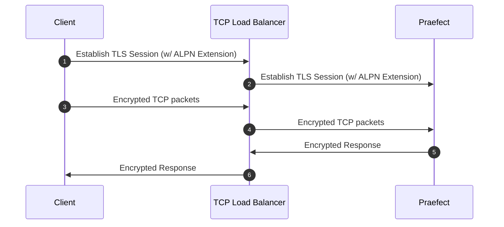
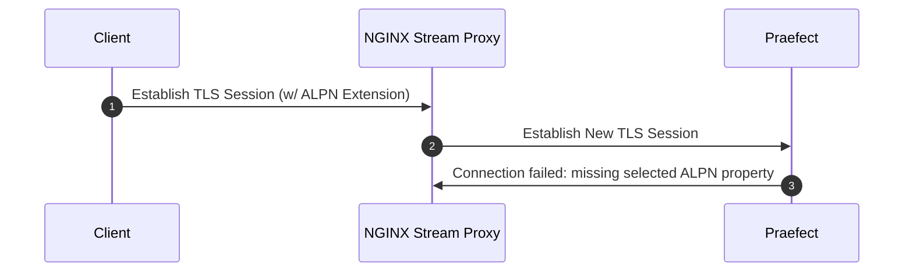

Gitaly Cluster (Praefect)は、以下のいずれかの方法で構成します:

- 以下の規模までのインストールには、[リファレンスアーキテクチャ](../../reference_architectures/_index.md)の一部として提供されているGitaly Cluster (Praefect) の設定手順を利用できます:
  - [60 RPSまたは3,000ユーザー](../../reference_architectures/3k_users.md#configure-gitaly-cluster-praefect)。
  - [100 RPSまたは5,000ユーザー](../../reference_architectures/5k_users.md#configure-gitaly-cluster-praefect)。
  - [200 RPSまたは10,000ユーザー](../../reference_architectures/10k_users.md#configure-gitaly-cluster-praefect)。
  - [500 RPSまたは25,000ユーザー](../../reference_architectures/25k_users.md#configure-gitaly-cluster-praefect)。
  - [1000 RPSまたは50,000ユーザー](../../reference_architectures/50k_users.md#configure-gitaly-cluster-praefect)。
- このページに続くカスタム設定手順。

小規模なGitLabのインストールでは、[Gitaly単体](../_index.md)で十分な場合があります。

> [!note]
> Gitaly Cluster (Praefect)は、まだKubernetes、Amazon ECS、または類似のコンテナ環境ではサポートされていません。詳細については、[エピック6127](https://gitlab.com/groups/gitlab-org/-/epics/6127)を参照してください。

## 要件 {#requirements}

Gitaly Cluster (Praefect) の最小推奨設定には以下が必要です:

- 1つのロードバランサー
- 1つのPostgreSQLサーバー ([サポートされているバージョン](../../../install/requirements.md#postgresql))
- 3つのPraefectノード
- 3つのGitalyノード (プライマリ1つ、セカンダリ2つ)

> [!note]
> [ディスク要件](../_index.md#disk-requirements)はGitalyノードに適用されます。

GitalyノードのいずれかがミューティングRPC呼び出しで失敗した場合にタイブレーカーとなるよう、奇数個のGitalyノードを設定する必要があります。

実装の詳細については、[デザインドキュメント](https://gitlab.com/gitlab-org/gitaly/-/blob/master/doc/design_ha.md)を参照してください。

> [!note]
> GitLabで機能フラグが設定されていない場合、コンソールからはfalseとして読み取られ、Praefectはそれらのデフォルト値を使用します。デフォルト値はGitLabのバージョンによって異なります。

### ネットワークレイテンシーと接続 {#network-latency-and-connectivity}

Gitaly Cluster (Praefect)のネットワークレイテンシーは、理想的には1桁のミリ秒で測定できるべきです。レイテンシーは、特に以下の点で重要です:

- Gitalyノードのヘルスチェック。ノードは1秒以内に応答できなければなりません。
- [強い整合性](_index.md#strong-consistency)を強制する参照トランザクション。レイテンシーが低いほど、Gitalyノードは変更に早く合意できます。

Gitalyノード間の許容可能なレイテンシーを達成するには:

- 物理ネットワークでは、一般に高帯域幅の単一ロケーション接続を意味します。
- クラウドでは、一般に同じリージョン内を意味し、クロスアベイラビリティゾーンレプリケーションを許可することを含みます。これらのリンクは、この種の同期のために設計されています。2ミリ秒未満のレイテンシーは、Gitaly Cluster (Praefect) に十分であるべきです。

レプリケーションのために低いネットワークレイテンシーを提供できない場合 (例えば、遠隔地間) は、Geoを検討してください。詳細については、[Geoとの比較](_index.md#comparison-to-geo)を参照してください。

Gitaly Cluster (Praefect) の[コンポーネント](_index.md#components)は、多くのルートを介して相互に通信します。Gitaly Cluster (Praefect)が適切に機能するためには、ファイアウォールルールで以下を許可する必要があります:

| 送信元                   | 宛先                     | デフォルトポート | TLSポート |
|:-----------------------|:-----------------------|:-------------|:---------|
| GitLab                 | Praefectロードバランサー | `2305`       | `3305`   |
| Praefectロードバランサー | Praefect               | `2305`       | `3305`   |
| Praefect               | Gitaly                 | `8075`       | `9999`   |
| Praefect               | GitLab (内部API)  | `80`         | `443`    |
| Gitaly                 | GitLab (内部API)  | `80`         | `443`    |
| Gitaly                 | Praefectロードバランサー | `2305`       | `3305`   |
| Gitaly                 | Praefect               | `2305`       | `3305`   |
| Gitaly                 | Gitaly                 | `8075`       | `9999`   |

> [!note]
> GitalyはPraefectに直接接続しません。ただし、Praefectノード上のファイアウォールがGitalyノードからのトラフィックを許可しない限り、GitalyからPraefectロードバランサーへのリクエストはブロックされる可能性があります。

### Praefectデータベースのストレージ {#praefect-database-storage}

データベースには以下のメタデータのみが含まれるため、要件は比較的低いです:

- リポジトリがどこにあるか。
- キューに入れられた作業の一部。

リポジトリの数によって異なりますが、主要なGitLabアプリケーションデータベースと同様に、適切な最小値は5～10 GBです。

## セットアップ手順 {#setup-instructions}

GitLabをLinuxパッケージを使用して[インストール](https://about.gitlab.com/install/)した場合 (強く推奨)、以下の手順に従ってください:

1. [準備](#preparation)
1. [Praefectデータベースの設定](#postgresql)
1. [Praefectプロキシ/ルーターの設定](#praefect)
1. [各Gitalyノードの設定](#gitaly) (Gitalyノードごとに1回)
1. [ロードバランサーの設定](#load-balancer)
1. [GitLabサーバー設定の更新](#gitlab)
1. [Grafanaを設定する](#grafana)

### 準備 {#preparation}

始める前に、動作中のGitLabインスタンスがあることを確認してください。[GitLabのインストール方法を学ぶ](https://about.gitlab.com/install/)。

PostgreSQLサーバーをプロビジョニングする。Linuxパッケージに同梱されているPostgreSQLを使用して、PostgreSQLデータベースを設定する必要があります。外部PostgreSQLサーバーを使用できますが、[手動で](#manual-database-setup)セットアップする必要があります。

すべての新しいノードを[GitLabをインストール](https://about.gitlab.com/install/)して準備します。以下が必要です:

- 1つのPostgreSQLノード
- 1つのPgBouncerノード (オプション)
- 少なくとも1つのPraefectノード (最小限のストレージが必要)
- 3つのGitalyノード (高CPU、高メモリ、高速ストレージ)
- 1つのGitLabサーバー

各ノードのIP/ホストアドレスも必要です:

1. `PRAEFECT_LOADBALANCER_HOST`: PraefectロードバランサーのIP/ホストアドレス
1. `POSTGRESQL_HOST`: PostgreSQLサーバーのIP/ホストアドレス
1. `PGBOUNCER_HOST`: PostgreSQLサーバーのIP/ホストアドレス
1. `PRAEFECT_HOST`: PraefectサーバーのIP/ホストアドレス
1. `GITALY_HOST_*`: 各GitalyサーバーのIPまたはホストアドレス
1. `GITLAB_HOST`: GitLabサーバーのIP/ホストアドレス

Google Cloud Platform、SoftLayer、またはVPC (仮想プライベートクラウド) を提供するその他のベンダーを使用している場合、各クラウドインスタンスのプライベートアドレス (Google Cloud Platformの「内部アドレス」に対応) を`PRAEFECT_HOST`、`GITALY_HOST_*`、および`GITLAB_HOST`に使用できます。

#### シークレット {#secrets}

コンポーネント間の通信は、以下に説明するさまざまなシークレットで保護されています。開始する前に、それぞれに一意のシークレットを生成し、メモしておいてください。これにより、セットアッププロセスが完了すると、これらのプレースホルダートークンを安全なトークンに置き換えることができます。

1. `GITLAB_SHELL_SECRET_TOKEN`: これは、Gitフックによって、Gitプッシュを受け入れる際にGitLabへのHTTPコールバックAPIリクエストを行うために使用されます。このシークレットは、レガシー上の理由によりGitLab Shellと共有されます。
1. `PRAEFECT_EXTERNAL_TOKEN`: Praefectクラスターでホストされているリポジトリは、このトークンを持つGitalyクライアントのみがアクセスできます。
1. `PRAEFECT_INTERNAL_TOKEN`: このトークンは、Praefectクラスター内のレプリケーショントラフィックに使用されます。このトークンは`PRAEFECT_EXTERNAL_TOKEN`とは異なります。GitalyクライアントはPraefectクラスターの内部ノードに直接アクセスできてはならないためです。これによりデータ損失につながる可能性があります。
1. `PRAEFECT_SQL_PASSWORD`: このパスワードは、PraefectがPostgreSQLに接続するために使用されます。
1. `PRAEFECT_SQL_PASSWORD_HASH`: Praefectユーザーのパスワードのハッシュ。`gitlab-ctl pg-password-md5 praefect`を使用してハッシュを生成します。このコマンドは、`praefect`ユーザーのパスワードを要求します。`PRAEFECT_SQL_PASSWORD`プレーンテキストパスワードを入力します。デフォルトでは、Praefectは`praefect`ユーザーを使用しますが、変更できます。
1. `PGBOUNCER_SQL_PASSWORD_HASH`: PgBouncerユーザーのパスワードのハッシュ。PgBouncerは、このパスワードを使用してPostgreSQLに接続します。詳細については、[バンドルされたPgBouncer](../../postgresql/pgbouncer.md)のドキュメントを参照してください。

これらのシークレットが必要な場所を以下の手順で示します。

> [!note]
> Linuxパッケージのインストールでは、`GITLAB_SHELL_SECRET_TOKEN`に`gitlab-secrets.json`を使用できます。

### タイムサーバー設定のカスタマイズ {#customize-time-server-setting}

デフォルトでは、GitalyとPraefectのノードは、時刻同期チェックに`pool.ntp.org`にあるタイムサーバーを使用します。この設定は、各ノードの`gitlab.rb`に以下を追加することでカスタマイズできます:

- Gitalyノードの場合、`gitaly['env'] = { "NTP_HOST" => "ntp.example.com" }`。
- Praefectノードの場合、`praefect['env'] = { "NTP_HOST" => "ntp.example.com" }`。

### PostgreSQL {#postgresql}

> [!note]
> Praefectは、GitLabアプリケーションデータベースとは別のデータベースを使用して、Gitalyリポジトリのレプリケーション状態を管理します。[Geo](../../geo/_index.md)とGitaly Cluster (Praefect)を使用する場合、Praefectのレプリケーション状態は各Geoサイトに固有です。各Geoサイトには、Praefectデータベースを格納するために、独立した読み書き可能なPostgreSQLデータベースインスタンスが必要です。
>
> - GitLabアプリケーションデータベースとPraefectデータベースを同じPostgreSQLサーバーに保存しないでください。
> - GeoサイトのプライマリにPraefect Postgresデータベースを設定して、Geoセカンダリサイトにレプリケートすることは避けてください。

これらの手順は、単一障害点となる単一のPostgreSQLデータベースをセットアップするのに役立ちます。これを避けるために、独自のクラスター化されたPostgreSQLを設定できます。他のデータベース (例えば、PraefectやGeoデータベース) のためのクラスター化されたデータベースサポートは、[イシュー7292](https://gitlab.com/gitlab-org/omnibus-gitlab/-/issues/7292)で提案されています。

以下のオプションが利用可能です:

- 非Geoインストールの場合、いずれか:
  - [ドキュメント化されたPostgreSQLのセットアップ](../../postgresql/_index.md)のいずれかを使用します。
  - 独自のサードパーティデータベースセットアップを使用します。これには[手動セットアップ](#manual-database-setup)が必要です。
- Geoインスタンスの場合、いずれか:
  - 独立した[PostgreSQLインスタンス](https://www.postgresql.org/docs/16/high-availability.html)をセットアップします。
  - クラウド管理のPostgreSQLサービスを使用します。AWS [リレーショナルデータベースサービス](https://aws.amazon.com/rds/)が推奨されます。

PostgreSQLをセットアップすると、空のPraefectテーブルが作成されます。詳細については、[関連するトラブルシューティングセクション](troubleshooting.md#relation-does-not-exist-errors)を参照してください。

#### GitLabとPraefectデータベースを同じサーバーで実行する {#running-gitlab-and-praefect-databases-on-the-same-server}

GitLabアプリケーションデータベースとPraefectデータベースは、同じサーバーで実行できます。ただし、LinuxパッケージのPostgreSQLを使用する場合、Praefectは独自のデータベースサーバーを持つべきです。フェイルオーバーが発生した場合、Praefectはそれを認識せず、使用しようとしているデータベースが以下のいずれかの状態になるため、失敗し始めます:

- 利用できない。
- 読み取り専用モード。

#### 手動データベースセットアップ {#manual-database-setup}

このセクションを完了するには、以下が必要です:

- 1つのPraefectノード
- 1つのPostgreSQLノード
  - データベースサーバーを管理する権限を持つPostgreSQLユーザー

このセクションでは、PostgreSQLデータベースを設定します。これは、外部およびLinuxパッケージが提供するPostgreSQLサーバーの両方に使用できます。

以下の手順を実行するには、Linuxパッケージ (`/opt/gitlab/embedded/bin/psql`) によって`psql`がインストールされているPraefectノードを使用できます。Linuxパッケージが提供するPostgreSQLを使用している場合は、代わりにPostgreSQLノードで`gitlab-psql`を使用できます:

1. Praefectが使用する新しいユーザー`praefect`を作成します:

   ```sql
   CREATE ROLE praefect WITH LOGIN PASSWORD 'PRAEFECT_SQL_PASSWORD';
   ```

   `PRAEFECT_SQL_PASSWORD`を、準備手順で生成した強力なパスワードに置き換えます。

1. `praefect`ユーザーが所有する新しいデータベース`praefect_production`を作成します。

   ```sql
   CREATE DATABASE praefect_production WITH OWNER praefect ENCODING UTF8;
   ```

Linuxパッケージが提供するPgBouncerを使用する場合は、以下の追加手順を実行する必要があります。バックエンドとして、Linuxパッケージに同梱されているPostgreSQLを使用することを強く推奨します。以下の手順は、Linuxパッケージが提供するPostgreSQLでのみ機能します:

1. Linuxパッケージが提供するPgBouncerの場合、実際のパスワードの代わりに`praefect`パスワードのハッシュを使用する必要があります:

   ```sql
   ALTER ROLE praefect WITH PASSWORD 'md5<PRAEFECT_SQL_PASSWORD_HASH>';
   ```

   `<PRAEFECT_SQL_PASSWORD_HASH>`を、準備手順で生成したパスワードのハッシュに置き換えます。`md5`リテラルがプレフィックスとして付けられます。

1. PgBouncerが使用する新しいユーザー`pgbouncer`を作成します:

   ```sql
   CREATE ROLE pgbouncer WITH LOGIN;
   ALTER USER pgbouncer WITH password 'md5<PGBOUNCER_SQL_PASSWORD_HASH>';
   ```

   `PGBOUNCER_SQL_PASSWORD_HASH`を、準備手順で生成した強力なパスワードハッシュに置き換えます。

1. Linuxパッケージに同梱されているPgBouncerは、[`auth_query`](https://www.pgbouncer.org/config.html#generic-settings)を使用するように設定されており、`pg_shadow_lookup`関数を使用します。`praefect_production`データベースにこの関数を作成する必要があります:

   ```sql
   CREATE OR REPLACE FUNCTION public.pg_shadow_lookup(in i_username text, out username text, out password text) RETURNS record AS $$
   BEGIN
       SELECT usename, passwd FROM pg_catalog.pg_shadow
       WHERE usename = i_username INTO username, password;
       RETURN;
   END;
   $$ LANGUAGE plpgsql SECURITY DEFINER;

   REVOKE ALL ON FUNCTION public.pg_shadow_lookup(text) FROM public, pgbouncer;
   GRANT EXECUTE ON FUNCTION public.pg_shadow_lookup(text) TO pgbouncer;
   ```

Praefectが使用するデータベースが設定されました。

これで、Praefectがデータベースを使用するように設定できます:

```ruby
praefect['configuration'] = {
   # ...
   database: {
      # ...
      host: POSTGRESQL_HOST,
      user: 'praefect',
      port: 5432,
      password: PRAEFECT_SQL_PASSWORD,
      dbname: 'praefect_production',
   }
}
```

PostgreSQLの設定後にPraefectデータベースエラーが発生した場合は、[トラブルシューティング手順](troubleshooting.md#relation-does-not-exist-errors)を参照してください。

#### 読み取り分散キャッシュ {#reads-distribution-caching}

`session_pooled`設定を追加で設定することで、Praefectのパフォーマンスを向上させることができます:

```ruby
praefect['configuration'] = {
   # ...
   database: {
      # ...
      session_pooled: {
         # ...
         host: POSTGRESQL_HOST,
         port: 5432

         # Use the following to override parameters of direct database connection.
         # Comment out where the parameters are the same for both connections.
         user: 'praefect',
         password: PRAEFECT_SQL_PASSWORD,
         dbname: 'praefect_production',
         # sslmode: '...',
         # sslcert: '...',
         # sslkey: '...',
         # sslrootcert: '...',
      }
   }
}
```

設定すると、この接続は[SQL LISTEN](https://www.postgresql.org/docs/16/sql-listen.html)機能に自動的に使用され、PraefectがPostgreSQLからキャッシュの無効化に関する通知を受け取れるようになります。

この機能が動作していることを確認するには、Praefectログで以下のログエントリを探してください:

```plaintext
reads distribution caching is enabled by configuration
```

#### PgBouncerを使用する {#use-pgbouncer}

PostgreSQLのリソース消費を削減するため、PostgreSQLインスタンスの前に[PgBouncer](https://www.pgbouncer.org/)をセットアップし、設定する必要があります。ただし、Praefectが行う接続数が少ないため、PgBouncerは必須ではありません。PgBouncerを使用することを選択した場合、GitLabアプリケーションデータベースとPraefectデータベースの両方に同じPgBouncerインスタンスを使用できます。

PostgreSQLインスタンスの前にPgBouncerを設定するには、Praefectの設定でデータベースパラメータを設定することで、PraefectをPgBouncerにポイントする必要があります:

```ruby
praefect['configuration'] = {
   # ...
   database: {
      # ...
      host: PGBOUNCER_HOST,
      port: 6432,
      user: 'praefect',
      password: PRAEFECT_SQL_PASSWORD,
      dbname: 'praefect_production',
      # sslmode: '...',
      # sslcert: '...',
      # sslkey: '...',
      # sslrootcert: '...',
   }
}
```

Praefectは、[LISTEN](https://www.postgresql.org/docs/16/sql-listen.html)機能をサポートするPostgreSQLへの追加接続が必要です。PgBouncerでは、この機能は`session`プールモード (`pool_mode = session`) でのみ利用可能です。`transaction`プールモード (`pool_mode = transaction`) ではサポートされていません。

追加接続を設定するには、以下のいずれかの方法で行う必要があります:

- 同じPostgreSQLデータベースエンドポイントを使用する新しいPgBouncerデータベースを設定しますが、プールモードは異なります (`pool_mode = session`)。
- PraefectをPostgreSQLに直接接続し、PgBouncerをバイパスする。

##### `pool_mode = session`で新しいPgBouncerデータベースを設定する {#configure-a-new-pgbouncer-database-with-pool_mode--session}

PgBouncerは`session`プールモードで使用する必要があります。[バンドルされたPgBouncer](../../postgresql/pgbouncer.md)を使用するか、外部のPgBouncerを使用して[手動で設定](https://www.pgbouncer.org/config.html)できます。

以下の例では、バンドルされたPgBouncerを使用し、PostgreSQLホスト上に2つの独立した接続プールをセットアップしています。1つは`session`プールモード、もう1つは`transaction`プールモードです。この例が機能するためには、[セットアップ手順](#manual-database-setup)に記載されているようにPostgreSQLサーバーを準備する必要があります。

次に、PgBouncerホスト上で個別の接続プールを設定します:

```ruby
pgbouncer['databases'] = {
  # Other database configuration including gitlabhq_production
  ...

  praefect_production: {
    host: POSTGRESQL_HOST,
    # Use `pgbouncer` user to connect to database backend.
    user: 'pgbouncer',
    password: PGBOUNCER_SQL_PASSWORD_HASH,
    pool_mode: 'transaction'
  },
  praefect_production_direct: {
    host: POSTGRESQL_HOST,
    # Use `pgbouncer` user to connect to database backend.
    user: 'pgbouncer',
    password: PGBOUNCER_SQL_PASSWORD_HASH,
    dbname: 'praefect_production',
    pool_mode: 'session'
  },

  ...
}

# Allow the praefect user to connect to PgBouncer
pgbouncer['users'] = {
  'praefect': {
    'password': PRAEFECT_SQL_PASSWORD_HASH,
  }
}
```

`praefect_production`と`praefect_production_direct`は両方とも同じデータベースエンドポイント (`praefect_production`) を使用しますが、プールモードは異なります。これは、PgBouncerの以下の`databases`セクションに変換されます:

```ini
[databases]
praefect_production = host=POSTGRESQL_HOST auth_user=pgbouncer pool_mode=transaction
praefect_production_direct = host=POSTGRESQL_HOST auth_user=pgbouncer dbname=praefect_production pool_mode=session
```

これで、Praefectが両方の接続にPgBouncerを使用するように設定できます:

```ruby
praefect['configuration'] = {
   # ...
   database: {
      # ...
      host: PGBOUNCER_HOST,
      port: 6432,
      user: 'praefect',
      # `PRAEFECT_SQL_PASSWORD` is the plain-text password of
      # Praefect user. Not to be confused with `PRAEFECT_SQL_PASSWORD_HASH`.
      password: PRAEFECT_SQL_PASSWORD,
      dbname: 'praefect_production',
      session_pooled: {
         # ...
         dbname: 'praefect_production_direct',
         # There is no need to repeat the following. Parameters of direct
         # database connection will fall back to the values specified in the
         # database block.
         #
         # host: PGBOUNCER_HOST,
         # port: 6432,
         # user: 'praefect',
         # password: PRAEFECT_SQL_PASSWORD,
      },
   },
}
```

この設定により、Praefectは両方の接続タイプにPgBouncerを使用します。

> [!note]
> Linuxパッケージのインストールでは認証要件 (`auth_query`を使用) を処理しますが、データベースを手動で準備し、外部PgBouncerを設定する場合は、PgBouncerが使用するファイルに`praefect`ユーザーとそのパスワードを含める必要があります。例えば、[`auth_file`](https://www.pgbouncer.org/config.html#auth_file)設定オプションが設定されている場合は`userlist.txt`。詳細については、PgBouncerのドキュメントを参照してください。

##### PraefectがPostgreSQLに直接接続するように設定する {#configure-praefect-to-connect-directly-to-postgresql}

`session`プールモードでPgBouncerを設定する代わりに、Praefectを設定して、PostgreSQLへの直接アクセスに異なる接続パラメータを使用できます。この接続は`LISTEN`機能をサポートします。

PgBouncerをバイパスするPraefectの設定の例で、PostgreSQLに直接接続します:

```ruby
praefect['configuration'] = {
   # ...
   database: {
      # ...
      session_pooled: {
         # ...
         host: POSTGRESQL_HOST,
         port: 5432,

         # Use the following to override parameters of direct database connection.
         # Comment out where the parameters are the same for both connections.
         #
         user: 'praefect',
         password: PRAEFECT_SQL_PASSWORD,
         dbname: 'praefect_production',
         # sslmode: '...',
         # sslcert: '...',
         # sslkey: '...',
         # sslrootcert: '...',
      },
   },
}
```

### Praefect {#praefect}

Praefectを設定する前に、[Praefectの設定ファイルの例](https://gitlab.com/gitlab-org/gitaly/-/blob/master/config.praefect.toml.example)を参照して慣れてください。Linuxパッケージを使用してGitLabをインストールした場合、例のファイルにある設定はRubyに変換する必要があります。

複数のPraefectノードがある場合:

1. 1つのノードをデプロイノードとして指定し、以下の手順を使用して設定します。
1. 追加の各ノードについて、以下の手順を完了してください。

このセクションを完了するには、[設定済みのPostgreSQLサーバー](#postgresql)が必要です。以下を含みます:

> [!warning]
> Praefectは専用のノードで実行する必要があります。PraefectをアプリケーションサーバーまたはGitalyノード上で実行しないでください。

Praefectノード上で:

1. `/etc/gitlab/gitlab.rb`を編集して、他のすべてのサービスを無効にします:

<!--
Updates to example must be made at:

- <https://gitlab.com/gitlab-org/gitlab/-/blob/master/doc/administration/gitaly/configure_gitaly.md#configure-gitaly-server>
- All reference architecture pages
-->

   ```ruby
   # Avoid running unnecessary services on the Praefect server
   gitaly['enable'] = false
   postgresql['enable'] = false
   redis['enable'] = false
   nginx['enable'] = false
   puma['enable'] = false
   sidekiq['enable'] = false
   gitlab_workhorse['enable'] = false
   prometheus['enable'] = false
   alertmanager['enable'] = false
   gitlab_exporter['enable'] = false
   gitlab_kas['enable'] = false

   # Enable only the Praefect service
   praefect['enable'] = true

   # Prevent database migrations from running on upgrade automatically
   praefect['auto_migrate'] = false
   gitlab_rails['auto_migrate'] = false
   ```

1. `/etc/gitlab/gitlab.rb`を編集して、Praefectがネットワークインターフェースでリッスンするように設定します:

   ```ruby
   praefect['configuration'] = {
      # ...
      listen_addr: '0.0.0.0:2305',
   }
   ```

1. `/etc/gitlab/gitlab.rb`を編集して、Prometheusメトリクスを設定します:

   ```ruby
   praefect['configuration'] = {
      # ...
      #
      # Enable Prometheus metrics access to Praefect. You must use firewalls
      # to restrict access to this address/port.
      # The default metrics endpoint is /metrics
      prometheus_listen_addr: '0.0.0.0:9652',
      # Some metrics run queries against the database. Enabling separate database metrics allows
      # these metrics to be collected when the metrics are
      # scraped on a separate /db_metrics endpoint.
      prometheus_exclude_database_from_default_metrics: true,
   }
   ```

1. `/etc/gitlab/gitlab.rb`を編集して、Praefect用の強力な認証トークンを設定します。これは、クラスター外のクライアント (GitLab Shellなど) がPraefectクラスターと通信するために必要です:

   ```ruby
   praefect['configuration'] = {
      # ...
      auth: {
         # ...
         token: 'PRAEFECT_EXTERNAL_TOKEN',
      },
   }
   ```

1. Praefectが[PostgreSQLデータベース](#postgresql)に接続するように設定します。[PgBouncer](#use-pgbouncer)も使用することを強く推奨します。

   TLSクライアント証明書を使用したい場合は、以下のオプションを使用できます:

   ```ruby
   praefect['configuration'] = {
      # ...
      database: {
         # ...
         #
         # Connect to PostgreSQL using a TLS client certificate
         # sslcert: '/path/to/client-cert',
         # sslkey: '/path/to/client-key',
         #
         # Trust a custom certificate authority
         # sslrootcert: '/path/to/rootcert',
      },
   }
   ```

   デフォルトでは、PraefectはオポチュニスティックTLSを使用してPostgreSQLに接続します。これは、Praefectが`sslmode`が`prefer`に設定されたPostgreSQLへの接続を試みることを意味します。以下の行のコメントを解除することで、これをオーバーライドできます:

   ```ruby
   praefect['configuration'] = {
      # ...
      database: {
         # ...
         # sslmode: 'disable',
      },
   }
   ```

1. `/etc/gitlab/gitlab.rb`を編集して、Praefectクラスターがクラスター内の各Gitalyノードに接続するように設定します。

   仮想ストレージの名前は、GitLab設定で設定されたストレージ名と一致している必要があります。以降の手順でストレージ名を`default`として設定するため、ここでも`default`を使用します。このクラスターには、相互にレプリカとなる3つのGitalyノード`gitaly-1`、`gitaly-2`、`gitaly-3`があります。

   > [!warning]
   > すでに`default`という名前の既存ストレージにデータがある場合は、仮想ストレージを別の名前で設定し、その後[データをGitaly Cluster (Praefect) ストレージに移行する](_index.md#migrate-to-gitaly-cluster-praefect)必要があります。

   `PRAEFECT_INTERNAL_TOKEN`を、Praefectがクラスター内のGitalyノードと通信する際に使用される強力なシークレットに置き換えます。このトークンは`PRAEFECT_EXTERNAL_TOKEN`とは異なります。

   `GITALY_HOST_*`を、各GitalyノードのIPまたはホストアドレスに置き換えます。

   レプリカの数を増やすために、より多くのGitalyノードをクラスターに追加できます。非常に大規模なGitLabインスタンスの場合、さらに多くのクラスターを追加することもできます。

   > [!note]
   > 仮想ストレージにGitalyノードを追加する場合、その仮想ストレージ内のすべてのストレージ名は一意である必要があります。さらに、Praefectの設定で参照されているすべてのGitalyノードアドレスは一意である必要があります。

   ```ruby
   # Name of storage hash must match storage name in gitlab_rails['repositories_storages'] on GitLab
   # server ('default') and in gitaly['configuration'][:storage][INDEX][:name] on Gitaly nodes ('gitaly-1')
   praefect['configuration'] = {
      # ...
      virtual_storage: [
         {
            # ...
            name: 'default',
            node: [
               {
                  storage: 'gitaly-1',
                  address: 'tcp://GITALY_HOST_1:8075',
                  token: 'PRAEFECT_INTERNAL_TOKEN'
               },
               {
                  storage: 'gitaly-2',
                  address: 'tcp://GITALY_HOST_2:8075',
                  token: 'PRAEFECT_INTERNAL_TOKEN'
               },
               {
                  storage: 'gitaly-3',
                  address: 'tcp://GITALY_HOST_3:8075',
                  token: 'PRAEFECT_INTERNAL_TOKEN'
               },
            ],
         },
      ],
   }
   ```

1. `/etc/gitlab/gitlab.rb`への変更を保存し、[Praefectを再設定](../../restart_gitlab.md#reconfigure-a-linux-package-installation)します:

   ```shell
   gitlab-ctl reconfigure
   ```

1. 下記のとおりです:

   - 「デプロイノード」:
     1. `/etc/gitlab/gitlab.rb`で`praefect['auto_migrate'] = true`を設定して、Praefectデータベースの自動移行を再度有効にします。
     1. データベースの移行が再設定中にのみ実行され、アップグレード時に自動的に実行されないようにするには、以下を実行します。

        ```shell
        sudo touch /etc/gitlab/skip-auto-reconfigure
        ```

   - 他のノードについては、設定をそのままにしておくことができます。`/etc/gitlab/skip-auto-reconfigure`は必須ではありませんが、`apt-get update`のようなコマンドを実行したときにGitLabが自動的に再設定を実行するのを防ぐために、これを設定したい場合があります。これにより、追加の設定変更を行った後、手動で再設定を実行できます。

1. `/etc/gitlab/gitlab.rb`への変更を保存し、[Praefectを再設定](../../restart_gitlab.md#reconfigure-a-linux-package-installation)します:

   ```shell
   gitlab-ctl reconfigure
   ```

1. Praefectが[そのPrometheusリスナーアドレスを更新した](https://gitlab.com/gitlab-org/gitaly/-/issues/2734)ことを確認するために、[Praefectを再起動](../../restart_gitlab.md#reconfigure-a-linux-package-installation)します:

   ```shell
   gitlab-ctl restart praefect
   ```

1. PraefectがPostgreSQLに到達できることを確認します:

   ```shell
   sudo -u git -- /opt/gitlab/embedded/bin/praefect -config /var/opt/gitlab/praefect/config.toml sql-ping
   ```

   チェックが失敗した場合は、手順が正しく実行されていることを確認してください。`/etc/gitlab/gitlab.rb`を編集した場合は、`sql-ping`コマンドを試す前に、`sudo gitlab-ctl reconfigure`を再度実行することを忘れないでください。

#### TLSサポートの有効化 {#enable-tls-support}

PraefectはTLS暗号化をサポートしています。セキュアな接続をリッスンするPraefectインスタンスと通信するには、次のことを行う必要があります。

- Gitalyが[TLS用に設定](../tls_support.md)されていることを確認し、GitLab設定の対応するストレージエントリの`gitaly_address`に`tls://` URLスキームを使用します。
- 証明書は自動的に提供されないため、独自の証明書を用意してください。各Praefectサーバーに対応する証明書を、そのPraefectサーバーにインストールする必要があります。

さらに、証明書またはその認証局は、[GitLabカスタム証明書の設定](https://docs.gitlab.com/omnibus/settings/ssl/#install-custom-public-certificates)で説明されている手順（以下にも繰り返します）に従って、すべてのGitalyサーバー、およびこのサーバーと通信するすべてのPraefectクライアントにインストールする必要があります。

次の点に注意してください。

- 証明書は、Praefectサーバーへのアクセスに使用するアドレスを指定する必要があります。ホスト名またはIPアドレスをサブジェクトの別名（SAN）として証明書に追加する必要があります。
- [Gitaly TLSが有効](../tls_support.md)なコマンドラインから`dial-nodes`や`list-untracked-repositories`のようなPraefectサブコマンドを実行する場合、Gitaly証明書が信頼されるように`SSL_CERT_DIR`または`SSL_CERT_FILE`環境変数を設定する必要があります。例: 

  ```shell
  SSL_CERT_DIR=/etc/gitlab/trusted-certs sudo -u git -- /opt/gitlab/embedded/bin/praefect -config /var/opt/gitlab/praefect/config.toml dial-nodes
  ```

- Praefectサーバーは、暗号化されていないリスニングアドレス`listen_addr`と暗号化されたリスニングアドレス`tls_listen_addr`の両方で同時に設定できます。これにより、必要に応じて、暗号化されていないトラフィックから暗号化されたトラフィックへの段階的な移行を行うことができます。

  暗号化されていないリスナーを無効にするには、以下を設定します:

  ```ruby
  praefect['configuration'] = {
    # ...
    listen_addr: nil,
  }
  ```

PraefectをTLSで設定します。

Linuxパッケージインストールの場合:

1. Praefectサーバーの証明書を作成します。
1. Praefectサーバーで、`/etc/gitlab/ssl`ディレクトリを作成し、キーと証明書をそこにコピーします。

   ```shell
   sudo mkdir -p /etc/gitlab/ssl
   sudo chmod 755 /etc/gitlab/ssl
   sudo cp key.pem cert.pem /etc/gitlab/ssl/
   sudo chmod 644 key.pem cert.pem
   ```

1. `/etc/gitlab/gitlab.rb`を編集して、以下を追加します。

   ```ruby
   praefect['configuration'] = {
      # ...
      tls_listen_addr: '0.0.0.0:3305',
      tls: {
         # ...
         certificate_path: '/etc/gitlab/ssl/cert.pem',
         key_path: '/etc/gitlab/ssl/key.pem',
      },
   }
   ```

1. ファイルを保存し、[再設定](../../restart_gitlab.md#reconfigure-a-linux-package-installation)します。
1. Praefectクライアント（各Gitalyサーバーを含む）で、証明書またはその認証局を`/etc/gitlab/trusted-certs`にコピーします。

   ```shell
   sudo cp cert.pem /etc/gitlab/trusted-certs/
   ```

1. Praefectクライアント（Gitalyサーバーを除く）で、`/etc/gitlab/gitlab.rb`の`gitlab_rails['repositories_storages']`を次のように編集します。

   ```ruby
   gitlab_rails['repositories_storages'] = {
     "default" => {
       "gitaly_address" => 'tls://PRAEFECT_LOADBALANCER_HOST:3305',
       "gitaly_token" => 'PRAEFECT_EXTERNAL_TOKEN'
     }
   }
   ```

1. ファイルを保存し、[GitLabを再設定](../../restart_gitlab.md#reconfigure-a-linux-package-installation)します。

セルフコンパイルインストールの場合:

1. Praefectサーバーの証明書を作成します。
1. Praefectサーバーで、`/etc/gitlab/ssl`ディレクトリを作成し、キーと証明書をそこにコピーします。

   ```shell
   sudo mkdir -p /etc/gitlab/ssl
   sudo chmod 755 /etc/gitlab/ssl
   sudo cp key.pem cert.pem /etc/gitlab/ssl/
   sudo chmod 644 key.pem cert.pem
   ```

1. Praefectクライアント (各Gitalyサーバーを含む) で、証明書またはその認証局をシステム信頼済み証明書にコピーします:

   ```shell
   sudo cp cert.pem /usr/local/share/ca-certificates/praefect.crt
   sudo update-ca-certificates
   ```

1. Praefectクライアント（Gitalyサーバーを除く）で、`/home/git/gitlab/config/gitlab.yml`の`storages`を次のように編集します。

   ```yaml
   gitlab:
     repositories:
       storages:
         default:
           gitaly_address: tls://PRAEFECT_LOADBALANCER_HOST:3305
   ```

1. ファイルを保存し、[GitLabを再起動](../../restart_gitlab.md#self-compiled-installations)します。
1. すべてのPraefectサーバー証明書、またはそれらの認証局を各Gitalyサーバーのシステム信頼済み証明書にコピーします。これにより、Gitalyサーバーから呼び出しされたときにPraefectサーバーが証明書を信頼するようになります:

   ```shell
   sudo cp cert.pem /usr/local/share/ca-certificates/praefect.crt
   sudo update-ca-certificates
   ```

1. `/home/git/praefect/config.toml`を編集して、以下を追加します。

   ```toml
   tls_listen_addr = '0.0.0.0:3305'

   [tls]
   certificate_path = '/etc/gitlab/ssl/cert.pem'
   key_path = '/etc/gitlab/ssl/key.pem'
   ```

1. ファイルを保存し、[GitLabを再起動](../../restart_gitlab.md#self-compiled-installations)します。

#### サービスディスカバリ {#service-discovery}

前提条件: 

- DNSサーバー。

GitLabは、Praefectホストのリストを取得するためにサービスディスカバリを使用します。サービスディスカバリは、DNS AまたはAAAAレコードの定期的なチェックを伴い、レコードから取得するされたIPがターゲットノードのアドレスとして機能します。PraefectはSRVレコードによるサービスディスカバリをサポートしていません。

デフォルトでは、チェック間の最小時間は5分で、レコードのTTLに関係なくです。Praefectはこの間隔のカスタマイズをサポートしていません。クライアントが更新を受信すると、以下のようになります:

- 新しいIPアドレスへの新しい接続を確立します。
- 既存の接続は、変更されていないIPアドレスに維持します。
- 削除されたIPアドレスへの接続を破棄します。

削除予定の接続における処理中のリクエストは、完了するまで処理されます。Workhorseには10分間のタイムアウトがありますが、他のクライアントはグレースフルタイムアウトを指定していません。

DNSサーバーは、それ自体でロードバランシングを行うのではなく、すべてのIPアドレスを返す必要があります。クライアントは、ラウンドロビン方式でIPアドレスにリクエストを分散できます。

クライアント設定を更新する前に、DNSサービスディスカバリが正しく機能することを確認してください。IPアドレスのリストを正しく返す必要があります。`dig`は検証に役立つツールです。

```console
❯ dig A praefect.service.consul @127.0.0.1

; <<>> DiG 9.10.6 <<>> A praefect.service.consul @127.0.0.1
;; global options: +cmd
;; Got answer:
;; ->>HEADER<<- opcode: QUERY, status: NOERROR, id: 29210
;; flags: qr aa rd ra; QUERY: 1, ANSWER: 3, AUTHORITY: 0, ADDITIONAL: 1

;; OPT PSEUDOSECTION:
; EDNS: version: 0, flags:; udp: 4096
;; QUESTION SECTION:
;praefect.service.consul.                     IN      A

;; ANSWER SECTION:
praefect.service.consul.              0       IN      A       10.0.0.3
praefect.service.consul.              0       IN      A       10.0.0.2
praefect.service.consul.              0       IN      A       10.0.0.1

;; Query time: 0 msec
;; SERVER: ::1#53(::1)
;; WHEN: Wed Dec 14 12:53:58 +07 2022
;; MSG SIZE  rcvd: 86
```

##### サービスディスカバリを設定する {#configure-service-discovery}

デフォルトでは、PraefectはDNS解決をオペレーティングシステムに委任します。このような場合、Gitalyアドレスは以下のいずれかの形式で設定できます:

- `dns:[host]:[port]`
- `dns:///[host]:[port]` (3つのスラッシュに注意)

この形式で設定することで、権威あるネームサーバーを指定することもできます:

- `dns://[authority_host]:[authority_port]/[host]:[port]`



- GitLab 18.10で[導入](https://gitlab.com/gitlab-org/gitlab/-/work_items/585789)されました。



TLS暗号化でサービスディスカバリを使用するには、`dns+tls`スキームを使用します:

- `dns+tls:[host]:[port]` (短縮形)
- `dns+tls:///[host]:[port]` (3つのスラッシュに注意)
- `dns+tls://[authority_host]:[authority_port]/[host]:[port]`

`dns+tls://`スキームは、DNSベースのサービスディスカバリとTLS暗号化を組み合わせたものです。このスキームを使用する前に、PraefectサーバーでTLSを設定する必要があります。詳細については、[TLSの有効化](#enable-tls-support)を参照してください。

各PraefectエンドポイントのTLS証明書には、以下の`PRAEFECT_SERVICE_DISCOVERY_ADDRESS`で使用されているホスト名と一致するSubject Alternative Name (SAN) が含まれている必要があります。例えば、アドレスが`dns+tls:///praefect.service.consul:3305`の場合、各Praefectノードの証明書にはSANエントリとして`praefect.service.consul`が含まれている必要があります。SANが一致しない場合、接続は失敗します。





1. 各PraefectノードのIPアドレスをDNSサービスディスカバリアドレスに追加します。
1. Praefectクライアント (ただしGitalyサーバーを除く) では、`/etc/gitlab/gitlab.rb`の`gitlab_rails['repositories_storages']`を次のように編集します。`PRAEFECT_SERVICE_DISCOVERY_ADDRESS`を、`praefect.service.consul`などのPraefectサービスディスカバリアドレスに置き換えます。

   ```ruby
   gitlab_rails['repositories_storages'] = {
     "default" => {
       "gitaly_address" => 'dns:PRAEFECT_SERVICE_DISCOVERY_ADDRESS:2305',
       "gitaly_token" => 'PRAEFECT_EXTERNAL_TOKEN'
     }
   }
   ```

   TLSを使用するには、スキームを`dns+tls://`に変更します:

   ```ruby
   gitlab_rails['repositories_storages'] = {
     "default" => {
       "gitaly_address" => 'dns+tls://DNS_SERVER_ADDRESS:53/PRAEFECT_SERVICE_DISCOVERY_ADDRESS:3305',
       "gitaly_token" => 'PRAEFECT_EXTERNAL_TOKEN'
     }
   }
   ```

1. ファイルを保存し、[GitLabを再設定](../../restart_gitlab.md#reconfigure-a-linux-package-installation)します。





1. DNSサービスディスカバリサービスをインストールします。すべてのPraefectノードをサービスに登録します。
1. Praefectクライアント（Gitalyサーバーを除く）で、`/home/git/gitlab/config/gitlab.yml`の`storages`を次のように編集します。

   ```yaml
   gitlab:
     repositories:
       storages:
         default:
           gitaly_address: dns:PRAEFECT_SERVICE_DISCOVERY_ADDRESS:2305
   ```

   TLSを使用するには、スキームを`dns+tls://`に変更します:

   ```yaml
   gitlab:
     repositories:
       storages:
         default:
           gitaly_address: dns+tls://DNS_SERVER_ADDRESS:53/PRAEFECT_SERVICE_DISCOVERY_ADDRESS:3305
   ```

1. ファイルを保存し、[GitLabを再起動](../../restart_gitlab.md#self-compiled-installations)します。





##### Consulでサービスディスカバリを設定する {#configure-service-discovery-with-consul}

すでにアーキテクチャにConsulサーバーがある場合は、各PraefectノードにConsulエージェントを追加し、それに`praefect`サービスを登録できます。これにより、各ノードのIPアドレスが`praefect.service.consul`に登録され、サービスディスカバリによって検出できるようになります。

前提条件: 

- Consulエージェントを追跡するための1つまたは複数の[Consul](../../consul.md)サーバー。

1. 各Praefectサーバーで、`/etc/gitlab/gitlab.rb`に以下を追加します:

   ```ruby
   consul['enable'] = true
   praefect['consul_service_name'] = 'praefect'

   # The following must also be added until this issue is addressed:
   # https://gitlab.com/gitlab-org/omnibus-gitlab/-/issues/8321
   consul['monitoring_service_discovery'] = true
   praefect['configuration'] = {
     # ...
     #
     prometheus_listen_addr: '0.0.0.0:9652',
   }
   ```

1. ファイルを保存し、[GitLabを再設定](../../restart_gitlab.md#reconfigure-a-linux-package-installation)します。
1. サービスディスカバリを使用するために、各Praefectサーバーで前の手順を繰り返します。
1. Praefectクライアント (ただしGitalyサーバーを除く) では、`/etc/gitlab/gitlab.rb`の`gitlab_rails['repositories_storages']`を次のように編集します。`CONSUL_SERVER`をConsulサーバーのIPまたはアドレスに置き換えます。デフォルトのConsul DNSポートは`8600`です。

   ```ruby
   gitlab_rails['repositories_storages'] = {
     "default" => {
       "gitaly_address" => 'dns://CONSUL_SERVER:8600/praefect.service.consul:2305',
       "gitaly_token" => 'PRAEFECT_EXTERNAL_TOKEN'
     }
   }
   ```

1. Praefectクライアントから`dig`を使用して、各IPアドレスが`praefect.service.consul`に`dig A praefect.service.consul @CONSUL_SERVER -p 8600`で登録されていることを確認します。`CONSUL_SERVER`を以前に設定した値に置き換えると、すべてのPraefectノードIPアドレスが出力に表示されるはずです。
1. ファイルを保存し、[GitLabを再設定](../../restart_gitlab.md#reconfigure-a-linux-package-installation)します。

### Gitaly {#gitaly}

> [!note]
> 各Gitalyノードについて、これらの手順を完了してください。

このセクションを完了するには、以下が必要です:

- [設定済みのPraefectノード](#praefect)
- GitLabがインストールされた3つ (またはそれ以上) のサーバーを、Gitalyノードとして設定します。これらは専用のノードであるべきで、これらのノードで他のサービスを実行しないでください。

Praefectクラスターに割り当てられたすべてのGitalyサーバーを設定する必要があります。設定は標準の[スタンドアロンGitalyサーバー](_index.md)と同じですが、以下の点が異なります:

- ストレージ名はGitLabではなくPraefectに公開されます。
- シークレットトークンはGitLabではなくPraefectと共有されます。

Praefectクラスター内のすべてのGitalyノードの設定は同じにすることができます。これは、Praefectが操作を正しくルーティングすることに依存しているためです。

特に以下の点に注意してください:

- このセクションで設定された`gitaly['configuration'][:auth][:token]`は、Praefectノード上の`praefect['configuration'][:virtual_storage][<index>][:node][<index>][:token]`の下にある`token`の値と一致している必要があります。この値は、[前のセクション](#praefect)で設定されました。このドキュメントでは、常にプレースホルダー`PRAEFECT_INTERNAL_TOKEN`を使用します。
- このセクションで設定された`gitaly['configuration'][:storage]`内の物理ストレージ名は、Praefectノード上の`praefect['configuration'][:virtual_storage]`の下にある物理ストレージ名と一致している必要があります。これは[前のセクション](#praefect)で設定されました。このドキュメントでは、物理ストレージ名として`gitaly-1`、`gitaly-2`、および`gitaly-3`を使用します。

Gitalyサーバーの設定の詳細については、当社の[Gitalyドキュメント](../configure_gitaly.md#configure-gitaly-servers)を参照してください。

1. GitalyノードにSSHで接続し、rootとしてログインします:

   ```shell
   sudo -i
   ```

1. `/etc/gitlab/gitlab.rb`を編集して、他のすべてのサービスを無効にします:

   ```ruby
   # Disable all other services on the Gitaly node
   postgresql['enable'] = false
   redis['enable'] = false
   nginx['enable'] = false
   puma['enable'] = false
   sidekiq['enable'] = false
   gitlab_workhorse['enable'] = false
   prometheus_monitoring['enable'] = false
   gitlab_kas['enable'] = false

   # Enable only the Gitaly service
   gitaly['enable'] = true

   # Enable Prometheus if needed
   prometheus['enable'] = true

   # Disable database migrations to prevent database connections during 'gitlab-ctl reconfigure'
   gitlab_rails['auto_migrate'] = false
   ```

1. `/etc/gitlab/gitlab.rb`を編集して、Gitalyがネットワークインターフェースでリッスンするように設定します:

   ```ruby
   gitaly['configuration'] = {
      # ...
      #
      # Make Gitaly accept connections on all network interfaces.
      # Use firewalls to restrict access to this address/port.
      listen_addr: '0.0.0.0:8075',
      # Enable Prometheus metrics access to Gitaly. You must use firewalls
      # to restrict access to this address/port.
      prometheus_listen_addr: '0.0.0.0:9236',
   }
   ```

1. `/etc/gitlab/gitlab.rb`を編集して、Gitaly用の強力な`auth_token`を設定します。これは、クライアントがこのGitalyノードと通信するために必要です。通常、このトークンはすべてのGitalyノードで同じです。

   ```ruby
   gitaly['configuration'] = {
      # ...
      auth: {
         # ...
         token: 'PRAEFECT_INTERNAL_TOKEN',
      },
   }
   ```

1. `git push`操作に必要なGitLab Shellシークレットトークンを設定します。次のいずれかの操作を行います:

   - 方法1:

     1. `/etc/gitlab/gitlab-secrets.json`をGitalyクライアントからGitalyサーバーおよびその他のGitalyクライアントの同じパスにコピーします。
     1. Gitalyサーバー上で[GitLabを再設定](../../restart_gitlab.md#reconfigure-a-linux-package-installation)します。

   - 方法2:

     1. `/etc/gitlab/gitlab.rb`を編集します。
     1. `GITLAB_SHELL_SECRET_TOKEN`を実際のシークレットに置き換えます。

        - GitLab 17.5以降:

          ```ruby
          gitaly['gitlab_secret'] = 'GITLAB_SHELL_SECRET_TOKEN'
          ```

        - GitLab 17.4以前:

          ```ruby
          gitlab_shell['secret_token'] = 'GITLAB_SHELL_SECRET_TOKEN'
          ```

1. `git push`操作にも必要な`internal_api_url`を設定します:

   ```ruby
   # Configure the gitlab-shell API callback URL. Without this, `git push` will
   # fail. This can be your front door GitLab URL or an internal load balancer.
   # Examples: 'https://gitlab.example.com', 'http://10.0.2.2'
   gitlab_rails['internal_api_url'] = 'https://gitlab.example.com'
   ```

1. `/etc/gitlab/gitlab.rb`で`gitaly['configuration'][:storage]`を設定して、Gitデータのストレージロケーションを設定します。各Gitalyノードは一意のストレージ名 (`gitaly-1`など) を持つ必要があり、他のGitalyノードで重複してはなりません。

   ```ruby
   gitaly['configuration'] = {
      # ...
      storage: [
        # Replace with appropriate name for each Gitaly nodes.
        {
          name: 'gitaly-1',
          path: '/var/opt/gitlab/git-data/repositories',
        },
      ],
   }
   ```

1. `/etc/gitlab/gitlab.rb`への変更を保存し、[Gitalyを再設定](../../restart_gitlab.md#reconfigure-a-linux-package-installation)します:

   ```shell
   gitlab-ctl reconfigure
   ```

1. Gitalyが[そのPrometheusリスナーアドレスを更新した](https://gitlab.com/gitlab-org/gitaly/-/issues/2734)ことを確認するために、[Gitalyを再起動](../../restart_gitlab.md#reconfigure-a-linux-package-installation)します:

   ```shell
   gitlab-ctl restart gitaly
   ```

> [!note]
> 前の手順は各Gitalyノードで完了する必要があります！

すべてのGitalyノードが設定された後、Praefect接続チェッカーを実行して、PraefectがPraefect設定内のすべてのGitalyサーバーに接続できることを確認します。

1. 各PraefectノードにSSHで接続し、Praefect接続チェッカーを実行します:

   ```shell
   sudo -u git -- /opt/gitlab/embedded/bin/praefect -config /var/opt/gitlab/praefect/config.toml dial-nodes
   ```

### ロードバランサー {#load-balancer}

フォールトトレラントなGitaly設定では、GitLabアプリケーションからPraefectノードへの内部トラフィックをルーティングするために、ロードバランサーが必要です。使用するロードバランサーや正確な設定の詳細は、GitLabドキュメントの範囲外です。

> [!note]
> ロードバランサーは、GitLabノードに加えてGitalyノードからのトラフィックを受け入れるように設定する必要があります。

GitLabのようなフォールトトレラントシステムを管理している場合、すでに選択したロードバランサーがあることを期待しています。いくつかの例としては、[HAProxy](https://www.haproxy.org/) (オープンソース)、[Google Internal Load Balancer](https://cloud.google.com/load-balancing/docs/internal/) 、[AWS Elasticロードバランサー](https://aws.amazon.com/elasticloadbalancing/)、F5 Big-IP LTM、およびCitrix Net Scalerなどがあります。このドキュメントでは、設定する必要があるポートとプロトコルについて概説します。

長時間実行される操作 (例えば、クローン) は一部の接続を長時間開いたままにするため、HAProxyの`leastconn`ロードバランシング戦略に相当するものを使用する必要があります。

| LBポート | バックエンドポート | プロトコル |
|:--------|:-------------|:---------|
| 2305    | 2305         | TCP      |

TCPロードバランサーを使用する必要があります。HTTP/2またはgRPCロードバランサーをPraefectと共に使用することは、[Gitalyサイドチャンネル](https://gitlab.com/gitlab-org/gitaly/-/blob/master/doc/sidechannel.md)のため機能しません。この最適化は、gRPCハンドシェイクプロセスを傍受します。これにより、すべての重いGit操作がgRPCよりも効率的な「チャンネル」にリダイレクトされますが、HTTP/2またはgRPCロードバランサーはこのようなリクエストを適切に処理しません。

TLSが有効な場合、[Praefectのいくつかのバージョン](#alpn-enforcement)では、[RFC 7540](https://datatracker.ietf.org/doc/html/rfc7540#section-3.3)に従ってApplication-Layer Protocol Negotiation (ALPN) 拡張が使用される必要があります。TCPロードバランサーは、追加の設定なしにALPNを直接渡します:



一部のTCPロードバランサーは、TLSクライアント接続を受け入れ、新しいTLS接続でPraefectに接続をプロキシするように設定できます。ただし、これはALPNが両方の接続でサポートされている場合にのみ機能します。

このため、`proxy_ssl`設定オプションが有効な場合、NGINXの[`ngx_stream_proxy_module`](https://nginx.org/en/docs/stream/ngx_stream_proxy_module.html)は機能しません:



ステップ2では、[NGINXがこれをサポートしていない](https://mailman.nginx.org/pipermail/nginx-devel/2017-July/010307.html)ため、ALPNは使用されません。詳細については、[NGINXイシュー406をフォロー](https://github.com/nginx/nginx/issues/406)してください。

#### ALPNエンフォースメント {#alpn-enforcement}

GitLabの一部のバージョンではALPNエンフォースメントが有効になっていました。しかし、ALPNエンフォースメントはデプロイを破損させ、[移行するパスを提供](https://github.com/grpc/grpc-go/issues/7922)するために無効化されています。以下のGitLabのバージョンでは、ALPNエンフォースメントが有効になっています:

- GitLab 17.7.0
- GitLab 17.6.0 - 17.6.2
- GitLab 17.5.0 - 17.5.4
- GitLab 17.4.x

[GitLab 17.5.5、17.6.3、および17.7.1](https://about.gitlab.com/releases/2025/01/08/patch-release-gitlab-17-7-1-released/)では、ALPNエンフォースメントは再度無効になっています。GitLab 17.4以前では、ALPNエンフォースメントは一度も有効化されていませんでした。

### GitLab {#gitlab}

このセクションを完了するには、以下が必要です:

- [設定済みのPraefectノード](#praefect)
- [設定済みのGitalyノード](#gitaly)

Praefectクラスターは、GitLabアプリケーションへのストレージロケーションとして公開する必要があります。これは`gitlab_rails['repositories_storages']`を更新することで行われます。

特に以下の点に注意してください:

- このセクションの`gitlab_rails['repositories_storages']`に追加されたストレージ名は、Praefectノード上の`praefect['configuration'][:virtual_storage]`の下にあるストレージ名と一致している必要があります。これは本ガイドの[Praefect](#praefect)セクションで設定されました。このドキュメントでは、Praefectストレージ名として`default`を使用します。

1. GitLabノードにSSHで接続し、rootとしてログインします:

   ```shell
   sudo -i
   ```

1. `/etc/gitlab/gitlab.rb`を編集して、適切なエンドポイントアクセスによりGitLabがファイルを配信できるように`external_url`を設定します:

   `GITLAB_SERVER_URL`を、現在のGitLabインスタンスがサービスを提供している実際の外部公開URLに置き換える必要があります:

   ```ruby
   external_url 'GITLAB_SERVER_URL'
   ```

1. GitLabホストで実行されているデフォルトのGitalyサービスを無効にします。GitLabは設定済みのクラスターに接続するため、これは必要ありません。

   > [!warning]
   > デフォルトのGitalyストレージに既存のデータがある場合は、まず[Gitalyクラスター (Praefect) ストレージにデータを移行する](_index.md#migrate-to-gitaly-cluster-praefect)必要があります。

   ```ruby
   gitaly['enable'] = false
   ```

1. `/etc/gitlab/gitlab.rb`を編集して、Praefectクラスターをストレージの場所として追加します。

   以下を置き換える必要があります:

   - `PRAEFECT_LOADBALANCER_HOST`をロードバランサーのIPアドレスまたはホスト名に置き換えます。
   - `PRAEFECT_EXTERNAL_TOKEN`を実際のシークレットに置き換えます。

   TLSを使用している場合:

   - `gitaly_address`は代わりに`tls://`で始める必要があります。
   - ポートを`3305`に変更する必要があります。

   ```ruby
   gitlab_rails['repositories_storages'] = {
     "default" => {
       "gitaly_address" => "tcp://PRAEFECT_LOADBALANCER_HOST:2305",
       "gitaly_token" => 'PRAEFECT_EXTERNAL_TOKEN'
     }
   }
   ```

1. `git push`中のGitalyノードからのコールバックが適切に認証されるように、GitLab Shellシークレットトークンを設定します。次のいずれかの操作を行います:

   - 方法1:

     1. `/etc/gitlab/gitlab-secrets.json`をGitalyクライアントからGitalyサーバーおよびその他のGitalyクライアントの同じパスにコピーします。
     1. Gitalyサーバー上で[GitLabを再設定](../../restart_gitlab.md#reconfigure-a-linux-package-installation)します。

   - 方法2:

     1. `/etc/gitlab/gitlab.rb`を編集します。
     1. `GITLAB_SHELL_SECRET_TOKEN`を実際のシークレットに置き換えます:

        - GitLab 17.5以降:

          ```ruby
          gitaly['gitlab_secret'] = 'GITLAB_SHELL_SECRET_TOKEN'
          ```

        - GitLab 17.4以前:

          ```ruby
          gitlab_shell['secret_token'] = 'GITLAB_SHELL_SECRET_TOKEN'
          ```

1. `/etc/gitlab/gitlab.rb`を編集してPrometheusのモニタリング設定を追加します。Prometheusが別のノードで有効になっている場合は、代わりにそのノードで編集してください。

   以下を置き換える必要があります:

   - `PRAEFECT_HOST`をPraefectノードのIPアドレスまたはホスト名に置き換えます。
   - `GITALY_HOST_*`を各GitalyノードのIPアドレスまたはホスト名に置き換えます。

   ```ruby
   prometheus['scrape_configs'] = [
     {
       'job_name' => 'praefect',
       'static_configs' => [
         'targets' => [
           'PRAEFECT_HOST:9652', # praefect-1
           'PRAEFECT_HOST:9652', # praefect-2
           'PRAEFECT_HOST:9652', # praefect-3
         ]
       ]
     },
     {
       'job_name' => 'praefect-gitaly',
       'static_configs' => [
         'targets' => [
           'GITALY_HOST_1:9236', # gitaly-1
           'GITALY_HOST_2:9236', # gitaly-2
           'GITALY_HOST_3:9236', # gitaly-3
         ]
       ]
     }
   ]
   ```

1. `/etc/gitlab/gitlab.rb`への変更を保存し、[GitLabを再構成](../../restart_gitlab.md#reconfigure-a-linux-package-installation)します:

   ```shell
   gitlab-ctl reconfigure
   ```

1. 各GitalyノードでGitフックがGitLabに到達できることを確認します。各Gitalyノードで実行します:

   ```shell
   sudo -u git -- /opt/gitlab/embedded/bin/gitaly check /var/opt/gitlab/gitaly/config.toml
   ```

1. GitLabがPraefectに到達できることを確認します:

   ```shell
   gitlab-rake gitlab:gitaly:check
   ```

1. Praefectストレージが新しいリポジトリを保存するように設定されていることを確認します:

   1. 右上隅で、**管理者**を選択します。
   1. 左サイドバーで、**設定** > **リポジトリ**を選択します。
   1. **リポジトリのストレージ**セクションを展開します。

   このガイドに従うと、`default`ストレージはすべての新しいリポジトリを保存するために100のウェイトを持つ必要があります。

1. 新しいプロジェクトを作成して、すべてが機能していることを確認します。リポジトリに表示されるコンテンツがあるように、「Readmeでリポジトリを初期化」ボックスをチェックします。プロジェクトが作成され、Readmeファイルが表示されたら、機能しています。

#### 既存のGitLabインスタンスにTCPを使用する {#use-tcp-for-existing-gitlab-instances}

既存のGitalyインスタンスにGitalyクラスター (Praefect) を追加する場合、既存のGitalyストレージはTCP/TLSでリッスンしている必要があります。`gitaly_address`が指定されていない場合、Unixソケットが使用され、クラスターとの通信が妨げられます。

例: 

```ruby
gitlab_rails['repositories_storages'] = {
  'default' => { 'gitaly_address' => 'tcp://old-gitaly.internal:8075' },
  'cluster' => {
    'gitaly_address' => 'tls://<PRAEFECT_LOADBALANCER_HOST>:3305',
    'gitaly_token' => '<praefect_external_token>'
  }
}
```

複数のGitalyストレージの実行に関する詳細については、[混合設定](../configure_gitaly.md#mixed-configuration)を参照してください。

#### 複数の仮想ストレージを設定する {#configure-multiple-virtual-storages}

複数の仮想ストレージを設定して、リポジトリを個別のGitalyクラスター (Praefect) クラスターに整理できます。各仮想ストレージは、独自のGitalyノードセットとレプリケーション設定で独立して動作します。

複数の仮想ストレージを設定するには:

1. 各Praefectノードで、`/etc/gitlab/gitlab.rb`を編集して`virtual_storage`配列に複数のエントリを追加します:

   ```ruby
   praefect['configuration'] = {
      # ...
      virtual_storage: [
         {
            name: 'storage-1',
            default_replication_factor: 3,
            node: [
               {
                  storage: 'gitaly-1',
                  address: 'tcp://GITALY_HOST_1:8075',
                  token: 'PRAEFECT_INTERNAL_TOKEN'
               },
               {
                  storage: 'gitaly-2',
                  address: 'tcp://GITALY_HOST_2:8075',
                  token: 'PRAEFECT_INTERNAL_TOKEN'
               },
               {
                  storage: 'gitaly-3',
                  address: 'tcp://GITALY_HOST_3:8075',
                  token: 'PRAEFECT_INTERNAL_TOKEN'
               }
            ]
         },
         {
            name: 'storage-2',
            default_replication_factor: 2,
            node: [
               {
                  storage: 'gitaly-4',
                  address: 'tcp://GITALY_HOST_4:8075',
                  token: 'PRAEFECT_INTERNAL_TOKEN'
               },
               {
                  storage: 'gitaly-5',
                  address: 'tcp://GITALY_HOST_5:8075',
                  token: 'PRAEFECT_INTERNAL_TOKEN'
               },
               {
                  storage: 'gitaly-6',
                  address: 'tcp://GITALY_HOST_6:8075',
                  token: 'PRAEFECT_INTERNAL_TOKEN'
               }
            ]
         }
      ]
   }
   ```

1. 変更を保存し、[Praefectを再構成](../../restart_gitlab.md#reconfigure-a-linux-package-installation)します:

   ```shell
   gitlab-ctl reconfigure
   ```

1. GitLabサーバーで、`/etc/gitlab/gitlab.rb`を編集して両方の仮想ストレージを設定します:

   ```ruby
   gitlab_rails['repositories_storages'] = {
     "storage-1" => {
       "gitaly_address" => "tcp://PRAEFECT_1_LOADBALANCER_HOST:2305",
       "gitaly_token" => 'PRAEFECT_EXTERNAL_TOKEN'
     },
     "storage-2" => {
       "gitaly_address" => "tcp://PRAEFECT_2_LOADBALANCER_HOST:2305",
       "gitaly_token" => 'PRAEFECT_EXTERNAL_TOKEN'
     }
   }
   ```

1. 変更を保存し、[GitLabを再構成](../../restart_gitlab.md#reconfigure-a-linux-package-installation)します:

   ```shell
   gitlab-ctl reconfigure
   ```

1. 設定を確認します:

   ```shell
   gitlab-rake gitlab:gitaly:check
   ```

設定後、以下を実行できます:

- 新しいリポジトリに使用されるストレージを制御するために、ストレージのウェイトを割り当てます。[リポジトリストレージのウェイト](../../repository_storage_paths.md#configure-where-new-repositories-are-stored)を参照してください。
- 既存のリポジトリをストレージ間で移動します。[リポジトリを移動](../../operations/moving_repositories.md)を参照してください。

#### 混合スタンドアロンおよびクラスターストレージを設定する {#configure-mixed-standalone-and-cluster-storages}

GitLabを設定して、スタンドアロンのGitalyインスタンスとGitalyクラスター (Praefect) 仮想ストレージの両方を同時に使用できます。移行中、または一部のリポジトリのみが高可用性を必要とする場合にこれを行うことがあります。

混合設定を設定するには:

1. スタンドアロンのGitalyインスタンスがTCPでリッスンするように設定されていることを確認します。スタンドアロンのGitalyノードで、`/etc/gitlab/gitlab.rb`を編集します:

   ```ruby
   gitaly['configuration'] = {
      # ...
      listen_addr: '0.0.0.0:8075'
   }
   ```

1. スタンドアロンGitalyインスタンスの認証を設定します:

   ```ruby
   gitaly['configuration'] = {
      # ...
      auth: {
         token: 'GITALY_AUTH_TOKEN',
      },
   }
   ```

1. 保存して[再構成](../../restart_gitlab.md#reconfigure-a-linux-package-installation)します:

   ```shell
   gitlab-ctl reconfigure
   ```

1. GitLabサーバーで、`/etc/gitlab/gitlab.rb`を編集してスタンドアロンおよびクラスターストレージの両方を設定します:

   ```ruby
   gitlab_rails['repositories_storages'] = {
     'default' => {
       'gitaly_address' => 'tcp://STANDALONE_GITALY_HOST:8075',
       'gitaly_token' => 'GITALY_AUTH_TOKEN'
     },
     'cluster' => {
       'gitaly_address' => 'tcp://PRAEFECT_LOADBALANCER_HOST:2305',
       'gitaly_token' => 'PRAEFECT_EXTERNAL_TOKEN'
     }
   }
   ```

1. 変更を保存し、[GitLabを再構成](../../restart_gitlab.md#reconfigure-a-linux-package-installation)します:

   ```shell
   gitlab-ctl reconfigure
   ```

1. 両方のストレージにアクセスできることを確認します:

   ```shell
   gitlab-rake gitlab:gitaly:check
   ```

この設定では、次のようになります。

- `default`ストレージはスタンドアロンのGitalyノードに直接接続します。
- `cluster`ストレージは、ロードバランサーを介してGitalyクラスター (Praefect) に接続します。
- GitLabは両方のストレージを同等に扱い、どちらのストレージにもリポジトリを保存できます。
- 新しいリポジトリに対して、一方のストレージを他方よりも優先するように[ストレージのウェイトを設定](../../repository_storage_paths.md#configure-where-new-repositories-are-stored)できます。

詳細については、[混合設定](../configure_gitaly.md#mixed-configuration)を参照してください。

### Grafana {#grafana}

GrafanaはGitLabに含まれており、Praefectクラスターをモニタリングするために使用できます。詳細なドキュメントについては、[Grafanaダッシュボードサービス](../../monitoring/performance/grafana_configuration.md)を参照してください。

簡単に始めるには:

1. GitLabノード (またはGrafanaが有効になっているいずれかのノード) にSSHで接続し、rootとしてログインします:

   ```shell
   sudo -i
   ```

1. `/etc/gitlab/gitlab.rb`を編集してGrafanaのログインフォームを有効にします。

   ```ruby
   grafana['disable_login_form'] = false
   ```

1. `/etc/gitlab/gitlab.rb`への変更を保存し、[GitLabを再構成](../../restart_gitlab.md#reconfigure-a-linux-package-installation)します:

   ```shell
   gitlab-ctl reconfigure
   ```

1. Grafana管理者のパスワードを設定します。このコマンドは、新しいパスワードの入力を求めます:

   ```shell
   gitlab-ctl set-grafana-password
   ```

1. Webブラウザで、GitLabサーバーの`/-/grafana` (`https://gitlab.example.com/-/grafana`など) を開きます。

   設定したパスワードとユーザー名`admin`を使用してログインします。

1. **検索**に移動し、`gitlab_build_info`をクエリして、すべてのマシンからメトリクスを取得していることを確認します。

おつかれさまでした。監視可能なフォールトトレラントなPraefectクラスターを設定しました。

## レプリケーション係数を設定する {#configure-replication-factor}

Praefectは、特定のストレージノードにリポジトリをホストするよう割り当てることで、リポジトリごとにレプリケーション係数を設定することをサポートしています。

> [!warning]
> オブジェクトプール、フォークしたリポジトリ、またはフォーク自体のレプリケーション係数を減らさないでください。これにより、フォークネットワーク全体が破損する可能性があります。オブジェクトプールには、`@pools/`で始まる相対パスがあります。リポジトリがフォークしたかどうかは、GitLab UIを通じて確認できます。

Praefectは実際のレプリケーション係数を保存しませんが、目的のレプリケーション係数が満たされるように、リポジトリをホストするのに十分なストレージを割り当てます。仮想ストレージからストレージノードが後で削除された場合、そのストレージに割り当てられたリポジトリのレプリケーション係数はそれに応じて減少します。

以下を設定できます:

- 新しく作成されたリポジトリに適用される、各仮想ストレージのデフォルトレプリケーション係数。
- 既存のリポジトリのレプリケーション係数を`set-replication-factor`サブコマンドで設定します。

### デフォルトレプリケーション係数を設定する {#configure-default-replication-factor}

> [!warning]
> オブジェクトプールがある場合にデフォルトレプリケーションを減らすと、一部のリンクされたリポジトリが破損する可能性があります。オブジェクトプールには、`@pools/`で始まる相対パスがあります。

If `default_replication_factor`が設定されていない場合、リポジトリは`virtual_storages`で定義されたすべてのストレージノードに常にレプリケートされます。仮想ストレージに新しいストレージノードが導入されると、新規および既存のリポジトリの両方が自動的にそのノードにレプリケートされます。

多くのストレージノードを持つ大規模なGitalyクラスター (Praefect) デプロイでは、すべてのストレージノードにリポジトリをレプリケートすることは合理的でない場合が多く、問題を引き起こす可能性があります。レプリケーション係数3は通常十分であり、これは利用可能なストレージがそれ以上あっても、3つのストレージにリポジトリをレプリケートすることを意味します。レプリケーション係数が高いほど、プライマリストレージへの負荷が増加します。

デフォルトレプリケーション係数を設定するには、`/etc/gitlab/gitlab.rb`ファイルに設定を追加します:

```ruby
praefect['configuration'] = {
   # ...
   virtual_storage: [
      {
         # ...
         name: 'default',
         default_replication_factor: 3,
      },
   ],
}
```

### 既存のリポジトリのレプリケーション係数を設定する {#configure-replication-factor-for-existing-repositories}

`set-replication-factor`サブコマンドは、必要なレプリケーション係数に到達するために、ランダムなストレージノードを自動的に割り当てまたは割り当て解除します。リポジトリのプライマリノードは常に最初に割り当てられ、割り当て解除されることはありません。

```shell
sudo -u git -- /opt/gitlab/embedded/bin/praefect -config /var/opt/gitlab/praefect/config.toml set-replication-factor -virtual-storage <virtual-storage> -relative-path <relative-path> -replication-factor <replication-factor>
```

- `-virtual-storage`は、リポジトリが配置されている仮想ストレージです。
- `-relative-path`は、ストレージ内のリポジトリの相対パスです。
- `-replication-factor`は、リポジトリの目的のレプリケーション係数です。プライマリはリポジトリのコピーを必要とするため、最小値は`1`です。最大レプリケーション係数は、仮想ストレージ内のストレージの数です。

成功すると、割り当てられたホストストレージが出力されます。例: 

```shell
$ sudo -u git -- /opt/gitlab/embedded/bin/praefect -config /var/opt/gitlab/praefect/config.toml set-replication-factor -virtual-storage default -relative-path @hashed/3f/db/3fdba35f04dc8c462986c992bcf875546257113072a909c162f7e470e581e278.git -replication-factor 2

current assignments: gitaly-1, gitaly-2
```

### リポジトリストレージの推奨事項 {#repository-storage-recommendations}

必要なストレージのサイズはインスタンスによって異なり、[設定されたレプリケーション係数](_index.md#replication-factor)に依存します。リポジトリストレージの冗長性の実装を含めることをお勧めします。

レプリケーション係数が次のとおりの場合:

- `1`の場合: GitalyとGitalyクラスター (Praefect) は、ほぼ同じストレージ要件を持っています。
- `1`より多い場合: 必要なストレージの量は`used space * replication factor`です。`used space`には、計画されている将来の成長を含める必要があります。

## リポジトリの検証 {#repository-verification}

Praefectは、リポジトリに関するメタデータをデータベースに保存します。リポジトリがPraefectを介さずにディスク上で変更された場合、メタデータが不正確になる可能性があります。例えば、Gitalyノードが新しいノードに置き換えられるのではなく再構築された場合、リポジトリの検証によってこれが検出されます。

メタデータはレプリケーションとルーティングの決定に使用されるため、不正確な点があると問題が発生する可能性があります。Praefectには、メタデータをディスク上の実際の状態と定期的に照合して検証するバックグラウンドワーカーが含まれています。ワーカーは次のとおりです:

1. 健全なストレージで検証するレプリカのバッチを選択します。レプリカは未検証であるか、設定された検証間隔を超過しています。未検証のレプリカが優先され、次に最後の成功した検証からの時間が最も長い他のレプリカが続きます。
1. レプリカがそれぞれのストレージに存在するかどうかを確認します。もし:
   - レプリカが存在する場合、最後の成功した検証時刻を更新します。
   - レプリカが存在しない場合、そのメタデータレコードを削除します。
   - チェックが失敗した場合、次のワーカーがさらに多くの作業をデキューするときに、レプリカは再び検証のために選択されます。

ワーカーは、検証しようとしている各レプリカに対して排他的な検証リースを取得します。これにより、複数のワーカーが同じレプリカを同時に検証するのを防ぎます。ワーカーは、チェックが完了するとリースを解放します。ワーカーが何らかの理由でリースを解放せずに終了した場合、Praefectは期限切れのリースを10秒ごとに解放するバックグラウンドgoroutineを含んでいます。

ワーカーは、メタデータの削除を実行する前にそれぞれをログに記録します。`perform_deletions`キーは、無効なメタデータレコードが実際に削除されたかどうかを示します。例: 

```json
{
  "level": "info",
  "msg": "removing metadata records of non-existent replicas",
  "perform_deletions": false,
  "replicas": {
    "default": {
      "@hashed/6b/86/6b86b273ff34fce19d6b804eff5a3f5747ada4eaa22f1d49c01e52ddb7875b4b.git": [
        "praefect-internal-0"
      ]
    }
  }
}
```

### 検証ワーカーを設定する {#configure-the-verification-worker}

ワーカーはデフォルトで有効になっており、7日ごとにメタデータレコードを検証します。検証間隔は、有効なGo期間文字列[Go duration string](https://pkg.go.dev/time#ParseDuration)で設定できます。

3日ごとにメタデータを検証するには:

```ruby
praefect['configuration'] = {
   # ...
   background_verification: {
      # ...
      verification_interval: '72h',
   },
}
```

0以下の値はバックグラウンドベリファイアーを無効にします。

```ruby
praefect['configuration'] = {
   # ...
   background_verification: {
      # ...
      verification_interval: '0',
   },
}
```

#### 削除を有効にする {#enable-deletions}



- [導入](https://gitlab.com/gitlab-org/gitaly/-/issues/4080)され、GitLab 15.0ではデフォルトで無効になっています。
- GitLab 15.9では[デフォルトで有効](https://gitlab.com/gitlab-org/gitaly/-/merge_requests/5321)になりました。



> [!warning]
> リポジトリの名前変更との競合状態により不正確な削除が発生する可能性があるため、GitLab 15.9より前は削除がデフォルトで無効になっていました。これは、Geoを持たないインスタンスよりもGeoインスタンスの方が名前変更を多く実行するため、特に顕著です。GitLab 15.0から15.5では、[`gitaly_praefect_generated_replica_paths`機能フラグ](_index.md#praefect-generated-replica-paths)が有効になっている場合にのみ、削除を有効にする必要があります。機能フラグはGitLab 15.6で削除され、これにより常に削除を安全に有効にできるようになりました。

デフォルトでは、ワーカーは無効なメタデータレコードを削除します。削除されたレコードをログに記録し、Prometheusメトリクスを出力します。

無効なメタデータレコードの削除は、次で無効にできます:

```ruby
praefect['configuration'] = {
   # ...
   background_verification: {
      # ...
      delete_invalid_records: false,
   },
}
```

### 検証を手動で優先する {#prioritize-verification-manually}

一部のレプリカの検証を、次のスケジュールされた検証時刻よりも早く優先させることができます。これは、ディスク障害の後などに必要になる場合があります。たとえば、管理者がディスクの内容が変更された可能性があることを認識している場合です。Praefectはいずれレプリカを再度検証しますが、それまでの間にユーザーはエラーに遭遇する可能性があります。

一部のレプリカの再検証を手動で優先するには、`praefect verify`サブコマンドを使用します。サブコマンドはレプリカを未検証としてマークします。未検証のレプリカは、バックグラウンド検証ワーカーによって優先されます。レプリカを検証するには、検証ワーカーを有効にする必要があります。

特定のリポジトリのレプリカの検証を優先する:

```shell
sudo -u git -- /opt/gitlab/embedded/bin/praefect -config /var/opt/gitlab/praefect/config.toml verify -repository-id=<repository-id>
```

仮想ストレージに保存されているすべてのレプリカの検証を優先する:

```shell
sudo -u git -- /opt/gitlab/embedded/bin/praefect -config /var/opt/gitlab/praefect/config.toml verify -virtual-storage=<virtual-storage>
```

ストレージに保存されているすべてのレプリカの検証を優先する:

```shell
sudo -u git -- /opt/gitlab/embedded/bin/praefect -config /var/opt/gitlab/praefect/config.toml verify -virtual-storage=<virtual-storage> -storage=<storage>
```

出力には、未検証としてマークされたレプリカの数が含まれます。

## 自動フェイルオーバーとプライマリ選出 {#automatic-failover-and-primary-election}

Praefectは各Gitalyノードの健全性を定期的にヘルスチェックします。これは、現在のプライマリノードが異常であると判断された場合に、新しく選出されたプライマリGitalyノードに自動的にフェイルオーバーするために使用されます。

[リポジトリ固有のプライマリノード](#repository-specific-primary-nodes)が、利用可能な唯一の選出戦略です。

### リポジトリ固有のプライマリノード {#repository-specific-primary-nodes}

Gitaly Cluster (Praefect) は、各リポジトリごとに個別にプライマリGitalyノードを選出します。[設定可能なレプリケーション要素](#configure-replication-factor)と組み合わせることで、ストレージ容量を水平的にスケールするし、Gitalyノード間で書き込みロードを分散できます。

プライマリ選出は遅延実行されます。Praefectは、現在のプライマリノードが異常な場合、直ちに新しいプライマリノードを選出しません。現在のプライマリが利用できないときにリクエストを処理する必要がある場合、新しいプライマリが選出されます。

有効なプライマリノード候補は、次のGitalyノードです:

- 健全であること。Gitalyノードは、`>=50%` Praefectノードが過去10秒間にGitalyノードのヘルスチェックに成功した場合に、健全であるとみなされます。
- リポジトリの完全に最新のコピーを保持している。

複数のプライマリノード候補がある場合、Praefectは次の処理を行います:

- ランダムに1つを選択します。
- リポジトリをホストするように割り当てられたGitalyノードの昇格を優先します。プライマリとして選出する割り当てられたGitalyノードがない場合、Praefectは一時的に割り当てられていないノードを選出することがあります。利用可能な割り当てられたノードができた場合、割り当てられていないプライマリは、割り当てられたプライマリに置き換えられます。

あるリポジトリに有効なプライマリ候補がない場合:

- 異常なプライマリノードは降格され、リポジトリにはプライマリノードがない状態になります。
- プライマリノードを必要とする操作は、プライマリが正常に選出されるまで失敗します。
