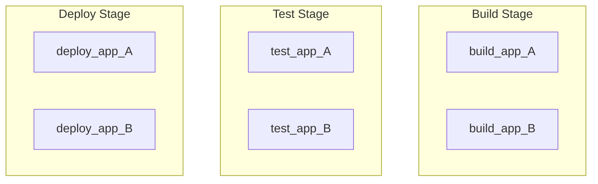
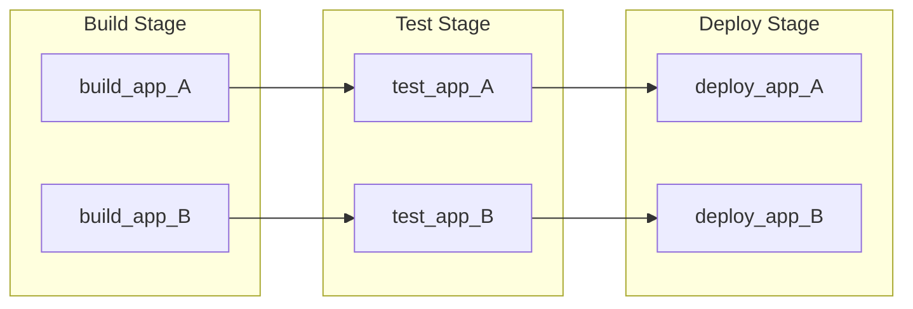
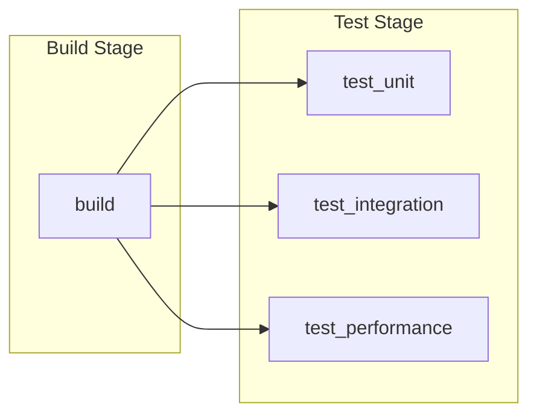
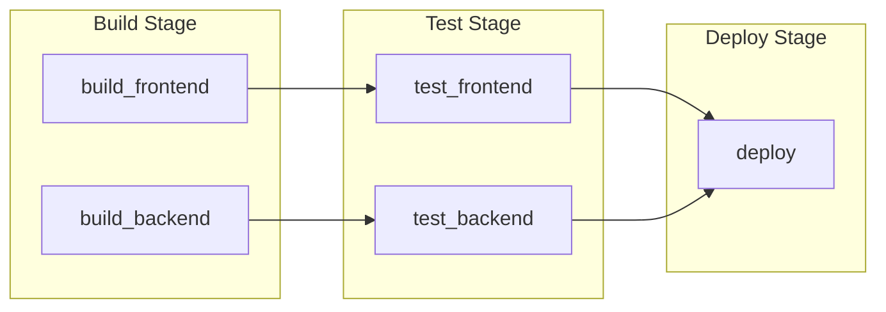
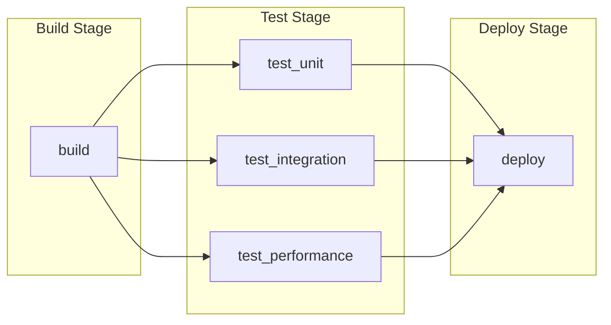
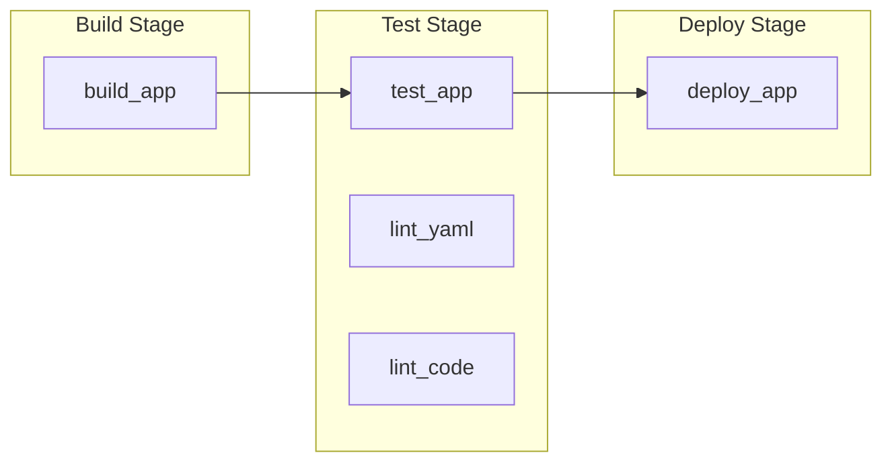
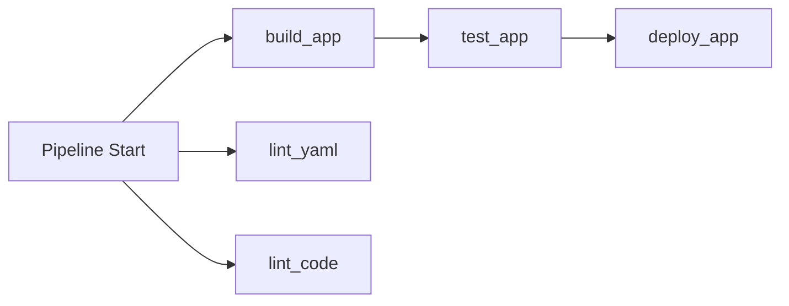



- プラン: Free、Premium、Ultimate
- 提供形態: GitLab.com、GitLab Self-Managed、GitLab Dedicated



[`needs`](_index.md#needs)キーワードを使用して、ジョブの依存関係をパイプラインで指定します。ジョブは、パイプラインステージに関わらず、その依存関係が完了するとすぐに開始されます。これにより、ジョブを以前より早く実行し、不要な待機を回避できます。

ユースケース:

- モノレポ: 独立したサービスを並列実行パスでビルドするしてテストします。
- マルチプラットフォームビルド: すべてのビルドが完了するのを待たずに、異なるプラットフォーム向けにコンパイルします。
- より高速なフィードバック: テスト結果とエラーを以前より早く取得します。

> [!note]
> `needs: project`と`needs: pipeline`キーワードは、ジョブの依存関係を指定するためには使用されません。他のパイプラインからアーティファクトをフェッチするには、[`needs: project`](_index.md#needsproject)を使用します。アップストリームパイプラインのステータスをミラーするには、[`needs: pipeline`](_index.md#needspipeline)を使用します。

## `needs`の仕組み {#how-needs-works}

デフォルトでは、ジョブはステージで実行されます。ジョブは、開始する前に、以前のステージ内のすべてのジョブが完了するのを待ちます。

`needs`を使用すると、どのジョブがどのジョブに依存するかを正確に指定できます。その依存関係が完了するとすぐにジョブが開始されます。これは、以前のステージにある他のジョブがまだ実行中でも同様です。これにより、一種の[有向非巡回グラフ (DAG)](https://en.wikipedia.org/wiki/Directed_acyclic_graph)パイプラインが作成されます。

ステージ化されたジョブとジョブの`needs`依存関係を同じパイプライン内で混在させることができます。

さらに、以前のジョブやステージの完了を待たずに、ジョブをすぐに実行するように`needs: []`を使用できます。ソースコードビルド結果に依存しないLintジョブやスキャナーは、すぐに実行できるため、即座に実行することが一般的です。

## `needs`とステージのみを使用するジョブとの比較 {#needs-compared-to-jobs-that-only-use-stages}

`needs`を使用する利点を示すために、6つのジョブを持つパイプラインを設定する2つの方法を比較できます。

このパイプラインには、ステージに編成された6つのジョブがあります。`needs`がないと、一部のジョブが独立していても、次のステージが開始する前に、ステージ内のすべてのジョブが完了する必要があります:

```yaml
stages:
  - build
  - test
  - deploy

build_app_A:
  stage: build
  script: echo "Building A..."

build_app_B:
  stage: build
  script: echo "Building B..."

test_app_A:
  stage: test
  script: echo "Testing A..."

test_app_B:
  stage: test
  script: echo "Testing B..."

deploy_app_A:
  stage: deploy
  script: echo "Deploying A..."

deploy_app_B:
  stage: deploy
  script: echo "Deploying B..."
```



この例では、`build`ステージ内のすべてのジョブが完了するまで、テストジョブやデプロイジョブは実行されません。Aジョブの実行に時間がかかる場合、Bのテストジョブおよびデプロイジョブは、Aジョブが完了するのを待っている間に遅延する可能性があります。

`needs`を使用すると、2つの独立した実行パスを定義できます。各ジョブは、実際に必要とするジョブのみに依存するため、2つのパス間で並列実行が可能です:

```yaml
stages:
  - build
  - test
  - deploy

build_app_A:
  stage: build
  script: echo "Building A..."

build_app_B:
  stage: build
  script: echo "Building B..."

test_app_A:
  stage: test
  needs: ["build_app_A"]
  script: echo "Testing A..."

test_app_B:
  stage: test
  needs: ["build_app_B"]
  script: echo "Testing B..."

deploy_app_A:
  stage: deploy
  needs: ["test_app_A"]
  script: echo "Deploying A..."

deploy_app_B:
  stage: deploy
  needs: ["test_app_B"]
  script: echo "Deploying B..."
```



この例では、`build_app_A`がまだ実行中であっても、`build_app_B`が正常に完了するとすぐに`test_app_B`が実行されます。同様に、`build_app_A`が完了する前に`deploy_app_B`が実行され、デプロイされる可能性があります。

### ジョブ間の依存関係を表示 {#view-dependencies-between-jobs}

ジョブ間の依存関係は、パイプライングラフで確認できます。

この表示を有効にするには、パイプラインの詳細ページから次の手順を実行します:

- **ジョブの依存関係**を選択します。
- オプション。オプション。**依存関係を表示**を切替て、ジョブがどのようにリンクされているかを表示します。


## `needs`の例 {#needs-examples}

`needs`を使用して、ジョブ間の依存関係を作成し、ジョブの開始待機時間を短縮します。パターンには、ファンアウト、ファンイン、ダイヤモンド依存関係が含まれます。

### ファンアウト {#fan-out}

ファンアウトジョブ依存関係グラフを作成するには、複数のジョブが1つのジョブに依存するように設定します。

例: 

```yaml
stages:
  - build
  - test

build:
  stage: build
  script: echo "Building..."

test_unit:
  stage: test
  needs: ["build"]
  script: echo "Unit tests..."

test_integration:
  stage: test
  needs: ["build"]
  script: echo "Integration tests..."

test_performance:
  stage: test
  needs: ["build"]
  script: echo "Performance tests..."
```



### ファンイン {#fan-in}

ファンイン依存関係グラフを作成するには、1つのジョブが複数のジョブの完了を待機するように設定します。例: 

```yaml
stages:
  - build
  - test
  - deploy

build_frontend:
  stage: build
  script: echo "Building frontend..."

build_backend:
  stage: build
  script: echo "Building backend..."

test_frontend:
  stage: test
  needs: ["build_frontend"]
  script: echo "Testing frontend..."

test_backend:
  stage: test
  needs: ["build_backend"]
  script: echo "Testing backend..."

deploy:
  stage: deploy
  needs: ["test_frontend", "test_backend"]
  script: echo "Deploying..."
```



### ダイヤモンド依存関係 {#diamond-dependency}

ダイヤモンド依存関係グラフを作成するには、ファンアウトとファンインを組み合わせます。1つのジョブが複数のジョブにファンアウトし、それが再び1つのジョブにファンインします。例: 

```yaml
stages:
  - build
  - test
  - deploy

build:
  stage: build
  script: echo "Building..."

test_unit:
  stage: test
  needs: ["build"]
  script: echo "Unit tests..."

test_integration:
  stage: test
  needs: ["build"]
  script: echo "Integration tests..."

test_performance:
  stage: test
  needs: ["build"]
  script: echo "Performance tests..."

deploy:
  stage: deploy
  needs: ["test_unit", "test_integration", "test_performance"]
  script: echo "Deploying..."
```



### 即時開始 {#immediate-start}

`needs: []`を使用して、パイプラインが作成されたときに、他のジョブやステージを待たずに、ジョブをすぐに開始するように設定します。これは、すぐに実行できるものの、`test`のように、より後のステージに表示されるべきLintするツールやスキャンツールに使用します。

例: 

```yaml
stages:
  - build
  - test
  - deploy

build_app:
  stage: build
  script: echo "Building app..."

test_app:
  stage: test
  script: echo "Testing app..."

lint_yaml:
  stage: test
  needs: []
  script: echo "Linting YAML..."

lint_code:
  stage: test
  needs: []
  script: echo "Linting code..."

deploy_app:
  stage: deploy
  script: echo "Deploying app..."
```

パイプラインビューには、ステージごとにグループ化されたジョブが表示されます:



ジョブは可能な限り早く実行を開始します:



この例では、`lint_yaml`と`lint_code`は`needs: []`を使用してすぐに開始し、`build_app`や`test`ステージの完了を待ちません。`deploy_app`は`needs`を使用しないため、開始する前に以前のステージにあるすべてのジョブが完了するのを待ちます。

## ステージなしのパイプライン {#stageless-pipelines}

`stage`および`stages`キーワードを省略し、`needs`のみを使用してジョブの順序を定義できます。`stage`キーワードがないすべてのジョブは、デフォルトの`test`ステージで実行されます:

```yaml
compile:
  script: echo "Compiling..."

unit_tests:
  needs: ["compile"]
  script: echo "Running unit tests..."

integration_tests:
  needs: ["compile"]
  script: echo "Running integration tests..."

package:
  needs: ["unit_tests", "integration_tests"]
  script: echo "Packaging..."
```

このパイプラインの構造を表示するには、パイプラインの詳細ページから[**ジョブの依存関係**](#view-dependencies-between-jobs)を選択します。デフォルトビューを使用する場合、すべてのジョブは`test`ステージにまとめられます。

## オプションの依存関係 {#optional-dependencies}

`needs`の`optional: true`を使用すると、パイプライン内にジョブが存在する場合にのみジョブに依存できます。このオプションを使用して、`needs`と[`rules`](_index.md#rules)を組み合わせたときに実行される場合とされない場合があるジョブを処理します。

例: 

```yaml
stages:
  - build
  - test
  - deploy

build:
  stage: build
  script: echo "Building..."

test:
  stage: test
  needs: ["build"]
  script: echo "Testing..."

test_optional:
  stage: test
  rules:
    - if: $RUN_OPTIONAL_TESTS == "true"
  script: echo "Optional tests..."

deploy:
  stage: deploy
  needs:
    - job: "test"
    - job: "test_optional"
      optional: true
  script: echo "Deploying..."
```

この例では: 

- `deploy`は以下に依存します:
  - `test`。パイプライン内に常に存在します。
  - `test_optional`。`RUN_OPTIONAL_TESTS`が`true`の場合にのみパイプライン内に存在します。
- `RUN_OPTIONAL_TESTS`が次のとき:
  - `true`の場合、`test_optional`はパイプラインに存在せず、`test`が完了した後に`deploy`が実行されます。
  - `false`の場合、`test_optional`はパイプラインに存在し、`deploy`は`test`と`test_optional`の両方が完了するのを待ちます。

`optional: true`がないと、`deploy`ジョブが`test_optional`を期待しているにもかかわらず、それがパイプラインに存在しないため、パイプラインの作成が失敗します。

## `needs`と`parallel:matrix`の組み合わせ {#combine-needs-with-parallelmatrix}

`needs`キーワードは`parallel:matrix`と連携して、[並列化されたジョブを指す依存関係を定義します](../jobs/job_control.md#specify-needs-between-parallelized-jobs)。

## トラブルシューティング {#troubleshooting}

### エラー: `'job' does not exist in the pipeline` {#error-job-does-not-exist-in-the-pipeline}

`needs`と`rules`を組み合わせると、パイプラインの作成が失敗し、次のエラーが表示されることがあります:

```plaintext
'unit_tests' job needs 'compile' job, but 'compile' does not exist in the pipeline.
This might be because of the only, except, or rules keywords. To need a job that
sometimes does not exist in the pipeline, use needs:optional.
```

このエラーは、`needs`がパイプラインに存在しない別のジョブに設定されている1つのジョブによって引き起こされます。この問題を修正するには、次のいずれかを実行する必要があります:

- [`optional: true`](#optional-dependencies)をジョブの依存関係に追加して、必要なジョブがパイプラインに存在しない場合に無視されるようにします。
- `rules`設定を更新して、必要なジョブが常に実行されるようにします。

例: 

```yaml
# Method 1: Job with rules that may not exist
compile:
  stage: build
  rules:
    - if: $COMPILE == "true"
  script: echo "Compiling..."

unit_tests:
  stage: test
  needs:
    - job: "compile"        # If $COMPILE == "false", the `compile` job is not added
      optional: true        # to the pipeline and this needs is ignored.
  script: echo "Running unit tests..."

# Method 2: Job with rules that always matches the dependent job
build:
  stage: build
  rules:
    - if: $BUILD == "true"
  script: echo "Building..."

test:
  stage: test
  rules:                    # Both jobs have identical `rules`, and will always exist
    - if: $BUILD == "true"  # in the pipeline together.
  needs: ["build"]
  script: echo "Testing..."
```
