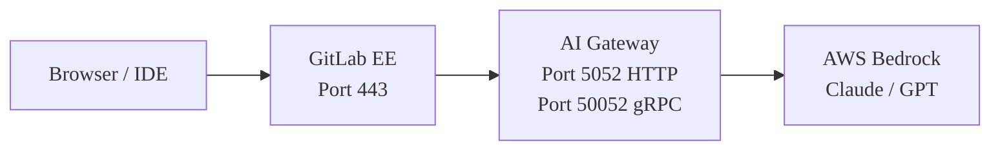



- プラン: Premium、Ultimate
- 提供形態: GitLab Self-Managed



このガイドでは、EC2インスタンスから動作するDuo Agent Platform (DAP)フローまで、AWS Bedrockを使用してセルフホスト型のAIモデルでGitLabをデプロイする手順を説明します。すべてのコマンドはコピー&ペースト可能です。すべてのよくある間違いは文書化されています。

このガイドでは、単一のEC2インスタンス上でGitLab (Docker) とAI Gateway (Docker Compose) を並行して実行し、AWS BedrockをLLMプロバイダーとして使用します。このアーキテクチャは、概念実証および評価デプロイに適しています。

本番環境でのデプロイについては、[リファレンスアーキテクチャ](../../administration/reference_architectures/_index.md)を参照してください。

## 前提条件 {#prerequisites}

開始する前に、以下が必要です:

| 要件 | 詳細 |
|-------------|---------|
| **AWS account** | ターゲット地域 (`us-east-1`推奨) でのBedrockアクセス。 |
| **EC2 instance** | `t3.xlarge`最小 (4 vCPU、16 GB RAM)。`t3.2xlarge` (8 vCPU、32 GB) が本番環境に推奨されます。 |
| **ドメイン名** | EC2インスタンスを指す2つのDNSレコード: `gitlab.example.com`と`aigw.example.com`。 |
| **GitLab license** | PremiumまたはUltimate。Classic Duo機能 (チャット、コード提案) には、[Duo seat assignment](../../subscriptions/subscription-add-ons.md)が必要です。オンラインライセンス (GitLab 18.9以降) を使用するDAPは、[usage-based billing through GitLab Credits](../../subscriptions/gitlab_credits.md)を使用し、Duo Enterpriseシートは必要ありません。オフラインライセンスでDAPを使用する場合は、ELAオプションについてGitLabアカウントチームにお問い合わせください。 |
| **SSH access** | EC2インスタンスへ。 |
| **Security group** | ポート80、443、8443が受信開放されています。 |

## アーキテクチャの概要 {#architecture-overview}



AI Gatewayは、GitLabと並行してサイドカーコンテナとして動作します。組み込みのGitLab NGINXはHTTPSとgRPCのトラフィックをAI Gatewayにプロキシします。AI GatewayはLLMリクエストをAWS Bedrockに転送します。

ポート8443はDAPフローに必要です。DAPはgRPCを使用してAI Gateway Duo Workflow Service (DWS) と通信します。GitLab NGINXは、ポート8443のgRPC TLSをAI GatewayのgRPCポート (50052) にプロキシする必要があります。

## ステップ1: AWSインフラストラクチャをプロビジョニングする {#step-1-provision-aws-infrastructure}

### EC2インスタンスを起動する {#launch-an-ec2-instance}

Ubuntu 22.04以降のインスタンスを以下で起動します:

- **Instance type:** `t3.xlarge` (最小) または`t3.2xlarge` (推奨)
- **ストレージ:** 100 GB gp3
- **AMI:** Ubuntu Server 22.04 LTSまたは24.04

### Security groupを設定する {#configure-the-security-group}

これらの受信ポートを開放します:

| ポート | プロトコル | ソース | 目的 |
|------|----------|--------|---------|
| 22 | TCP | あなたのIP | SSH |
| 80 | TCP | `0.0.0.0/0` | HTTP (Let's Encrypt検証) |
| 443 | TCP | `0.0.0.0/0` | HTTPS (GitLabおよびAI Gatewayプロキシ) |
| 8443 | TCP | `0.0.0.0/0` | gRPC TLS (DAPフロー) |

IDEクライアント (VS Code、JetBrains) は、DAPフローのためにポート8443に直接接続します。ユーザーがVPNの背後にいる場合、送信元IP範囲を制限できます。

### Dockerをインストールする {#install-docker}

インスタンスにSSHでログインし、Dockerをインストールします:

```shell
sudo apt-get update && sudo apt-get upgrade -y

# Install Docker (official method)
curl --fail --silent --show-error --location "https://get.docker.com" | sudo bash

# Install Docker Compose plugin
sudo apt-get install -y docker-compose-plugin

# Verify
sudo docker --version
sudo docker compose version
```

### DNSをセットアップする {#set-up-dns}

EC2パブリックIPを指す2つのAレコードを作成します:

| レコード | タイプ | 値 |
|--------|------|-------|
| `gitlab.example.com` | A | あなたのEC2パブリックIP |
| `aigw.example.com` | A | あなたのEC2パブリックIP |

両方のドメインは同じIPを指します。GitLab NGINXはホスト名に基づいてトラフィックをルーティングします。

DNS伝播を検証します:

```shell
dig gitlab.example.com +short
dig aigw.example.com +short
```

両方のコマンドはあなたのEC2パブリックIPを返すべきです。

## ステップ2: GitLabをインストールする {#step-2-install-gitlab}

### データディレクトリを作成する {#create-data-directories}

```shell
sudo mkdir -p /srv/gitlab/config /srv/gitlab/logs /srv/gitlab/data
```

### GitLabを実行する {#run-gitlab}

このコマンドは、Let's Encryptを使用してGitLab EEをインストールして起動します:

```shell
sudo docker run --detach \
  --hostname gitlab.example.com \
  --env GITLAB_OMNIBUS_CONFIG="
    external_url 'https://gitlab.example.com';
    letsencrypt['enable'] = true;
    letsencrypt['auto_renew'] = true;
    letsencrypt['contact_emails'] = ['you@example.com'];
    gitlab_rails['gitlab_shell_ssh_port'] = 2222;
  " \
  --publish 443:443 \
  --publish 80:80 \
  --publish 2222:22 \
  --publish 8443:8443 \
  --name gitlab \
  --restart always \
  --volume /srv/gitlab/config:/etc/gitlab \
  --volume /srv/gitlab/logs:/var/log/gitlab \
  --volume /srv/gitlab/data:/var/opt/gitlab \
  --shm-size 256m \
  gitlab/gitlab-ee:latest
```

> [!note]
> `--publish 8443:8443`フラグはDAP (gRPC TLS) に必要です。これを省略すると、DAPフローはサイレントに失敗します。実行中のコンテナにポートを追加することはできません。再作成する必要があります。

### GitLabが起動するまで待つ {#wait-for-gitlab-to-start}

GitLabは初回実行時に初期化に3～5分かかります:

```shell
until curl --silent --fail "https://gitlab.example.com/-/health" > /dev/null 2>&1; do
  echo "Waiting for GitLab to start..."
  sleep 10
done
echo "GitLab is up!"
```

### rootパスワードを設定する {#set-the-root-password}

```shell
sudo docker exec gitlab cat /etc/gitlab/initial_root_password
```

`https://gitlab.example.com`でユーザー名`root`とコマンド出力のパスワードを使用してサインインします。すぐに変更してください。

### ライセンスを適用する {#apply-your-license}

1. **管理者 > サブスクリプション**に移動します。
1. GitLabライセンスファイルをアップロードします。

## ステップ3: AI Gatewayをデプロイする {#step-3-deploy-the-ai-gateway}

### 正しいイメージタグを見つける {#find-the-correct-image-tag}

AI GatewayイメージはDocker Hubの`gitlab/model-gateway`にあります。GitLabバージョンに一致するバージョンタグを使用する必要があります。

> [!note]
> `latest`タグはありません。`gitlab/model-gateway:latest`を使用すると、イメージが見つからないエラーで失敗します。

タグフォーマット: `self-hosted-v{MAJOR}.{MINOR}.{PATCH}-ee`

利用可能なタグをチェックします:

```shell
curl --silent "https://hub.docker.com/v2/repositories/gitlab/model-gateway/tags?page_size=10&ordering=last_updated" | \
  python3 -c "import sys,json; [print(t['name'], '  ', t['last_updated'][:10]) for t in json.load(sys.stdin)['results']]"
```

### JWT署名キーを生成する {#generate-a-jwt-signing-key}

AI GatewayはDWSリクエストを認証するためにJWTキーが必要です:

```shell
sudo mkdir -p /srv/enterprise-sidecar
openssl genrsa -out /srv/enterprise-sidecar/duo_workflow_jwt.key 2048
```

### 環境ファイルを作成する {#create-the-environment-file}

`/srv/enterprise-sidecar/.env`を作成します:

```shell
cat << 'EOF' | sudo tee /srv/enterprise-sidecar/.env
# AWS Bedrock credentials
AWS_ACCESS_KEY_ID=<your-aws-access-key>
AWS_SECRET_ACCESS_KEY=<your-aws-secret-key>
AWS_REGION=us-east-1

# AI Gateway: JWT signing key (for DWS authentication)
AIGW_JWT_SIGNING_KEY=<paste contents of duo_workflow_jwt.key>
EOF
```

環境ファイルに制限付き権限を設定します:

```shell
sudo chmod 600 /srv/enterprise-sidecar/.env
```

JWTキーを環境ファイルに埋め込むには、`\n`のリテラルで改行を置き換えて、キーが1行に収まるようにします:

```shell
JWT_KEY=$(sudo awk '{printf "%s\\n", $0}' /srv/enterprise-sidecar/duo_workflow_jwt.key)
sudo sed -i "s|AIGW_JWT_SIGNING_KEY=.*|AIGW_JWT_SIGNING_KEY=${JWT_KEY}|" /srv/enterprise-sidecar/.env
```

### Docker Composeファイルを作成する {#create-the-docker-compose-file}

`/srv/enterprise-sidecar/docker-compose.yml`を作成します:

```yaml
services:
  ai-gateway:
    image: gitlab/model-gateway:self-hosted-v<VERSION>-ee  # Replace <VERSION> with your GitLab version (for example, 18.11.0)
    container_name: ai-gateway
    restart: unless-stopped
    environment:
      AIGW_GITLAB_URL: https://gitlab.example.com
      AIGW_GITLAB_API_URL: https://gitlab.example.com/api/v4/
      DUO_WORKFLOW_SELF_SIGNED_JWT__SIGNING_KEY: ${AIGW_JWT_SIGNING_KEY}
      AWS_ACCESS_KEY_ID: ${AWS_ACCESS_KEY_ID}
      AWS_SECRET_ACCESS_KEY: ${AWS_SECRET_ACCESS_KEY}
      AWS_REGION: ${AWS_REGION:-us-east-1}
      AIGW_LOGGING__LEVEL: INFO
      DUO_WORKFLOW_LOGGING__LEVEL: INFO
    ports:
      - "5052:5052"
      - "50052:50052"
    deploy:
      resources:
        limits:
          memory: 2048M
        reservations:
          memory: 512M
    healthcheck:
      test: ["CMD", "curl", "--silent", "--fail", "http://localhost:5052/monitoring/healthz"]
      interval: 30s
      timeout: 10s
      retries: 3
      start_period: 30s
```

### AI Gatewayを起動する {#start-the-ai-gateway}

```shell
cd /srv/enterprise-sidecar
sudo docker compose up -d
```

### AI Gatewayのヘルスチェックを検証する {#verify-ai-gateway-health}

```shell
# Check container is running
sudo docker ps | grep ai-gateway

# Check HTTP health endpoint (empty JSON means healthy)
curl --silent "http://localhost:5052/monitoring/healthz"

# Check logs for errors
sudo docker logs ai-gateway --tail 20
```

## ステップ4: AI GatewayのTLSを設定する {#step-4-configure-tls-for-the-ai-gateway}

AI GatewayにはHTTPS (チャット、コード提案用) とgRPC TLS (DAPフロー用) が必要です。組み込みのGitLab NGINXをリバースプロキシとして使用し、そのLet's Encrypt証明書を共有します。

### AI GatewayサブドメインをLet's Encryptに追加する {#add-the-ai-gateway-subdomain-to-lets-encrypt}

GitLab設定を編集します:

```shell
sudo docker exec -it gitlab editor /etc/gitlab/gitlab.rb
```

`letsencrypt`セクションを見つけて`alt_names`を追加します:

```ruby
letsencrypt['alt_names'] = ['aigw.example.com']
```

他の`alt_names` (レジストリサブドメインなど) がすでにある場合は、`aigw.example.com`を既存の配列に追加します:

```ruby
letsencrypt['alt_names'] = ['registry.example.com', 'aigw.example.com']
```

新しいSANを含めるために証明書を更新します:

```shell
sudo docker exec gitlab gitlab-ctl renew-le-certs
```

証明書にAI Gatewayサブドメインが含まれていることを検証します:

```shell
echo | openssl s_client -connect gitlab.example.com:443 2>/dev/null | \
  openssl x509 -noout -ext subjectAltName
```

`DNS:aigw.example.com`が出力に表示されるはずです。

### NGINXプロキシ設定を作成する {#create-the-nginx-proxy-configuration}

ホスト上でプロキシ設定ファイルを作成します:

```shell
cat << 'NGINX' | sudo tee /srv/gitlab/config/nginx/aigw-proxy.conf
# AI Gateway reverse proxy: HTTPS for HTTP API, gRPC TLS for DAP

# HTTP API: Duo Chat, Code Suggestions
server {
    listen 443 ssl;
    server_name aigw.example.com;

    ssl_certificate /etc/gitlab/ssl/gitlab.example.com.crt;
    ssl_certificate_key /etc/gitlab/ssl/gitlab.example.com.key;
    ssl_protocols TLSv1.2 TLSv1.3;
    ssl_ciphers HIGH:!aNULL:!MD5;

    location / {
        proxy_pass http://172.17.0.1:5052;
        proxy_set_header Host $host;
        proxy_set_header X-Real-IP $remote_addr;
        proxy_set_header X-Forwarded-For $proxy_add_x_forwarded_for;
        proxy_set_header X-Forwarded-Proto https;
        proxy_read_timeout 600s;
        proxy_send_timeout 600s;
    }

    location /monitoring/healthz {
        proxy_pass http://172.17.0.1:5052/monitoring/healthz;
        access_log off;
    }
}

# gRPC TLS: DAP / Duo Agent Platform flows
server {
    listen 8443 ssl http2;
    server_name aigw.example.com;

    ssl_certificate /etc/gitlab/ssl/gitlab.example.com.crt;
    ssl_certificate_key /etc/gitlab/ssl/gitlab.example.com.key;
    ssl_protocols TLSv1.2 TLSv1.3;
    ssl_ciphers HIGH:!aNULL:!MD5;

    location / {
        grpc_pass grpc://172.17.0.1:50052;
        grpc_read_timeout 600s;
        grpc_send_timeout 600s;
    }
}
NGINX
```

アドレス`172.17.0.1`はDockerのデフォルトブリッジゲートウェイIPです。GitLabコンテナ内から、このIPはホストマシンおよびAI Gatewayコンテナの公開ポートに到達します。

### GitLab NGINXに設定を含める {#include-the-configuration-in-the-gitlab-nginx}

設定ファイルをコンテナ内のNGINXランタイムディレクトリにコピーします:

```shell
sudo docker exec gitlab mkdir -p /var/opt/gitlab/nginx/conf
sudo docker cp /srv/gitlab/config/nginx/aigw-proxy.conf \
  gitlab:/var/opt/gitlab/nginx/conf/aigw-proxy.conf
```

> [!note]
> `/etc/gitlab/nginx/`にファイルを置かないでください。`gitlab.rb`内の`custom_nginx_config`によって参照されるファイルのみが読み込まれます。ランタイムディレクトリは`/var/opt/gitlab/nginx/conf/`です。

`gitlab.rb`にincludeディレクティブを追加します:

```shell
sudo docker exec -it gitlab editor /etc/gitlab/gitlab.rb
```

`nginx['custom_nginx_config']`行を見つけるか追加します:

```ruby
nginx['custom_nginx_config'] = "include /var/opt/gitlab/nginx/conf/aigw-proxy.conf;"
```

カスタムNGINX設定 (KeyCloakプロキシなど) がすでにある場合は、セミコロンで連結します:

```ruby
nginx['custom_nginx_config'] = "include /var/opt/gitlab/nginx/conf/keycloak-proxy.conf; include /var/opt/gitlab/nginx/conf/aigw-proxy.conf;"
```

### GitLabを再構成する {#reconfigure-gitlab}

```shell
sudo docker exec gitlab gitlab-ctl reconfigure
```

### TLSを検証する {#verify-tls}

```shell
# HTTPS for AI Gateway HTTP API
curl --silent "https://aigw.example.com/monitoring/healthz"
# Expected: {}

# gRPC TLS for DAP
openssl s_client -connect aigw.example.com:8443 < /dev/null 2>/dev/null | \
  grep "Verify return code"
# Expected: Verify return code: 0 (ok)
```

## ステップ5: AWS Bedrockに接続する {#step-5-connect-aws-bedrock}

### Bedrock用のIAMユーザーを作成する {#create-an-iam-user-for-bedrock}

AWSコンソールで、**IAM > ユーザー > ユーザーの作成**に移動します:

- **名前:** `gitlab-bedrock` (または類似の名称)
- **権限:**`AmazonBedrockFullAccess`管理ポリシーをアタッチします

アクセスキーを作成します（ユースケース: 「AWS外で実行されるアプリケーション」）。**アクセスキーID**と**シークレットアクセスキー**を保存します。

代替案として、EC2インスタンスにBedrock権限を持つIAMロールがある場合、アクセスキーを省略できます。AI Gatewayはインスタンスプロファイルを自動的に使用します。

### BedrockでAnthropicモデルをアクティブ化する {#activate-anthropic-models-on-bedrock}

このステップは必須であり、ほとんどの人が予期しないものです:

1. AWSコンソールで、**AWS console > Amazon Bedrock > Providers > Anthropic**に移動します。
1. **Submit use case details**ユースケースの詳細フォームに記入します。
1. アクティブ化まで約15分待ちます。

> [!note]
> このフォームがない場合、AnthropicモデルへのすべてのBedrock APIコールは以下を返します: `"Model use case details have not been submitted for this account."`古い「Model access」ページは廃止されました。モデルは初回呼び出し時に自動的に有効になりますが、Anthropicはユースケースフォームが必要です。

### モデルの推論プロファイルIDを見つける {#find-your-models-inference-profile-id}

新しいClaudeモデル (Claude 4.5 Sonnet以降) には、直接のモデルIDではなく、**inference profile ID**が必要です。

```shell
aws bedrock list-inference-profiles --region us-east-1 --output json | \
  python3 -c "
import sys, json
profiles = json.load(sys.stdin)['inferenceProfileSummaries']
for p in profiles:
    if 'claude' in p['inferenceProfileId'].lower():
        print(p['inferenceProfileId'])
"
```

> [!note]
> `us.`プレフィックス (例: `us.anthropic.claude-sonnet-4-6`) を使用し、基本モデルID (`anthropic.claude-sonnet-4-6`) は使用しないでください。
>
> | モデル識別子 | 結果 |
> |---|---|
> | `bedrock/anthropic.claude-sonnet-4-6` | **400 Bad Request**: 「オンデマンドスループットはサポートされていません」 |
> | `bedrock/us.anthropic.claude-sonnet-4-6` | 動作します |
>
> `us.`プレフィックスは米国のみの地域にルーティングします。`global.`プレフィックスは有効なすべての地域にルーティングします。

### 認証情報を使用してAI Gatewayを再起動する {#restart-the-ai-gateway-with-credentials}

まだ行っていない場合は、AWS認証情報を`/srv/enterprise-sidecar/.env`に追加してから再起動します:

```shell
cd /srv/enterprise-sidecar
sudo docker compose down ai-gateway
sudo docker compose up -d ai-gateway
```

## ステップ6: GitLab管理者設定を設定する {#step-6-configure-gitlab-admin-settings}

### AI Gateway URLを設定する {#set-ai-gateway-urls}

**管理者 > GitLab Duo**に移動し、**設定の変更**を選択します。

| 設定 | 値 |
|---------|-------|
| 接続方法 | GitLab Self-Managedを介した間接接続 |
| ローカルAI Gateway URL | `https://aigw.example.com` |
| ローカルDAPサービスURL | `aigw.example.com:8443` |
| AI Gatewayリクエストタイムアウト | `300` (秒) |

> [!note]
> Bedrockの場合、デフォルトの60秒のタイムアウトは短すぎます。単一のDAPフローには5～10分かかる場合があります。これを少なくとも300に設定します。

**変更を保存**を選択します。

### ヘルスチェックを実行する {#run-the-health-check}

同じページで、**ヘルスチェックを実行する**を選択します。4つの緑色のチェックが表示されるはずです:

| チェック | 予想 |
|-------|----------|
| AIゲートウェイ | 接続済み |
| ネットワーク | 到達可能 |
| コード提案 | 利用可能 |
| DAP | 利用可能 |

### セルフホストモデルを追加する {#add-a-self-hosted-model}

**管理者 > GitLab Duo > GitLab Duoのモデルを設定する**に移動します。

**セルフホストモデルの追加**を選択し、以下を記入します:

| フィールド | 値 |
|-------|-------|
| デプロイ名 | `Bedrock Claude Sonnet 4.6` (または説明的な名前) |
| プラットフォーム | `Amazon Bedrock` |
| モデルファミリー | `Claude` |
| モデル識別子 | `bedrock/us.anthropic.claude-sonnet-4-6` |

> [!note]
> モデル識別子は`bedrock/`で始まる必要があります。

**接続をテスト**を選択します。以下が表示されるはずです: *「セルフホストモデルへの接続に成功しました。」*

「400 Bad Request」が表示される場合、誤ったモデル識別子を使用しています。直接のモデルIDではなく、推論プロファイルID (`us.anthropic.claude-sonnet-4-6`) を使用してください。

**Add model**を選択します。

### モデルを機能に割り当てる {#assign-the-model-to-features}

同じページで、**AIネイティブ機能**タブを選択します。

Bedrockを介してルーティングしたい各機能について、ドロップダウンリストからセルフホストモデルを選択します:

| 機能 | 推奨される割り当て |
|---------|----------------------|
| **GitLab Duo Agent Platform > All agents, except Agentic Chat** | Bedrock Claude Sonnet 4.6 |
| **GitLab Duo Agent Platform > エージェントチャット** | Bedrock Claude Sonnet 4.6 |
| コード提案 | GitLab管理 (デフォルト) またはBedrock |
| Chat | GitLab管理 (デフォルト) またはBedrock |
| コードレビュー | GitLab管理 (デフォルト) またはBedrock |

まずDAP機能のみをBedrockに割り当て、チャットとコード提案はGitLab管理のデフォルトのままにします。これにより、日常的なデベロッパーエクスペリエンスを危険にさらすことなく、Bedrock接続を検証することができます。すべてが動作することを確認した後、より多くの機能を切り替えます。

## ステップ7: DAPフローのためにRunnerを登録する {#step-7-register-a-runner-for-dap-flows}

DAPフローはCI/CDパイプラインを作成します。登録済みのランナーがない場合、DAPフローは無期限に保留状態のままになります。

### Runnerをインストールして登録する {#install-and-register-a-runner}

EC2インスタンス (または別のマシン) に、GitLab Runnerをインストールします:

```shell
curl --location "https://packages.gitlab.com/install/repositories/runner/gitlab-runner/script.deb.sh" | sudo bash
sudo apt-get install -y gitlab-runner
```

GitLabインスタンスにRunnerを登録します。**管理者 > CI/CD > Runners**に移動し、**New instance runner**を選択して登録トークンを取得し、以下を実行します:

```shell
sudo gitlab-runner register \
  --url "https://gitlab.example.com" \
  --token "<REGISTRATION_TOKEN>" \
  --executor docker \
  --docker-image "ruby:3.2" \
  --tag-list "docker" \
  --description "Docker runner for DAP"
```

詳細については、[GitLab Runnerのインストール](https://docs.gitlab.com/runner/install/)と[Runnerの作成と登録](../../tutorials/create_register_first_runner/_index.md)を参照してください。

> [!note]
> DAPフローはDocker-in-Dockerワークフローを使用します。Runnerは`docker` executorを使用する必要があります。

## ステップ8: グループとプロジェクトでDuo機能を有効にする {#step-8-enable-duo-features-on-groups-and-projects}

管理者レベルの設定 (ステップ6) はDuo機能をインスタンス全体で利用可能にしますが、グループとプロジェクトレベルでも有効にする必要があります。

### グループでDuoを有効にする {#enable-duo-on-a-group}

1. グループの**設定 > 一般**に移動します。
1. **権限とグループ機能**を展開します。
1. **GitLab Duoの機能**で、**Enable GitLab Duo features**を選択します。
1. DAPを使用するには、**Enable experiment and beta features**と**フロー実行を許可** (有効にしたいフロータイプをチェック) も選択します。
1. **変更を保存**を選択します。

詳細については、[GitLab Duoの有効化または無効化](../../user/gitlab_duo/turn_on_off.md)を参照してください。

### プロジェクトでDuoを有効にする {#enable-duo-on-a-project}

1. プロジェクトの**設定 > 一般**に移動します。
1. **可視性、プロジェクトの機能、権限**を展開します。
1. **GitLab Duo**で、**Use GitLab Duo features**を有効にします。
1. **変更を保存**を選択します。

詳細については、[GitLab Duoの有効化または無効化](../../user/gitlab_duo/turn_on_off.md)を参照してください。

## ステップ9: エンドツーエンドを検証する {#step-9-verify-end-to-end}

### ヘルスチェック {#health-checks}

```shell
# AI Gateway HTTP health
curl --silent "https://aigw.example.com/monitoring/healthz"
# Expected: {}

# gRPC TLS connectivity
openssl s_client -connect aigw.example.com:8443 < /dev/null 2>/dev/null | \
  grep "Verify return code"
# Expected: Verify return code: 0 (ok)
```

ブラウザで**管理者 > GitLab Duo**に移動し、**設定の変更**を選択し、次に**ヘルスチェックを実行する**を選択します。4つのチェックすべてが緑色であるはずです。

### Rake検証タスクを実行する {#run-the-rake-verification-task}

```shell
sudo docker exec gitlab gitlab-rake "gitlab:duo:verify_self_hosted_setup[your_username]"
```

これにより、ライセンス、機能フラグ、AI Gateway接続、およびモデル設定の完全なチェーンが検証されます。

> [!note]
> Rakeタスクのモデル接続テストはプレースホルダーURL (`bedrockselfhostedmodel.com`) を使用しており、デプロイが正しく機能している場合でも失敗を報告する可能性があります。他のすべてのチェック (ライセンス、AI Gateway、機能割り当て) は有効です。

### Duo Chatをテストする {#test-duo-chat}

> [!note]
> Bedrockを使用したDuo Chatは、一部のAI Gatewayバージョンで400エラー (`"This model does not support assistant message prefill"`) を返す場合があります。これはDuo Chatのみに影響します。DAPフローは異なるコードパスを使用し、正しく動作します。このエラーが表示された場合は、チャットをGitLab管理モデルのままにし、DAP機能にのみBedrockを使用してください。

1. GitLabインスタンスで任意のプロジェクトを開きます。
1. **Duo Chat**アイコンを選択します。
1. 「マージリクエストとは何ですか?」のような簡単な質問をします。
1. 応答があることを検証します。

BedrockアクティビティのAI Gatewayログを監視します:

```shell
sudo docker logs -f ai-gateway 2>&1 | grep -i "litellm\|bedrock\|chat"
```

### DAPフローをテストする {#test-a-dap-flow}

これが実際のテストです。Bedrock上でDuo Agent Platformフローをエンドツーエンドで実行します:

1. いくつかのコードを含むプロジェクトを作成または開きます。
1. イシューを作成します (例: 「ログインフォームに入力検証を追加する」)。
1. イシューページで、**Duo > Start workflow**を選択します。
1. 待ちます。Bedrockを使用するDAPフローは通常3～10分かかります。
1. パイプラインをチェックします: **ビルド > パイプライン**。`source: duo_workflow`を探します。

フロー中にAI Gatewayログを監視します:

```shell
sudo docker logs -f ai-gateway 2>&1 | grep -i "workflow\|bedrock\|litellm"
```

DAPフロー中の予想されるログ出力:

```plaintext
LiteLLM completion() model= us.anthropic.claude-sonnet-4-6; provider = bedrock
```

> [!note]
> フローが約10秒で完了する場合、何かが間違っています。正常なフローは秒単位ではなく分単位かかります。AI Gatewayログでエラーをチェックします。

## ステップ10: モニタリング (オプション) {#step-10-monitoring-optional}

### AI GatewayPrometheusメトリクス {#ai-gateway-prometheus-metrics}

AI Gatewayは2つのポートでメトリクスを公開します:

| ポート | エンドポイント | コンテンツ |
|------|----------|---------|
| 8082 | `/metrics` | AI Gateway (FastAPI) メトリクス: リクエスト数、レイテンシ |
| 8083 | `/metrics` | DWSメトリクス: gRPCコール数 |

これらをPrometheusスクレイピングのために公開するには、`docker-compose.yml`ポートに追加します:

```yaml
ports:
  - "5052:5052"
  - "50052:50052"
  - "8082:8082"
  - "8083:8083"
```

そして、対応する環境変数を追加します:

```yaml
environment:
  AIGW_FASTAPI__METRICS_HOST: "0.0.0.0"
  AIGW_FASTAPI__METRICS_PORT: "8082"
  PROMETHEUS_METRICS__ADDR: "0.0.0.0"
  PROMETHEUS_METRICS__PORT: "8083"
```

## トラブルシューティング {#troubleshooting}

### AI Gatewayが起動しない {#ai-gateway-does-not-start}

コンテナがすぐに終了するか、ヘルスチェックが一度もパスしない場合:

```shell
sudo docker logs ai-gateway --tail 50
```

| Error | 修正 |
|-------|-----|
| `Image not found` | `latest`タグを使用しました。`self-hosted-v18.9.0-ee`のような明示的なバージョンを使用してください。 |
| `AIGW_GITLAB_URL must be set` | `docker-compose.yml`に環境変数を追加します。 |
| ヘルスチェックで接続が拒否されました | 起動まで30秒待ちます。永続する場合は、ポートバインディングをチェックします。 |

### 管理者UIでのヘルスチェックが失敗する {#health-check-fails-in-admin-ui}

| チェック | 一般的な原因 | 修正 |
|-------|-------------|-----|
| AI Gateway: 未接続 | 管理者設定のURLが間違っています | `https://aigw.example.com`を使用します (`http://`ではありません、ポート5052ではありません)。 |
| ネットワーク: 到達不能 | コンテナ内でDNSが解決されていません | `docker exec gitlab dig aigw.example.com`で検証します。 |
| DAP: 利用不可 | ポート8443が公開されていません | `--publish 8443:8443`を使用してGitLabコンテナを再作成します。 |

### モデル接続テスト時に400 Bad Request {#400-bad-request-when-testing-model-connection}

推論プロファイルIDではなく、直接のモデルIDを使用しています。

`bedrock/anthropic.claude-sonnet-4-6`を`bedrock/us.anthropic.claude-sonnet-4-6`に変更します (`us.`プレフィックスに注意してください)。

### 「モデルのユースケース詳細が提出されていません」 {#model-use-case-details-have-not-been-submitted}

1. AWSコンソールで、**AWS console > Amazon Bedrock > Providers > Anthropic**に移動します。
1. ユースケース詳細フォームを送信します。
1. アクティブ化まで約15分待ちます。
1. 再試行。

### TLSエラー {#tls-errors}

`curl "https://aigw.example.com/monitoring/healthz"`がSSLエラーを返す場合:

1. `gitlab.rb`の`letsencrypt['alt_names']`に`aigw.example.com`を追加したことを検証します。
1. `gitlab-ctl renew-le-certs`を実行したことを検証します。
1. NGINX設定が正しい証明書パスを使用していることを検証します。
1. NGINX設定ファイルが`/var/opt/gitlab/nginx/conf/`にあること (`/etc/gitlab/nginx/`ではないこと) を検証します。
1. `gitlab.rb`の`custom_nginx_config`がファイルを参照していることを検証します。

### DAPフローが開始しない {#dap-flows-do-not-start}

**Start workflow**を選択してもパイプラインが表示されない場合:

1. Runnerが登録されオンラインであることを検証します (**管理者 > CI/CD > Runners**)。[ステップ7](#step-7-register-a-runner-for-dap-flows)を参照してください。
1. グループとプロジェクトでDuoが有効になっていることを検証します。[ステップ8](#step-8-enable-duo-features-on-groups-and-projects)を参照してください。
1. ユーザーがGitLabクレジットまたはDuoシートを持っていることを検証します (**管理者 > GitLab Duo > Seat assignment**)。
1. ポート8443がGitLabコンテナ上で公開されていることを検証します。

### NGINX設定が有効にならない {#nginx-configuration-not-taking-effect}

`gitlab.rb`を編集し、再構成を実行した後:

1. ファイルがランタイムディレクトリに存在することを検証します:

   ```shell
   sudo docker exec gitlab ls -la /var/opt/gitlab/nginx/conf/
   ```

1. 見つからない場合は、再度コピーします:

   ```shell
   sudo docker cp /srv/gitlab/config/nginx/aigw-proxy.conf \
     gitlab:/var/opt/gitlab/nginx/conf/aigw-proxy.conf
   ```

1. NGINXを再構成して再起動します:

   ```shell
   sudo docker exec gitlab gitlab-ctl reconfigure
   sudo docker exec gitlab gitlab-ctl restart nginx
   ```

## 関連トピック {#related-topics}

- [サポートされているモデルとハードウェア要件](../../administration/gitlab_duo_self_hosted/supported_models_and_hardware_requirements.md)
- [サポートされているLLMサービスプラットフォーム](../../administration/gitlab_duo_self_hosted/supported_llm_serving_platforms.md)
- [Duo機能を設定する](../../administration/gitlab_duo_self_hosted/configure_duo_features.md)
- [AI Gatewayをインストールする](../../install/install_ai_gateway.md)
- [GitLab Duo Self-HostedとOllama](aws_googlecloud_ollama.md)
