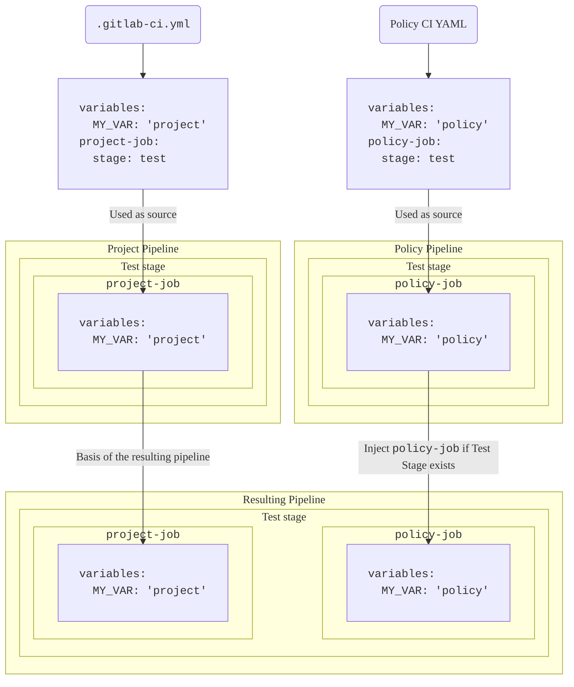



- プラン: Ultimate
- 提供形態: GitLab.com、GitLab Self-Managed、GitLab Dedicated





- GitLab 17.2で`pipeline_execution_policy_type`[フラグ](../../../administration/feature_flags/_index.md)とともに[導入](https://gitlab.com/groups/gitlab-org/-/epics/13266)されました。デフォルトでは有効になっています。
- GitLab 17.3で[一般提供](https://gitlab.com/gitlab-org/gitlab/-/issues/454278)になりました。機能フラグ`pipeline_execution_policy_type`は削除されました。



パイプライン実行ポリシーを使用して、単一の設定で複数のプロジェクトのCI/CDジョブを管理および適用します。

> [!warning]
> 既存の[コンプライアンスパイプライン](../../compliance/compliance_pipelines.md)を同じプロジェクトで移行するまで、パイプライン実行ポリシーを有効にしないでください。両方が設定されている場合、コンプライアンスパイプラインは標準のプロジェクトパイプラインを置き換えますが、パイプライン実行ポリシーは元のプロジェクトパイプラインに基づいて適用されます。これにより、パイプライン実行ポリシーの戦略およびCI/CD設定によって異なる予測不能な動作が発生し、ジョブの重複、パイプラインの失敗、または重要なセキュリティとコンプライアンスチェックの欠落につながる可能性があります。コンプライアンスパイプラインは[非推奨](../../../update/deprecations.md#compliance-pipelines)です。既存のコンプライアンスパイプラインをできるだけ早く移行する必要があります。また、すべての新しい実装にパイプライン実行ポリシーを使用してください。

- <i class="fa-youtube-play" aria-hidden="true"></i> ビデオチュートリアルについては、[Security Policies: Pipeline Execution Policy Type（セキュリティポリシー: パイプライン実行ポリシーの種類）](https://www.youtube.com/watch?v=QQAOpkZ__pA)をご覧ください。

## スキーマ {#schema}



- GitLab 17.4で`suffix`フィールドを[有効](https://gitlab.com/gitlab-org/gitlab/-/merge_requests/159858)にしました。
- GitLab 17.7で、`.pipeline-policy-pre`ステージが完了するまで、それ以降のステージが待機するようにパイプラインの実行を[変更](https://gitlab.com/gitlab-org/gitlab/-/merge_requests/165096)しました。
- [変更され](https://gitlab.com/gitlab-org/gitlab/-/issues/558233)、`.pipeline-policy-pre`ステージが失敗した場合、すべての以降のジョブがスキップされるようになりました (GitLab 18.10にて`ensure_pipeline_policy_pre_succeeds`という[フラグ](../../../administration/feature_flags/_index.md)と共に)。デフォルトでは有効になっています。



パイプライン実行ポリシーを含むYAMLファイルは、`pipeline_execution_policy`キーの下にネストされたパイプライン実行ポリシーのスキーマに一致するオブジェクトの配列で構成されます。セキュリティポリシープロジェクトごとに、`pipeline_execution_policy`キーの下に最大5つのポリシーを設定できます。最初の5つのポリシーの後に設定されたポリシーは適用されません。

新しいポリシーを保存すると、GitLabは[このJSONスキーマ](https://gitlab.com/gitlab-org/gitlab/-/blob/master/ee/app/validators/json_schemas/security_orchestration_policy.json)に照らしてその内容を検証します。[JSONスキーマ](https://json-schema.org/)に精通していない方は、以下のセクションと表を参照してください。

| フィールド | 型 | 必須 | 説明 |
|-------|------|----------|-------------|
| `pipeline_execution_policy` | パイプライン実行ポリシーの`array` | はい | パイプライン実行ポリシーのリスト（最大5つ） |

## `pipeline_execution_policy`スキーマ {#pipeline_execution_policy-schema}

| フィールド | 型 | 必須 | 説明                                                                                                                                                                                                                                                                                                                     |
|-------|------|----------|---------------------------------------------------------------------------------------------------------------------------------------------------------------------------------------------------------------------------------------------------------------------------------------------------------------------------------|
| `name` | `string` | はい | ポリシーの名前。最大255文字。                                                                                                                                                                                                                                                                                  |
| `description`（オプション） | `string` | はい | ポリシーの説明。                                                                                                                                                                                                                                                                                                      |
| `enabled` | `boolean` | はい | ポリシーを有効（`true`）または無効（`false`）にするフラグ。                                                                                                                                                                                                                                                                        |
| `content` | [`content`](#content-type)の`object` | はい | プロジェクトのパイプラインに挿入するCI/CD設定への参照。                                                                                                                                                                                                                                                          |
| `pipeline_config_strategy` | `string` | いいえ | `inject_policy`、`inject_ci`（非推奨）または`override_project_ci`を指定できます。詳細については、[パイプライン戦略](#pipeline-configuration-strategies)を参照してください。                                                                                                                                                                 |
| `policy_scope` | [`policy_scope`](_index.md#configure-the-policy-scope)の`object` | いいえ | 指定したプロジェクト、グループ、またはコンプライアンスフレームワークのラベルに基づいてポリシーのスコープを設定します。                                                                                                                                                                                                                                        |
| `suffix` | `string` | いいえ | `on_conflict`（デフォルト）または`never`のいずれかを指定できます。ジョブの命名の競合を処理するための動作を定義します。`on_conflict`は、一意性を損なうジョブに対して、ジョブ名に一意のサフィックスを適用します。`never`は、プロジェクトおよび適用可能なすべてのポリシーでジョブ名が一意でない場合、パイプラインを失敗させます。 |
| `skip_ci` | [`skip_ci`](pipeline_execution_policies.md#skip_ci-type)の`object` | いいえ | ユーザーが`skip-ci`ディレクティブを適用できるかどうかを定義します。デフォルトでは、`skip-ci`の使用は無視されるため、パイプライン実行ポリシーを含むパイプラインはスキップできません。                                                                                                                                             |
| `no_pipeline` | [`no_pipeline`](pipeline_execution_policies.md#no_pipeline-type)の`object` | いいえ | ユーザーが`no_pipeline`ディレクティブを適用できるかどうかを定義します。デフォルトでは、`no_pipeline`の使用は無視され、その結果、パイプライン実行ポリシーが設定されたパイプラインは作成できません。                                                                                                                                 |
| `variables_override` | [`variables_override`](pipeline_execution_policies.md#variables_override-type)の`object` | いいえ | ユーザーがポリシーによって作成されたジョブ内のポリシー変数の動作をオーバーライドできるかどうかを制御します。デフォルトでは、ポリシー変数は最優先で適用され、ユーザーはオーバーライドできません。                                                                                                               |

次の点に注意してください。

- パイプラインをトリガーするユーザーには、少なくとも、パイプライン実行ポリシーに指定されたパイプライン実行ファイルに対する読み取りアクセス権が必要です。そうでない場合、パイプラインは開始されません。
- パイプライン実行ファイルの削除または名前の変更が行われた場合、ポリシーが適用されたプロジェクトのパイプラインが動作しなくなる可能性があります。
- パイプライン実行ポリシーのジョブは、次の2つの予約済みステージのいずれかに割り当てることができます。
  - パイプラインの先頭にある`.pipeline-policy-pre`（`.pre`ステージの前）。
  - パイプラインの最後にある`.pipeline-policy-post`（`.post`ステージの後）。
- 予約済みステージのいずれかにジョブを挿入すると、常に動作することが保証されます。実行ポリシーのジョブは、標準（ビルド、テスト、デプロイ）ステージまたはユーザー定義のステージに割り当てることもできます。ただし、この場合、ジョブはプロジェクトのパイプライン設定に応じて無視されることがあります。
- パイプライン実行ポリシーの外部でジョブを予約済みステージに割り当てることはできません。
- パイプライン実行ポリシーには、一意のジョブ名を選択してください。一部のCI/CD設定はジョブ名に基づいているため、同じパイプラインに同じジョブ名が複数ある場合、望ましくない結果が生じる可能性があります。たとえば、`needs`キーワードを使用すると、あるジョブが別のジョブに依存します。`example`という名前のジョブが複数ある場合、`example`ジョブ名を`needs`で指定しているジョブは、複数の`example`ジョブインスタンスの中からランダムに1つだけに依存します。
- パイプライン実行ポリシーは、プロジェクトにCI/CD設定ファイルがない場合でも有効です。
- 適用されるサフィックスについては、ポリシーの順序が重要になります。
- 特定のプロジェクトに適用されるポリシーに`suffix: never`があり、同じ名前の別のジョブがパイプラインにすでに存在する場合は、パイプラインが失敗します。
- パイプライン実行ポリシーは、すべてのブランチおよびパイプラインソースで適用されます。ただし、[マージリクエストパイプライン](../../../ci/pipelines/merge_request_pipelines.md#configure-merge-request-pipelines)の場合、一部の`rules:`または`workflow:rules`設定によってジョブの実行が妨げられることがあります。パイプライン実行ポリシーが適用されるタイミングを制御するには、[ワークフロールール](../../../ci/yaml/workflow.md)を使用します。

### セキュリティポリシーパイプラインチェック {#security-policy-pipeline-check}



- プラン: Ultimate
- 提供形態: GitLab.com、GitLab Self-Managed、GitLab Dedicated
- ステータス: 実験的機能





- GitLab 18.11で`security_policy_pipeline_check`[機能フラグ](../../../administration/feature_flags/_index.md)とともに[導入](https://gitlab.com/gitlab-org/gitlab/-/issues/589650)されました。デフォルトでは無効になっています。
- GitLab 18.11で[デフォルトで有効](https://gitlab.com/gitlab-org/gitlab/-/issues/592205)になりました。



パイプライン実行ポリシーまたは[スキャン実行ポリシー](scan_execution_policies.md)がプロジェクトに設定されている場合、セキュリティポリシーパイプラインチェックは、マージリクエストがマージされる前に、最新のコミットに対するすべてのパイプラインが成功することを要求します。このチェックは、コミットによって実行されるすべてのパイプラインに適用され、セキュリティポリシーによって作成されたパイプラインに限定されません。

セキュリティポリシーパイプラインチェックは、マージリクエストパイプラインが成功しても、別のパイプライン（セキュリティポリシーによって作成されたブランチパイプラインなど）が失敗した場合に、マージを防止します。これにより、未検証のコードがマージされるのを防ぎます。

セキュリティポリシーパイプラインチェックは次のように動作します:

- プロジェクト設定の**パイプラインが完了している**が有効になっている場合、失敗したパイプラインは、マージを妨げるハードブロックとなります。
- **パイプラインが完了している**が有効になっていない場合、失敗したパイプラインは警告となります。マージリクエストは引き続き[自動マージ](../../project/merge_requests/auto_merge.md)に設定できます。
- プロジェクト設定の**スキップしたパイプラインは成功と見なされます**が有効になっている場合、スキップされたパイプラインは成功したものとして扱われます。

### `.pipeline-policy-pre`ステージ {#pipeline-policy-pre-stage}



- ステータス: ベータ版





- [変更され](https://gitlab.com/gitlab-org/gitlab/-/issues/558233)、`.pipeline-policy-pre`ステージが失敗した場合、すべての以降のジョブがスキップされるようになりました (GitLab 18.10にて`ensure_pipeline_policy_pre_succeeds`という[フラグ](../../../administration/feature_flags/_index.md)と共に)。デフォルトでは有効になっています。



> [!flag]
> この機能の利用可否は、機能フラグによって制御されます。詳細については、履歴を参照してください。

`.pipeline-policy-pre`ステージのジョブは常に実行されます。このステージは、セキュリティとコンプライアンスのユースケース向けに設計されています。`.pipeline-policy-pre`ステージが完了するまで、パイプライン内のジョブは開始されません。

`.pipeline-policy-pre`ステージが失敗するか、このステージ内のすべてのジョブがスキップされた場合、以降のステージ内のすべてのジョブがスキップされます。これには、次のジョブが含まれます。

- ジョブ (`needs: []`を伴う)。
- ジョブ (`when: always`を伴う)。

この動作がワークフローに不要な場合は、代わりに`.pre`ステージまたはカスタムステージを使用してください。

> [!note]
> GitLab 18.9以前では、`needs: []`または`when: always`を持つジョブは、`ensure_pipeline_policy_pre_succeeds`実験を有効にしない限り、`.pipeline-policy-pre`ステージの失敗をバイパスすることができました。この実験はもう必要ありません。この動作がデフォルトになりました。GitLab Self-Managedでは、管理者が[この機能フラグを無効にする](../../../administration/feature_flags/_index.md)ことで、`needs`ジョブのみがブロックされる以前の動作に戻すことができます。

### ジョブの命名に関するベストプラクティス {#job-naming-best-practice}



- 命名の競合処理はGitLab 17.4で[導入](https://gitlab.com/gitlab-org/gitlab/-/issues/473189)されました。



ジョブがセキュリティポリシーによって生成されたことを示す目に見えるインジケーターはありません。ポリシーによって作成されたジョブを特定しやすくし、ジョブ名の衝突を回避するために、ジョブ名に一意のプレフィックスまたはサフィックスを付加します。

例:

- `policy1:deployments:sast`を使用してください。この名前は、他のすべてのポリシーとプロジェクト全体で一意であると考えられます。
- `sast`を使用しないでください。この名前は、他のポリシーやプロジェクトで重複している可能性があります。

パイプライン実行ポリシーは、`suffix`属性に応じて命名の競合を処理します。同じ名前のジョブが複数ある場合、次のようになります。

- `on_conflict`（デフォルト）を使用すると、ジョブ名がパイプライン内の別のジョブと競合する場合にサフィックスがジョブに追加されます。
- `never`を使用すると、競合が発生した場合にサフィックスは追加されず、パイプラインは失敗します。

サフィックスは、ジョブがメインパイプラインにマージされる順序に基づいて追加されます。

順序は次のとおりです。

1. プロジェクトパイプラインのジョブ
1. プロジェクトポリシーのジョブ（該当する場合）
1. グループポリシーのジョブ（該当する場合、階層順。トップレベルグループが最後に適用される）

適用されるサフィックスの形式は次のとおりです。

`:policy-<security-policy-project-id>-<policy-index>`。

サフィックスが追加されたジョブの例: `sast:policy-123456-0`。

セキュリティポリシープロジェクト内の複数のポリシーが同じジョブ名を定義している場合、数値サフィックスは競合するポリシーのインデックスに対応します。

サフィックスが追加されたジョブの例:

- `sast:policy-123456-0`
- `sast:policy-123456-1`

### ジョブステージに関するベストプラクティス {#job-stage-best-practice}

パイプライン実行ポリシーで定義されたジョブは、プロジェクトのCI/CD設定で定義された任意の[ステージ](../../../ci/yaml/_index.md#stage)を使用でき、予約済みステージ`.pipeline-policy-pre`と`.pipeline-policy-post`も使用できます。

> [!note]
> ポリシーに`.pre`と`.post`のステージのみにジョブが含まれる場合、そのポリシーのパイプラインは`empty`と評価されます。これは、プロジェクトのパイプラインとマージされません。
>
> パイプライン実行ポリシーで`.pre`ステージと`.post`ステージを使用するには、別のステージで実行されるジョブを少なくとも1つ含める必要があります。例: `.pipeline-policy-pre`。

`inject_policy`[パイプライン戦略](#pipeline-configuration-strategies)を使用するときに、対象のプロジェクトに独自の`.gitlab-ci.yml`ファイルがない場合、すべてのポリシーステージがパイプラインに挿入されます。

（非推奨の）`inject_ci`[パイプライン戦略](#pipeline-configuration-strategies)を使用するときに、対象のプロジェクトに独自の`.gitlab-ci.yml`ファイルがない場合、使用できるステージはデフォルトのパイプラインステージと予約済みステージのみになります。

変更する権限がないCI/CD設定を持つプロジェクトにパイプライン実行ポリシーを適用する場合は、`.pipeline-policy-pre`ステージと`.pipeline-policy-post`ステージでジョブを定義する必要があります。これらのステージは、プロジェクトのCI/CD設定に関係なく、常に使用できます。

`override_project_ci`[パイプライン戦略](#pipeline-configuration-strategies)、複数のパイプライン実行ポリシー、カスタムステージを同時に使用する場合、ステージを同じ相対順序で定義して、相互の互換性を確保する必要があります。

有効な設定例:

```yaml
  - override-policy-1 stages: [build, test, policy-test, deploy]
  - override-policy-2 stages: [test, deploy]
```

無効な設定例:

```yaml
  - override-policy-1 stages: [build, test, policy-test, deploy]
  - override-policy-2 stages: [deploy, test]
```

1つ以上の`override_project_ci`ポリシーに無効な`stages`設定がある場合、パイプラインは失敗します。

### `content`型 {#content-type}

| フィールド | 型 | 必須 | 説明 |
|-------|------|----------|-------------|
| `project` | `string` | はい | 同じGitLabインスタンス上のプロジェクトへのGitLabプロジェクトのフルパス。 |
| `file` | `string` | はい | ルートディレクトリ（/）を基準にしたファイルのフルパス。YAMLファイルの拡張子は`.yml`または`.yaml`でなければなりません。 |
| `ref` | `string` | いいえ | ファイルの取得元のref。指定しない場合、デフォルトはプロジェクトのHEADです。 |

別のリポジトリに保存されているCI/CD設定を参照するには、ポリシーで`content`タイプを使用します。これにより、複数のポリシーで同じCI/CD設定を再利用できるため、これらの設定のメンテナンスのオーバーヘッドを削減できます。たとえば、ポリシーAとポリシーBで適用するカスタムシークレット検出CI/CD設定がある場合は、1つのYAML設定ファイルを作成し、両方のポリシーでその設定を参照できます。

前提条件: 

- `content`タイプを含むポリシーが適用されているプロジェクトでパイプライン実行をトリガーするユーザーには、少なくとも、CI/CDを含むプロジェクトに対する読み取り専用アクセス権が必要です。
- パイプライン実行ポリシーを適用するプロジェクトでは、パイプラインをトリガーするために、ユーザーに少なくとも、CI/CD設定を含むプロジェクトに対する読み取り専用アクセス権が必要です。

  GitLab 17.4以降では、`content`タイプを使用して、セキュリティポリシープロジェクトで指定されたCI/CD設定ファイルに必要な読み取り専用アクセス権を付与できます。これを行うには、セキュリティポリシープロジェクトの一般設定で**パイプライン実行ポリシー**設定を有効にします。この設定を有効にすると、パイプラインをトリガーしたユーザーに、パイプライン実行ポリシーによって適用されるCI/CD設定ファイルを読み取るためのアクセス権が付与されます。この設定では、設定ファイルが保存されているプロジェクトの他の部分へのアクセス権はユーザーに付与されません。詳細については、[アクセス権を自動的に付与する](#grant-access-automatically)を参照してください。

### `skip_ci`型 {#skip_ci-type}



- GitLab 17.7で[導入](https://gitlab.com/gitlab-org/gitlab/-/merge_requests/173480)されました。



パイプライン実行ポリシーは、誰が`[skip ci]`ディレクティブを使用できるかを制御します。`[skip ci]`を使用できる特定のユーザーまたはサービスアカウントを指定すると同時に、重要なセキュリティとコンプライアンスのチェックが確実に実行されるようにすることができます。

`skip_ci`キーワードを使用して、ユーザーが`skip_ci`ディレクティブを適用してパイプラインをスキップできるかどうかを指定します。キーワードを指定しなかった場合、`skip_ci`ディレクティブは無視され、すべてのユーザーはパイプライン実行ポリシーをバイパスできません。

| フィールド                   | 型     | 使用可能な値          | 説明 |
|-------------------------|----------|--------------------------|-------------|
| `allowed` | `boolean`   | `true`、`false` | パイプライン実行ポリシーが適用されたパイプラインで、`skip-ci`ディレクティブの使用を許可（`true`）または禁止（`false`）するフラグ。 |
| `allowlist`             | `object` | `users` | `allowed`フラグに関係なく、`skip-ci`ディレクティブの使用が常に許可されるユーザーを指定します。`users:`の後に、ユーザーIDを表す`id`キーを含んだオブジェクトの配列を指定します。 |

### `no_pipeline`型 {#no_pipeline-type}

パイプライン実行ポリシーは、誰が`[no_pipeline]`ディレクティブを使用できるかを制御します。`[no_pipeline]`を使用できる特定のユーザーまたはサービスアカウントを指定すると同時に、重要なセキュリティとコンプライアンスのチェックが確実に実行されるようにすることができます。

`no_pipeline`キーワードを使用して、ユーザーが`no_pipeline`ディレクティブを適用してパイプラインを作成しないことを許可するかどうかを指定します。キーワードを指定しなかった場合、`no_pipeline`ディレクティブは無視され、すべてのユーザーはパイプライン実行ポリシーをバイパスできません。

| フィールド                   | 型     | 使用可能な値          | 説明 |
|-------------------------|----------|--------------------------|-------------|
| `allowed` | `boolean`   | `true`、`false` | パイプライン実行ポリシーが適用されたパイプラインで、`no_pipeline`ディレクティブの使用を許可（`true`）または禁止（`false`）するフラグ。 |
| `allowlist`             | `object` | `users` | `allowed`フラグに関係なく、`no_pipeline`ディレクティブの使用が常に許可されるユーザーを指定します。`users:`の後に、ユーザーIDを表す`id`キーを含んだオブジェクトの配列を指定します。 |

### `variables_override`型 {#variables_override-type}



- GitLab 18.1で[導入](https://gitlab.com/groups/gitlab-org/-/epics/16430)されました。



| フィールド                   | 型     | 使用可能な値          | 説明 |
|-------------------------|----------|--------------------------|-------------|
| `allowed` | `boolean`   | `true`、`false` | `true`の場合、他の設定はポリシー変数をオーバーライドできます。`false`の場合、他の設定はポリシー変数をオーバーライドできません。 |
| `exceptions` | `array` | `array`の`string` | グローバルルールの例外となる変数。`allowed: false`の場合、`exceptions`は許可リストです。`allowed: true`の場合、`exceptions`は拒否リストです。 |
| `dotenv` | `string` | `respect_policy`、`allow_override` | [dotenvアーティファクト](../../../ci/yaml/artifacts_reports.md#artifactsreportsdotenv)の変数が`variables_override`ポリシールールを尊重するかどうかを制御します。デフォルトでは（指定されない場合、または`respect_policy`に設定されている場合）、dotenv変数は他の変数と同じオーバーライドルールに従います。`allow_override`に設定すると、dotenv変数がポリシールールをバイパスすることができます。このオプションは、dotenvアーティファクトがポリシー変数をオーバーライドすることに依存するワークフローとの下位互換性のために提供されています。`allow_override`の使用は、`variables_override`によって提供されるセキュリティ保証を弱めるため、推奨されません。 |

このオプションは、ポリシーが適用されたパイプラインでユーザー定義変数がどのように処理されるかを制御します。この機能を使用すると、次のことが可能になります。

- デフォルトでユーザー定義変数を拒否します（推奨）。これにより、セキュリティが強化されますが、カスタマイズ可能なすべての変数を`exceptions`許可リストに追加する必要があります。
- デフォルトでユーザー定義変数を許可します。これにより、柔軟性が向上しますが、ポリシーの適用に影響を与える可能性のある変数を`exceptions`拒否リストに追加する必要があるため、セキュリティは低下します。
- `allowed`グローバルルールに例外を定義します。

ユーザー定義変数は、パイプライン内の任意のポリシージョブの動作に影響を与える可能性があり、さまざまなソースから送信される可能性があります。

- [パイプライン変数](../../../ci/variables/_index.md#use-pipeline-variables)。
- [プロジェクト変数](../../../ci/variables/_index.md#for-a-project)。
- [グループ変数](../../../ci/variables/_index.md#for-a-group)。
- [インスタンス変数](../../../ci/variables/_index.md#for-an-instance)。

`variables_override`オプションが指定されていない場合、「最優先」の動作が保持されます。この動作の詳細については、[パイプライン実行ポリシーでの変数の優先順位](#precedence-of-variables-in-pipeline-execution-policies)を参照してください。

パイプライン実行ポリシーが変数の優先順位を制御する場合、ジョブログには設定された`variables_override`オプションとポリシー名が記述されます。これらのログを表示するには、`gitlab-runner`をバージョン18.1以降に更新する必要があります。

#### `variables_override`の設定例 {#example-variables_override-configuration}

`variables_override`オプションをパイプライン実行ポリシー設定に追加します。

```yaml
pipeline_execution_policy:
  - name: Security Scans
    description: 'Enforce security scanning'
    enabled: true
    pipeline_config_strategy: inject_policy
    content:
      include:
        - project: gitlab-org/security-policies
          file: security-scans.yml
    variables_override:
      allowed: false
      exceptions:
        - CS_IMAGE
        - SAST_EXCLUDED_ANALYZERS
```

##### コンテナカスタマイズを許可しながらセキュリティスキャンを適用する（許可リストアプローチ） {#enforcing-security-scans-while-allowing-container-customization-allowlist-approach}

セキュリティスキャンを適用しながら、プロジェクトチームが独自のコンテナイメージを指定できるようにするには、次のようにします。

```yaml
variables_override:
  allowed: false
  exceptions:
    - CS_IMAGE
```

この設定は、`CS_IMAGE`を除くすべてのユーザー定義変数をブロックし、セキュリティスキャンを無効にできないようにしながら、チームがコンテナイメージをカスタマイズできるようにします。

##### 特定のセキュリティ変数のオーバーライドを防ぐ（拒否リストアプローチ） {#prevent-specific-security-variable-overrides-denylist-approach}

ほとんどの変数を許可しながら、セキュリティスキャンを無効にできないようにするには、次のようにします。

```yaml
variables_override:
  allowed: true
  exceptions:
    - SECRET_DETECTION_DISABLED
    - SAST_DISABLED
    - DEPENDENCY_SCANNING_DISABLED
    - DAST_DISABLED
    - CONTAINER_SCANNING_DISABLED
```

この設定では、セキュリティスキャンを無効にする可能性のあるものを除き、すべてのユーザー定義変数を許可します。

> [!warning]
> この設定は柔軟性を提供できますが、セキュリティ上の影響があるため推奨されません。`exceptions`に明示的にリストされていない変数は、ユーザーが挿入できます。そのため、ポリシー設定は、`allowlist`アプローチを利用した場合ほど適切に保護されません。

### `policy scope`スキーマ {#policy-scope-schema}

ポリシーの適用をカスタマイズするには、ポリシーのスコープを定義して、指定したプロジェクト、グループ、またはコンプライアンスフレームワークのラベルを含めるか、除外します。詳細については、[スコープ](_index.md#configure-the-policy-scope)を参照してください。

> [!note]
> `policy_scope`フィールドを空のコレクション（たとえば`including: []`）に設定することは、フィールドを省略することと同じとみなされ、そのスコープ次元のすべてのプロジェクトにポリシーが適用されます。ポリシー全体を無効にするには、`enabled: false`を使用します。詳細については、[`policy_scope`内の空のコレクション](_index.md#empty-collections-in-policy_scope)を参照してください。

## CI/CD設定へのアクセスを管理する {#manage-access-to-the-cicd-configuration}

プロジェクトにパイプライン実行ポリシーを適用する場合、パイプラインをトリガーするユーザーには、少なくとも、ポリシーのCI/CD設定を含むプロジェクトに対する読み取り専用アクセス権が必要です。プロジェクトへのアクセス権は手動または自動で付与できます。

### アクセス権を手動で付与する {#grant-access-manually}

パイプライン実行ポリシーが適用されたパイプラインをユーザーまたはグループが実行できるようにするには、ポリシーのCI/CD設定を含むプロジェクトに招待します。

### アクセス権を自動的に付与する {#grant-access-automatically}

パイプライン実行ポリシーが適用されたプロジェクトでパイプラインを実行するすべてのユーザーに対して、ポリシーのCI/CD設定へのアクセス権を自動的に付与できます。

前提条件: 

- パイプライン実行ポリシーのCI/CD設定がセキュリティポリシープロジェクトに保存されていることを確認してください。
- セキュリティポリシープロジェクトの一般設定で、**パイプライン実行ポリシー**設定を有効にします。

セキュリティポリシープロジェクトがまだなく、最初のパイプライン実行ポリシーを作成する場合は、空のプロジェクトを作成し、セキュリティポリシープロジェクトとしてリンクします。プロジェクトをリンクするには、次の手順を実行します。

1. ポリシーを適用するグループまたはプロジェクトで、**セキュリティ** > **ポリシー** > **ポリシープロジェクトを編集**を選択します。
1. セキュリティポリシープロジェクトを選択します。

プロジェクトはセキュリティポリシープロジェクトになり、設定が利用可能になります。

> [!note]
> `$CI_JOB_TOKEN`を使用してダウンストリームパイプラインを作成するには、プロジェクトとグループがセキュリティポリシープロジェクトをリクエストする権限を持っていることを確認する必要があります。セキュリティポリシープロジェクトで、**設定** > **CI/CD** > **ジョブトークンの権限**に移動し、承認されたグループとプロジェクトを許可リストに追加します。**CI/CD**設定が表示されない場合は、**設定** > **一般** > **可視性、プロジェクトの機能、権限**に移動し、**CI/CD**を有効にしてください。

#### 設定 {#configuration}

1. ポリシープロジェクトで、**設定** > **一般** > **可視性、プロジェクトの機能、権限**を選択します。
1. **パイプライン実行ポリシー**設定を有効にします。
1. ポリシープロジェクトで、ポリシーのCI/CD設定のファイルを作成します。

   ```yaml
   # policy-ci.yml

   policy-job:
     script: ...
   ```

1. ポリシーを適用するグループまたはプロジェクトで、パイプライン実行ポリシーを作成し、セキュリティポリシープロジェクトのCI/CD設定ファイルを指定します。

   ```yaml
   pipeline_execution_policy:
   - name: My pipeline execution policy
     description: Enforces CI/CD jobs
     enabled: true
     pipeline_config_strategy: inject_policy
     content:
       include:
       - project: my-group/my-security-policy-project
         file: policy-ci.yml
   ```

## パイプライン設定の戦略 {#pipeline-configuration-strategies}

パイプライン設定の戦略は、ポリシー設定をプロジェクトパイプラインにマージする方法を定義します。パイプライン実行ポリシーは、`.gitlab-ci.yml`ファイルで定義されたジョブを分離されたパイプラインで実行します。このパイプラインは対象のプロジェクトのパイプラインにマージされます。

### `inject_policy`型 {#inject_policy-type}



- GitLab 17.9で[導入](https://gitlab.com/gitlab-org/gitlab/-/issues/475152)されました。



この戦略では、プロジェクトの元のCI/CD設定を完全に置き換えることなく、カスタムCI/CD設定を既存のプロジェクトパイプラインに追加します。これは、新しいセキュリティスキャン、コンプライアンスチェック、カスタムスクリプトの追加など、追加の手順で現在のパイプラインを強化または拡張する場合に適しています。

非推奨の`inject_ci`戦略とは異なり、`inject_policy`を使用すると、カスタムポリシーのステージをパイプラインに挿入できるため、CI/CDワークフローでポリシールールが適用される場所をよりきめ細かく制御できます。

複数のポリシーが有効になっている場合、この戦略は各ポリシーのすべてのジョブを注入します。

この戦略を使用する場合、各パイプラインには分離されたYAML設定があるため、プロジェクトのCI/CD設定はポリシーパイプラインで定義された動作をオーバーライドできません。

`.gitlab-ci.yml`ファイルがないプロジェクトの場合、この戦略は`.gitlab-ci.yml`ファイルを暗黙的に作成します。実行されるパイプラインには、パイプライン実行ポリシーで定義されたジョブのみが追加されます。

> [!note]
> パイプライン実行ポリシーがポリシージョブの実行を妨げるワークフロールールを使用する場合、実行されるジョブはプロジェクトのCI/CDジョブのみです。プロジェクトで、プロジェクトのCI/CDジョブが実行されないようにするワークフロールールを使用する場合、パイプライン実行ポリシーのジョブのみが実行されます。

#### ステージの挿入 {#stages-injection}

ポリシーパイプラインのステージは、通常のCI/CD設定に従います。カスタムステージの前後にステージを挿入することにより、カスタムポリシーステージをプロジェクトパイプラインに挿入する順序を定義します。

プロジェクトとポリシーのパイプラインステージは、有向非巡回グラフ（DAG）で表されます。この場合、ノードがステージであり、エッジが依存関係を表します。パイプラインを組み合わせる場合、個別のDAGは1つの大きなDAGにマージされます。その後、トポロジカルソートが実行され、すべてのパイプラインのステージを実行する順序が決定されます。このソートにより、最終的な順序ですべての依存関係が確実に守られます。競合する依存関係がある場合、パイプラインは実行に失敗します。依存関係を修正するには、プロジェクトとポリシーで使用するステージが一致していることを確認します。

ポリシーパイプライン設定でステージが明示的に定義されていない場合、パイプラインはデフォルトのステージ`stages: [build, test, deploy]`を使用します。これらのステージが含まれているにもかかわらず、異なる順序でリストされている場合、パイプラインは`Cyclic dependencies detected when enforcing policies`エラーで失敗します。

以下の例は、この動作を示しています。すべての例は、以下のプロジェクトのCI/CD設定を前提としています。

```yaml
# .gitlab-ci.yml
stages: [build, test, deploy]

project-build-job:
  stage: build
  script: ...

project-test-job:
  stage: test
  script: ...

project-deploy-job:
  stage: deploy
  script: ...
```

##### 例1 {#example-1}

```yaml
# policy-ci.yml
stages: [test, policy-stage, deploy]

policy-job:
  stage: policy-stage
  script: ...
```

この例では、`policy-stage`ステージは次の場所に挿入する必要があります。

- 存在する場合、`test`ステージの後
- 存在する場合、`deploy`ステージの前

結果: パイプラインには、ステージ`[build, test, policy-stage, deploy]`が含まれます。

特別なケース:

- `.gitlab-ci.yml`がステージを`[build, deploy, test]`として指定した場合、制約を満たすことができないため、パイプラインはエラー`Cyclic dependencies detected when enforcing policies`で失敗します。失敗を修正するには、プロジェクト設定を調整して、ステージをポリシーに合わせます。
- `.gitlab-ci.yml`がステージを`[build]`として指定した場合、結果のパイプラインにはステージ`[build, policy-stage]`が含まれます。

##### 例2 {#example-2}

```yaml
# policy-ci.yml
stages: [policy-stage, deploy]

policy-job:
  stage: policy-stage
  script: ...
```

この例では、`policy-stage`ステージは次の場所に挿入する必要があります。

- 存在する場合、`deploy`ステージの前

結果: パイプラインには、ステージ`[build, test, policy-stage, deploy]`が含まれます。

特別なケース:

- `.gitlab-ci.yml`がステージを`[build, deploy, test]`として指定した場合、結果のパイプラインのステージは`[build, policy-stage, deploy, test]`になります。
- プロジェクトパイプラインに`deploy`ステージがない場合、`policy-stage`ステージはパイプラインの最後（`.pipeline-policy-post`の直前）に挿入されます。

##### 例3 {#example-3}

```yaml
# policy-ci.yml
stages: [test, policy-stage]

policy-job:
  stage: policy-stage
  script: ...
```

この例では、`policy-stage`ステージは次の場所に挿入する必要があります。

- 存在する場合、`test`ステージの後

結果: パイプラインには、ステージ`[build, test, deploy, policy-stage]`が含まれます。

特別なケース:

- プロジェクトパイプラインに`test`ステージがない場合、`policy-stage`ステージはパイプラインの最後（`.pipeline-policy-post`の直前）に挿入されます。

##### 例4 {#example-4}

```yaml
# policy-ci.yml
stages: [policy-stage]

policy-job:
  stage: policy-stage
  script: ...
```

この例では、`policy-stage`ステージには制約がありません。

結果: パイプラインには、ステージ`[build, test, deploy, policy-stage]`が含まれます。

##### 例5 {#example-5}

```yaml
# policy-ci.yml
stages: [check, lint, test, policy-stage, deploy, verify, publish]

policy-job:
  stage: policy-stage
  script: ...
```

この例では、`policy-stage`ステージは次の場所に挿入する必要があります。

- 存在する場合、`check`、`lint`、`test`ステージの後
- 存在する場合、`deploy`、`verify`、`publish`ステージの前

結果: パイプラインには、ステージ`[build, test, policy-stage, deploy]`が含まれます。

特別なケース:

- `.gitlab-ci.yml`がステージを`[check, publish]`として指定した場合、結果のパイプラインにはステージ`[check, policy-stage, publish]`が含まれます。

#### デフォルトのステージ順序 {#default-stage-order}

ポリシーでステージが定義されていない場合、GitLabは、次のデフォルトのステージ順序を適用します。

1. `.pre`
1. `build`
1. `test`
1. `deploy`
1. `.post`。

デフォルトの順序は、これらのデフォルトステージを異なる順序で使用するプロジェクトと競合する可能性があります。たとえば、`stages: [test, build, deploy]`で`test`を`build`の前に使用する場合です。

#### 循環依存関係を回避する {#avoiding-cyclic-dependencies}

循環依存関係のエラーは、ポリシーのステージ順序がプロジェクトのステージ順序と競合する場合に発生します。これらのエラーを回避するには、次のようにします。

- ステージ順序を明確にして、プロジェクトと互換性があるようにするために、ポリシーでステージを常に明示的に定義します。ポリシーでデフォルトステージの`build`、`test`、または`deploy`を使用する場合は、順序がすべてのプロジェクトで適用されることに注意してください。
- 予約済みステージ（`.pipeline-policy-pre`および`.pipeline-policy-post`）のみを使用する場合は、これらの予約済みステージは常にパイプラインの最初と最後に配置されるため、ポリシーでデフォルトステージを定義する必要はありません。

これらのガイドラインに従うことで、異なるステージ設定を持つプロジェクト間で確実に動作するポリシーを作成できます。

### `inject_ci`（非推奨） {#inject_ci-deprecated}

> [!warning]
> この機能はGitLab 17.9で[非推奨](https://gitlab.com/gitlab-org/gitlab/-/issues/475152)になりました。代わりに[`inject_policy`](#inject_policy-type)を使用してください。この機能はカスタムポリシーのステージの適用をサポートしています。

この戦略では、プロジェクトの元のCI/CD設定を完全に置き換えることなく、カスタムCI/CD設定を既存のプロジェクトパイプラインに追加します。これは、新しいセキュリティスキャン、コンプライアンスチェック、カスタムスクリプトの追加など、追加の手順で現在のパイプラインを強化または拡張する場合に適しています。

複数のポリシーを有効にすると、すべてのジョブが付加的に挿入されます。

この戦略を使用する場合、各パイプラインには分離されたYAML設定があるため、プロジェクトのCI/CD設定はポリシーパイプラインで定義された動作をオーバーライドできません。

`.gitlab-ci.yml`ファイルがないプロジェクトの場合、この戦略は`.gitlab-ci.yml`ファイルを暗黙的に作成します。つまり、パイプライン実行ポリシーで定義されたジョブのみを含むパイプラインが実行されます。

> [!note]
> パイプライン実行ポリシーがポリシージョブの実行を妨げるワークフロールールを使用する場合、実行されるジョブはプロジェクトのCI/CDジョブのみです。プロジェクトで、プロジェクトのCI/CDジョブが実行されないようにするワークフロールールを使用する場合、パイプライン実行ポリシーのジョブのみが実行されます。

### `override_project_ci` {#override_project_ci}



- ワークフロールールの処理を更新しました:
  - GitLab 17.8で`policies_always_override_project_ci`[フラグ](../../../administration/feature_flags/_index.md)とともに[導入](https://gitlab.com/gitlab-org/gitlab/-/merge_requests/175088)されました。デフォルトでは有効になっています。
  - GitLab 17.10で、[一般提供](https://gitlab.com/gitlab-org/gitlab/-/issues/512877)になりました。機能フラグ`policies_always_override_project_ci`は削除されました。
- `override_project_ci`の処理が[変更され](https://gitlab.com/gitlab-org/gitlab/-/issues/504434)、GitLab 17.9でスキャン実行ポリシーをパイプライン実行ポリシーと同時に実行できるようになりました。



この戦略は、プロジェクトの既存のCI/CD設定を、パイプライン実行ポリシーによって定義された新しい設定に置き換えます。この戦略は、組織全体のCI/CD標準や、規制の厳しい業界のコンプライアンス要件を適用する場合など、パイプライン全体を標準化または置き換える必要がある場合に最適です。パイプライン設定をオーバーライドするには、CI/CDジョブを定義し、`include:project`を使用しないでください。

この戦略は、`inject_ci`戦略または`inject_policy`戦略を使用する他のポリシーよりも優先されます。`override_project_ci`を含むポリシーが適用される場合、プロジェクトのCI/CD設定は無視されます。ただし、他のセキュリティポリシー設定はオーバーライドされません。

スキャン実行ポリシーとパイプライン実行ポリシーの両方で`override_project_ci`を使用すると、CI/CD設定がマージされ、両方のポリシーが結果のパイプラインに適用されます。

または、プロジェクトのCI/CD設定をオーバーライドする代わりに、プロジェクトの`.gitlab-ci.yml`とマージできます。設定をマージするには、`include:project`を使用します。この戦略を使用すると、ユーザーはプロジェクトのCI/CD設定をパイプライン実行ポリシー設定に含めることができるため、ユーザーはポリシーのジョブをカスタマイズできます。たとえば、ポリシーとプロジェクトのCI/CD設定を1つのYAMLファイルに結合して、`before_script`設定をオーバーライドしたり、スキャンするコンテナに必要なパスを定義するために`CS_IMAGE`などの必要な変数を定義したりできます。[こちら](https://youtu.be/W8tubneJ1X8)に、この動作の短いデモがあります。次の図は、プロジェクトレベルおよびポリシーレベルで定義された変数が、結果のパイプラインでどのように選択されるかを示しています。



> [!note]
> パイプライン実行ポリシーのワークフロールールは、プロジェクトの元のCI/CD設定をオーバーライドします。ポリシーでワークフロールールを定義することにより、ブランチパイプラインの使用を禁止するなど、リンクされているすべてのプロジェクトに適用されるルールを設定できます。

#### パイプライン名 {#pipeline-name}

パイプライン実行ポリシーが`override_project_ci`戦略を使用する場合、プロジェクトの元のCI/CD設定で定義されている[パイプライン名](../../../ci/yaml/_index.md#workflowname)をオーバーライドします。

パイプライン実行ポリシー設定でパイプライン名を定義できます。

`override_project_ci`戦略を持つ複数のパイプライン実行ポリシーがある場合、グループ階層で最も低いものが適用されます。たとえば、プロジェクトのポリシーは、そのプロジェクトが属するグループのポリシーをオーバーライドします。サブグループのポリシーは、そのサブグループが属するグループのポリシーよりも優先されます。

### パイプライン実行ポリシーの設定にプロジェクトのCI/CD設定を含める {#include-a-projects-cicd-configuration-in-the-pipeline-execution-policy-configuration}

`override_project_ci`戦略を使用する場合、プロジェクトの設定をパイプライン実行ポリシーの設定に含めることができます。

```yaml
include:
  - project: $CI_PROJECT_PATH
    ref: $CI_COMMIT_SHA
    file: $CI_CONFIG_PATH
    rules:
      - exists:
          paths:
            - '$CI_CONFIG_PATH'
          project: '$CI_PROJECT_PATH'
          ref: '$CI_COMMIT_SHA'

compliance_job:
 ...
```

> [!note]
> プロジェクトの`.gitlab-ci.yml`設定が`include:project`を使用して`override_project_ci`ポリシーに含まれる場合、プロジェクト設定はポリシーパイプラインの一部になります。このシナリオでは、予約済みステージの使用がポリシーパイプライン内で許可されているため、含まれるプロジェクト設定は予約済みステージ（`.pipeline-policy-pre`と`.pipeline-policy-post`）にジョブを割り当てることができます。この例外を除き、[予約済みステージにジョブを割り当てることはできません](#job-stage-best-practice)。

## CI/CD変数 {#cicd-variables}

> [!warning]
> 機密情報や認証情報は、Gitリポジトリ内のプレーンテキストのポリシー設定の一部として保存されるため、変数に保存しないでください。

デフォルトでは、パイプライン実行ポリシーは分離して実行されるため、ポリシーの外部で定義された変数は適用されません。

[`variables_override`設定](#variables_override-type)を有効にすると、パイプライン実行ポリシーは次のユーザー定義変数にアクセスできます:

- グループのCI/CD設定からの変数。
- プロジェクトのCI/CD設定からの変数。
- 新しいパイプラインの実行時にユーザーによって指定された変数。

ただし、`variables_override`設定が有効になっている場合でも、パイプライン実行ポリシーは次の種類の変数にアクセスできません:

- 他のポリシーで定義された変数。
- プロジェクトの`.gitlab-ci.yml`ファイルで定義された変数。

有効にすると、`variables_override`設定により、ポリシーは標準の[CI/CD変数の変数の優先順位](../../../ci/variables/_index.md#cicd-variable-precedence)ルールに従って変数にアクセスし、適用できます。

ただし、優先順位ルールは、パイプライン実行ポリシー戦略に応じて異なる可能性があるため、パイプライン実行ポリシーを使用する場合はより複雑になります。

- `inject_policy`戦略: 変数がパイプライン実行ポリシーで定義されている場合、ジョブは常にこの値を使用します。変数がパイプライン実行ポリシーで定義されていない場合、ジョブはグループまたはプロジェクトの設定からの値を適用します。
- `inject_ci`戦略: 変数がパイプライン実行ポリシーで定義されている場合、ジョブは常にこの値を使用します。変数がパイプライン実行ポリシーで定義されていない場合、ジョブはグループまたはプロジェクトの設定からの値を適用します。
- `override_project_ci`戦略: 結果のパイプライン内のすべてのジョブは、ポリシーのジョブとして処理されます。ポリシーで定義された変数（含まれているファイル内の変数を含む）は、プロジェクト変数およびグループ変数よりも優先されます。つまり、含まれているプロジェクトのCI/CD設定にあるジョブの変数が、プロジェクトとグループの設定で定義された変数よりも優先されます。

パイプライン実行ポリシーの変数の詳細については、[パイプライン実行ポリシーでの変数の優先順位](#precedence-of-variables-in-pipeline-execution-policies)を参照してください。

[UIでプロジェクトまたはグループの変数を定義できます](../../../ci/variables/_index.md#define-a-cicd-variable-in-the-ui)。

### パイプライン実行ポリシーでの変数の優先順位 {#precedence-of-variables-in-pipeline-execution-policies}

特に`override_project_ci`戦略と一緒にパイプライン実行ポリシーを使用する場合、複数の場所で定義された変数の値の優先順位は、標準のCI/CDパイプラインとは異なる場合があります。理解しておくべき重要な点を次に示します。

- `override_project_ci`を使用する場合、結果のパイプライン内のすべてのジョブは、含まれているプロジェクトのCI/CD設定からのジョブを含め、ポリシーのジョブと見なされます。
- ポリシーパイプラインで定義された変数（インスタンス全体またはジョブを対象）は、プロジェクトまたはグループの設定で定義された変数よりも優先されます。
- この動作は、プロジェクトのCI/CD設定ファイル（`.gitlab-ci.yml`）に含まれているジョブを含め、すべてのジョブに適用されます。

#### 例 {#example}

プロジェクトのCI/CD設定の変数と、含まれている`.gitlab-ci.yml`ファイルに定義されているジョブの変数が同じ名前を持つ場合、`override_project_ci`を使用するとジョブの変数が優先されます。

プロジェクトのCI/CD設定に、`MY_VAR`変数が定義されています。

- キー: `MY_VAR`
- 値: `Project configuration variable value`

含まれているプロジェクトの`.gitlab-ci.yml`に、同じ変数が定義されています。

```yaml
project-job:
  variables:
    MY_VAR: "Project job variable value"
  script:
    - echo $MY_VAR  # This will output "Project job variable value"
```

この場合、ジョブの変数の値`Project job variable value`が優先されます。

### 手動実行パイプラインで変数を事前入力する {#prefill-variables-in-manually-run-pipelines}



- GitLab 18.5で[導入](https://gitlab.com/gitlab-org/gitlab/-/issues/527021)されました。



> [!warning]
> この機能は、GitLab 18.5より前に作成されたパイプライン実行ポリシーでは動作しません。古いパイプライン実行ポリシーでこの機能を使用するには、次のいずれかの方法があります:
>
> - パイプライン実行ポリシーの既存のYAML設定ファイルを変更します。
> - ポリシーをコピー、削除、再作成します。
>
> 詳細については、[パイプライン実行ポリシーを再作成する](#recreate-pipeline-execution-policies)を参照してください。

`description`、`value`、および`options`キーワードを使用して、ユーザーがパイプラインを手動で実行する際に[事前入力される](../../../ci/pipelines/_index.md#prefill-variables-in-manual-pipelines)CI/CD変数を定義できます。変数の用途や許容される値など、関連情報を提供するために説明を使用します。

ジョブ固有の変数を事前入力することはできません。

手動でトリガーされるパイプラインでは、**新しいパイプライン**ページに、適用可能なすべてのポリシーのCI/CD設定で定義されている`description`を持つすべてのパイプライン変数が表示されます。

事前入力された変数は[`variables_override`](pipeline_execution_policies.md#variables_override-type)を使用して許可済みとして設定する必要があります。そうしないと、パイプラインを手動でトリガーしたときに使用される値は無視されます。

#### パイプライン実行ポリシーを再作成する {#recreate-pipeline-execution-policies}

パイプライン実行ポリシーを再作成するには:

<!-- markdownlint-disable MD044 -->

1. 上部のバーで、**検索または移動先**を選択して、グループを見つけます。
1. **セキュリティ** > **ポリシー**を選択します。
1. 再作成したいパイプライン実行ポリシーを選択します。
1. 右サイドバーで**YAML**タブを選択し、ポリシーファイルの内容全体をコピーします。
1. ポリシーテーブルの横にある縦方向の省略記号（）を選択し、**削除**を選択します。
1. 生成されたマージリクエストをマージします。
1. **セキュリティ** > **ポリシー**に戻り、**新規ポリシー**を選択します。
1. **パイプライン実行ポリシー**セクションで、**ポリシーの選択**を選択します。
1. **.yamlモード**で、古いポリシーの内容を貼り付けます。
1. **マージリクエスト経由で更新**を選択し、生成されたマージリクエストをマージします。

<!-- markdownlint-enable MD044 -->

## セキュリティ上重要なポリシーが実行されることを保証する {#ensuring-that-security-critical-policies-execute}

セキュリティおよびコンプライアンス目的でパイプライン実行ポリシーを実装する場合、ポリシーがバイパスするされたり侵害されたりしないように、次のベストプラクティスを考慮してください。

### セキュリティ上重要なジョブに`changes:`ルールの使用を避ける {#avoid-changes-rules-for-security-critical-jobs}

セキュリティ上重要なパイプラインポリシーでは、`changes:`ルールはブランチパイプラインで予期せぬ結果を生む可能性があるため、使用を避けてください。`changes:`キーワードはSHAベースの差分に依存しており、`git commit --amend`に強制プッシュを続行する場合など、特定のシナリオでバイパスすることができます。

`git commit --amend`に強制プッシュを続行する場合、GitLabは変更されたファイルを異なる方法で計算します:

1. 最初のプッシュ（標準コミット）:
   1. GitLabは新しいコミットをその親と比較します。
   1. GitLabはターゲットファイルが変更されたことを検出します。
   1. The `changes: [filename]`ルールが正しくトリガーされます。

1. 2回目のプッシュ（`--force`を伴う修正コミット）:
   1. 修正されたコミットは、以前のコミット全体を新しいSHAで置き換えます。
   1. GitLabは`git diff HEAD~`を使用して変更を計算します。これは、ブランチ上の以前のコミットと比較します。
   1. そのブランチ上の以前のコミットも同じファイル変更を含んでいたため、差分には**no new changes**は表示されません。
   1. The `changes:`ルールはトリガーされません。

代わりに、バイパスするできない条件を使用してください:

```yaml
check-critical-files:
  stage: .pipeline-policy-pre
  script:
    - |
      # Check if critical files differ from the target branch
      if git diff origin/$CI_MERGE_REQUEST_TARGET_BRANCH_NAME --name-only | grep -q "Makefile\|\.gitlab-ci\.yml"; then
        echo "Critical files have been modified"
        exit 1
      fi
  rules:
    - if: $CI_PIPELINE_SOURCE == "merge_request_event"
      when: always
```

または、`changes:`条件なしですべてのパイプラインでポリシーチェックを実行します:

```yaml
security-check:
  stage: .pipeline-policy-pre
  script:
    - echo "Running security checks"
    - ./run-security-checks.sh
  rules:
    - when: always
```

`changes:`の動作の詳細については、[ジョブまたはパイプラインが`changes`を使用したときに予期せず実行される](../../../ci/jobs/job_troubleshooting.md#jobs-or-pipelines-run-unexpectedly-when-using-changes)を参照してください。

### 重要なセキュリティチェックには`.pipeline-policy-pre`ステージを使用する {#use-the-pipeline-policy-pre-stage-for-critical-security-checks}

`.pipeline-policy-pre`ステージのジョブは、セキュリティおよびコンプライアンスのユースケースのために設計されています。他のすべてのパイプラインジョブは、このステージが完了するまで待機してから開始されます。`.pipeline-policy-pre`ステージが失敗した場合、後続のすべてのジョブはスキップされます。

#### 重複するセキュリティ設定を検出する {#detect-duplicate-security-configurations}

`.pipeline-policy-pre`を使用して、既存のセキュリティ設定をチェックし、ガイダンスを提供するカスタム検証ジョブを作成できます。たとえば、パイプライン実行ポリシーを使用して組織全体でセキュリティスキャンを強制している場合でも、一部のプロジェクトには独自のセキュリティスキャン実装がすでに存在する場合、`.pipeline-policy-pre`を使用して重複するスキャンを特定できます。

ポリシーのCI/CD設定の例:

```yaml
# policy-ci.yml
check-duplicate-scans:
  stage: .pipeline-policy-pre
  script:
    - |
      echo "Checking for duplicate security scan configurations..."
      if [ -f ".gitlab-ci.yml" ]; then
        if grep -q "secret_detection:" .gitlab-ci.yml || \
           grep -q "sast:" .gitlab-ci.yml || \
           grep -q "dependency_scanning:" .gitlab-ci.yml || \
           grep -q "container_scanning:" .gitlab-ci.yml; then
          echo "WARNING: Duplicate security scans detected."
          echo ""
          echo "This project has security scans defined in .gitlab-ci.yml"
          echo "that might duplicate the scans enforced by pipeline execution policies."
          echo ""
          echo "To avoid redundant scans and reduce pipeline time:"
          echo "1. Review your .gitlab-ci.yml for security scanning jobs."
          echo "2. Remove duplicate jobs (secret_detection, sast, dependency_scanning, and so on)."
          echo "3. The pipeline execution policy ensures these scans still run."
          echo ""
          echo "For questions, contact your security team."
        else
          echo "No duplicate security scans detected."
        fi
      fi
  allow_failure: true
  rules:
    - when: always
```

この設定では:

- パイプラインをブロックせずに、潜在的な重複設定を検出します。
- 開発チームに実用的なガイダンスを提供します。
- クリーンアップが必要なプロジェクトの表示レベルを維持します。
- 意図しない結果を招く可能性があるジョブの自動削除の複雑さを回避します。

この例を拡張して、他の設定の問題をチェックしたり、セキュリティチームがプロジェクト全体のコンプライアンスを追跡するためのレポートを生成したりすることができます。

### 変数のオーバーライドを制御する {#control-variable-overrides}

[`variables_override`](#variables_override-type)設定を使用して、セキュリティスキャンを無効にしたり、重要なセキュリティ設定を変更したりすることで、ユーザーが重要なセキュリティ変数をオーバーライドするのを防ぎます。

```yaml
variables_override:
  allowed: false
  exceptions:
    - CS_IMAGE  # Allow customization of container image only
```

### ジョブの命名を保護する {#secure-job-naming}

ジョブ名に一意で分かりやすいプレフィックスを使用して、競合を防ぎ、ジョブがセキュリティ強制であることをユーザーに明確に示します:

```yaml
# Good: Clear security policy job name
security-policy:sast-scan:
  stage: .pipeline-policy-pre
  script: ...

# Avoid: Generic name that could conflict
sast:
  stage: .pipeline-policy-pre
  script: ...
```

## `[no_pipeline]`を使用する場合の動作 {#behavior-with-no_pipeline}

デフォルトでは、通常のパイプラインが作成されないようにするために、ユーザーはプッシュオプションに`[no_pipeline]`を含めて保護ブランチにコミットをプッシュできます。ただし、ポリシーは`[no_pipeline]`ディレクティブを無視するため、パイプライン実行ポリシーで定義されたジョブは常にトリガーされます。これにより、デベロッパーはポリシーで定義されたジョブの実行をスキップできなくなり、重要なセキュリティとコンプライアンスのチェックが常に実行されるようになります。

`[no_pipeline]`動作のより柔軟な制御については、[`no_pipeline`タイプ](#no_pipeline-type)セクションを参照してください。

## `[skip ci]`を使用する場合の動作 {#behavior-with-skip-ci}

デフォルトでは、標準のパイプラインがトリガーされないようにするために、ユーザーはコミットメッセージに`[skip ci]`を追加して、保護ブランチにコミットをプッシュできます。ただし、ポリシーは`[skip ci]`ディレクティブを無視するため、パイプライン実行ポリシーで定義されたジョブは常にトリガーされます。これにより、デベロッパーはポリシーで定義されたジョブの実行をスキップできなくなり、重要なセキュリティとコンプライアンスのチェックが常に実行されるようになります。

`[skip ci]`動作のより柔軟な制御については、[`skip_ci`タイプ](#skip_ci-type)セクションを参照してください。

## 例 {#examples}

次の例は、パイプライン実行ポリシーで実現できることを示しています。

### パイプライン実行ポリシー {#pipeline-execution-policy}

[セキュリティポリシープロジェクト](enforcement/security_policy_projects.md)に保存されている`.gitlab/security-policies/policy.yml`ファイルで、次の例を使用できます。

```yaml
---
pipeline_execution_policy:
- name: My pipeline execution policy
  description: Enforces CI/CD jobs
  enabled: true
  pipeline_config_strategy: override_project_ci
  content:
    include:
    - project: my-group/pipeline-execution-ci-project
      file: policy-ci.yml
      ref: main # optional
  policy_scope:
    projects:
      including:
      - id: 361
```

### プロジェクト変数に基づいて適用されるジョブをカスタマイズする {#customize-enforced-jobs-based-on-project-variables}

パイプライン実行ポリシーは、プロジェクト固有の変数に基づいて動作を適応させます。個々のプロジェクトが強制されるジョブの特定の側面をカスタマイズできるようにしながら、適切なデフォルトを提供する柔軟なポリシーを作成できます。

#### 変数の評価 {#variable-evaluation}

パイプライン実行ポリシーのルール（`if: $PROJECT_CS_IMAGE`など）は、プロジェクトのコンテキストに基づいてではなく、ポリシーの実行中に評価されます。これは、次の意味をもちます。

- プロジェクト変数は、標準名（たとえば、`$PROJECT_CS_IMAGE`）を使用してポリシーで利用できます。
- プロジェクト変数は、ポリシーで定義された変数よりも優先されることがあります。
- どの変数を使用するかについての評価は、GitLabがポリシーパイプラインを構築する際に発生します。

#### 変数の命名パターン {#variable-naming-patterns}

カスタマイズ可能なポリシーを作成する場合は、次の命名規則に従ってください:

- ポリシー変数: デフォルト値には標準名（たとえば、`CS_IMAGE`）を使用します。
- プロジェクトオーバーライド変数: その目的を明確に示すために、説明的なプレフィックス（たとえば、`PROJECT_CS_IMAGE`）を使用します。

このパターンは、命名の競合を防ぎ、意図を明確にします。

#### 例: カスタマイズ可能なコンテナイメージによるコンテナスキャン {#example-container-scanning-with-customizable-image}

この例は、デフォルトのコンテナイメージを使用しながら、プロジェクトが独自のコンテナイメージを指定できるようにするポリシーの作成方法を示しています:

```yaml
variables:
  CS_ANALYZER_IMAGE: "$CI_TEMPLATE_REGISTRY_HOST/security-products/container-scanning:8"
  CS_IMAGE: alpine:latest  # Default fallback value

policy::container-security:
  stage: .pipeline-policy-pre
  rules:
    - if: $PROJECT_CS_IMAGE  # Check if project defined a custom image
      variables:
        CS_IMAGE: $PROJECT_CS_IMAGE  # Use project's custom image
    - when: always  # Always run the job (with default or custom image)
  script:
    - echo "CS_ANALYZER_IMAGE:$CS_ANALYZER_IMAGE"
    - echo "CS_IMAGE:$CS_IMAGE"
```

動作の仕組み:

1. デフォルトの動作: プロジェクトに`PROJECT_CS_IMAGE`が定義されていない場合、`CS_IMAGE`は`alpine:latest`のままになります。
1. カスタム動作: プロジェクトが`PROJECT_CS_IMAGE`を定義した場合、その値は`CS_IMAGE`をオーバーライドします。
1. ルールの評価: `if: $PROJECT_CS_IMAGE`条件はポリシーのコンテキストで評価され、プロジェクト変数にアクセスできます。
1. 変数の優先順位: ポリシーの変数割り当ては、デフォルト値よりも優先されます。

コンテナイメージをカスタマイズするには、プロジェクトは`PROJECT_CS_IMAGE`を[プロジェクト変数](../../../ci/variables/_index.md#for-a-project)として定義する必要があり、`.gitlab-ci.yml`ファイルに指定してはいけません。

#### 変数に関する考慮事項の概要 {#summary-of-variable-considerations}

変数のソース:

- プロジェクト変数は、プロジェクトのCI/CD設定で定義する必要があり、`.gitlab-ci.yml`では定義できません。
- ポリシーは、標準名を使用してグループ変数およびインスタンス変数にもアクセスできます。
- ポリシー変数は、両方が同じ名前で定義されている場合、プロジェクト変数よりも優先されます。

ルールの評価: 

- パイプライン実行ポリシー内のすべての`rules:`条件は、ポリシーが実行されるときに評価されます。これは、ポリシーがプロジェクト固有の変数にアクセスし、それに対応できることを意味します。
- 評価は、ジョブが実行される前に、パイプライン構築中に行われます。

ベストプラクティス:

- プロジェクトのオーバーライドには、説明的な変数名とプレフィックス（たとえば、`PROJECT_*`）を使用します。
- ポリシーには常に適切なデフォルトを提供します。
- ユーザー向けに利用可能なカスタマイズ変数をドキュメント化します。

### `.gitlab-ci.yml`とアーティファクトを使用して適用されるジョブをカスタマイズする {#customize-enforced-jobs-using-gitlab-ciyml-and-artifacts}

ポリシーパイプラインは分離して実行されるため、パイプライン実行ポリシーは`.gitlab-ci.yml`から変数を直接読み取りできません。プロジェクトのCI/CD設定で変数を定義する代わりに、`.gitlab-ci.yml`の変数を使用する場合は、アーティファクトを使用して、`.gitlab-ci.yml`設定から変数をパイプライン実行ポリシーのパイプラインに渡すことができます。

```yaml
# .gitlab-ci.yml

build-job:
  stage: build
  script:
    - echo "BUILD_VARIABLE=value_from_build_job" >> build.env
  artifacts:
    reports:
      dotenv: build.env
```

```yaml
stages:
- build
- test

test-job:
  stage: test
  script:
    - echo "$BUILD_VARIABLE" # Prints "value_from_build_job"
```

### プロジェクトの設定に`before_script`があるセキュリティスキャナーの動作をカスタマイズする {#customize-security-scanners-behavior-with-before_script-in-project-configurations}

プロジェクトの`.gitlab-ci.yml`にあるポリシーによって適用されるセキュリティジョブの動作をカスタマイズするには、`before_script`をオーバーライドします。これを行うには、ポリシーで`override_project_ci`戦略を使用し、プロジェクトのCI/CD設定を含めます。パイプライン実行ポリシー設定の例を次に示します。

```yaml
# policy.yml
type: pipeline_execution_policy
name: Secret detection
description: >
  This policy enforces secret detection and allows projects to override the
  behavior of the scanner.
enabled: true
pipeline_config_strategy: override_project_ci
content:
  include:
    - project: gitlab-org/pipeline-execution-policies/compliance-project
      file: secret-detection.yml
```

```yaml
# secret-detection.yml
include:
  - project: $CI_PROJECT_PATH
    ref: $CI_COMMIT_SHA
    file: $CI_CONFIG_PATH
  - template: Jobs/Secret-Detection.gitlab-ci.yml
```

プロジェクトの`.gitlab-ci.yml`で、スキャナーの`before_script`を定義できます。

```yaml
include:
  - template: Jobs/Secret-Detection.gitlab-ci.yml

secret_detection:
  before_script:
    - echo "Before secret detection"
```

`override_project_ci`を使用し、プロジェクトの設定を含めることで、YAML設定をマージできます。

### リソース固有の変数の制御を設定する {#configure-resource-specific-variable-control}

パイプライン実行ポリシーの変数をオーバーライドするグローバル変数をチームが設定できるようにすると同時に、ジョブ固有のオーバーライドを許可することができます。これにより、チームは、セキュリティスキャンに適切なデフォルトを設定して、他のジョブに適切なリソースを使用できるようになります。

以下を`resource-optimized-scans.yml`に含めます。

```yaml
variables:
  # Default resource settings for all jobs
  KUBERNETES_MEMORY_REQUEST: 4Gi
  KUBERNETES_MEMORY_LIMIT: 4Gi
  # Default values that teams can override via project variables
  SAST_KUBERNETES_MEMORY_REQUEST: 4Gi

sast:
  variables:
    SAST_EXCLUDED_ANALYZERS: 'spotbugs'
    KUBERNETES_MEMORY_REQUEST: $SAST_KUBERNETES_MEMORY_REQUEST
    KUBERNETES_MEMORY_LIMIT: $SAST_KUBERNETES_MEMORY_REQUEST
```

以下を`policy.yml`に含めます。

```yaml
pipeline_execution_policy:
- name: Resource-Optimized Security Policy
  description: Enforces security scans with efficient resource management
  enabled: true
  pipeline_config_strategy: inject_ci
  content:
    include:
    - project: security/policy-templates
      file: resource-optimized-scans.yml
      ref: main

  variables_override:
    allowed: false
    exceptions:
      # Allow scan-specific resource overrides
      - SAST_KUBERNETES_MEMORY_REQUEST
      - SECRET_DETECTION_KUBERNETES_MEMORY_REQUEST
      - CS_KUBERNETES_MEMORY_REQUEST
      # Allow necessary scan customization
      - CS_IMAGE
      - SAST_EXCLUDED_PATHS
```

このアプローチにより、チームは、パイプラインのすべてのジョブに影響を与えることなく、変数のオーバーライドを使用してスキャン固有のリソース変数（`SAST_KUBERNETES_MEMORY_REQUEST`などの）を設定できるので、大規模なプロジェクトのリソース管理を改善できます。この例は、他の一般的なスキャンカスタマイズオプションの使用法も示しています。また、これらのオプションをデベロッパーに対して展開できます。利用可能な変数を文書化して、開発チームが活用できるようにしてください。

### パイプライン実行ポリシーでグループ変数またはプロジェクト変数を使用する {#use-group-or-project-variables-in-a-pipeline-execution-policy}

パイプライン実行ポリシーでグループ変数またはプロジェクト変数を使用できます。

`PROJECT_VAR="I'm a project"`のプロジェクト変数を使用すると、次のパイプライン実行ポリシージョブの結果は`I'm a project`になります。

```yaml
pipeline execution policy job:
    stage: .pipeline-policy-pre
    script:
    - echo "$PROJECT_VAR"
```

### プロジェクト設定からの変数をパイプライン実行ポリシーに含める {#include-variables-from-the-project-configuration-in-a-pipeline-execution-policy}

パイプライン実行ポリシーは独自の分離されたコンテキストで実行されます。これは、プロジェクトの`.gitlab-ci.yml`ファイルで定義された変数がポリシージョブに自動的に利用可能にならないことを意味します。ただし、プロジェクトから別の変数ファイルを参照することで、プロジェクトで定義された変数を含めることができます。

このアプローチを使用するのは次の場合です:

- Dockerコンテナにカスタム命名規則を使用する必要がある場合。
- ポリシーが尊重すべきプロジェクト固有の設定を維持したい場合。
- 異なる名前を持つが同じプロジェクトから構築された複数のコンテナがある場合。

#### 例: プロジェクト変数ファイルを含める {#example-include-project-variables-file}

プロジェクトリポジトリに変数ファイル（たとえば、`gitlab-variables.yml`）を作成します:

```yaml
# gitlab-variables.yml
variables:
  DOCKER_TLS_CERTDIR: "/certs"
  CS_IMAGE: ${CI_REGISTRY_IMAGE}:build
  CUSTOM_VARIABLE: "custom-value"
```

パイプライン実行ポリシー設定で、この変数ファイルを含めます:

```yaml
# Pipeline execution policy configuration
include:
  - project: $CI_PROJECT_PATH
    ref: $CI_COMMIT_SHA
    file: 'gitlab-variables.yml'
  - template: Jobs/Container-Scanning.gitlab-ci.yml

container_scanning:
  stage: test
  before_script:
    - echo "CS_IMAGE = $CS_IMAGE"
    - echo "CUSTOM_VARIABLE = $CUSTOM_VARIABLE"
```

この設定では:

1. スキャンされているプロジェクトから`gitlab-variables.yml`ファイルを含めます。
1. そのファイルで定義された変数をポリシージョブで利用できるようにします。
1. 各プロジェクトが独自の変数値を定義しながら、一貫したポリシー構造を維持できるようにします。

#### 重要な考慮事項 {#important-considerations}

- 変数の優先順位: プロジェクトファイルから含まれる変数は、パイプライン実行ポリシーの標準的な[変数の優先順位ルール](#precedence-of-variables-in-pipeline-execution-policies)に従います。
- ファイルの場所: 変数ファイルは、プロジェクトリポジトリ内の任意の場所に配置できます。見つけて維持しやすいように、説明的な名前と場所を使用してください。
- 完全なCI/CD設定を含めることを避ける: このアプローチを使用する場合、`.gitlab-ci.yml`全体ではなく、変数ファイルのみを含めます。完全なCI/CD設定を含めると、ジョブの重複が発生する可能性があります。
- セキュリティ: 変数ファイルに機密情報を保存しないでください。機密データには、プロジェクトまたはグループ設定で定義された[CI/CD変数](../../../ci/variables/_index.md#define-a-cicd-variable-in-the-ui)を使用します。

#### 代替案: プロジェクトCI/CD設定を使用する {#alternative-use-project-cicd-settings}

動的に設定された変数が必要ない場合は、別のファイルを使用する代わりに、プロジェクトのCI/CD設定（**設定** > **CI/CD** > **変数**）で定数を設定できます。これらの変数は、追加の設定なしでパイプライン実行ポリシージョブで自動的に利用できます。

### パイプライン実行ポリシーを使用して変数の値を適用する {#enforce-a-variables-value-by-using-a-pipeline-execution-policy}

パイプライン実行ポリシーで定義された変数の値は、同じ名前のグループ変数またはポリシー変数の値をオーバーライドします。この例では、変数`PROJECT_VAR`のプロジェクト値が上書きされ、ジョブの結果は`I'm a pipeline execution policy`になります。

```yaml
variables:
  PROJECT_VAR: "I'm a pipeline execution policy"

pipeline execution policy job:
    stage: .pipeline-policy-pre
    script:
    - echo "$PROJECT_VAR"
```

### セキュリティポリシーのスコープが指定された`policy.yml`の例 {#example-policyyml-with-security-policy-scopes}

この例では、セキュリティポリシーの`policy_scope`で以下を指定します。

- ID `9`が適用されたコンプライアンスフレームワークを持つすべてのプロジェクトを含めます。
- ID `456`のプロジェクトを除外します。

```yaml
pipeline_execution_policy:
- name: Pipeline execution policy
  description: ''
  enabled: true
  pipeline_config_strategy: inject_policy
  content:
    include:
    - project: my-group/pipeline-execution-ci-project
      file: policy-ci.yml
  policy_scope:
    compliance_frameworks:
    - id: 9
    projects:
      excluding:
      - id: 456
```

### パイプライン実行ポリシーで`ci_skip`を設定する {#configure-ci_skip-in-a-pipeline-execution-policy}

次の例では、パイプライン実行ポリシーが適用され、[CIのスキップ](#skip_ci-type)は、ID `75`のユーザーを除き、許可されません。

```yaml
pipeline_execution_policy:
  - name: My pipeline execution policy with ci.skip exceptions
    description: 'Enforces CI/CD jobs'
    enabled: true
    pipeline_config_strategy: inject_policy
    content:
      include:
        - project: group-a/project1
          file: README.md
    skip_ci:
      allowed: false
      allowlist:
        users:
          - id: 75
```

### パイプライン実行ポリシーで`ci_no_pipeline`を設定する {#configure-ci_no_pipeline-in-a-pipeline-execution-policy}

次の例では、パイプライン実行ポリシーが適用され、[CIの作成なし](#no_pipeline-type)は`75`のIDを持つユーザーを除いて許可されません。

```yaml
pipeline_execution_policy:
  - name: My pipeline execution policy with ci.no_pipeline exceptions
    description: 'Enforces CI/CD jobs'
    enabled: true
    pipeline_config_strategy: inject_policy
    content:
      include:
        - project: group-a/project1
          file: README.md
    no_pipeline:
      allowed: false
      allowlist:
        users:
          - id: 75
```

### `exists`条件を設定する {#configure-the-exists-condition}

`exists`ルールを使用して、特定のファイルが存在する場合に、プロジェクトからCI/CD設定ファイルを組み込むようにパイプライン実行ポリシーを設定します。

次の例では、`Dockerfile`が存在する場合、パイプライン実行ポリシーはプロジェクトからCI/CD設定を組み込みます。`'$CI_PROJECT_PATH'`を`project`として使用するように`exists`ルールを設定する必要があります。設定しない場合、GitLabでは、セキュリティポリシーCI/CD設定を保持するプロジェクトのどこにファイルが存在するかが評価されます。

```yaml
include:
  - project: $CI_PROJECT_PATH
    ref: $CI_COMMIT_SHA
    file: $CI_CONFIG_PATH
    rules:
      - exists:
          paths:
            - 'Dockerfile'
          project: '$CI_PROJECT_PATH'
```

このアプローチを使用するには、グループまたはプロジェクトで`override_project_ci`戦略を使用する必要があります。

### パイプラインステージとジョブを`CI_JOB_TOKEN`で検証する {#validate-pipeline-stages-and-jobs-with-ci_job_token}

`CI_JOB_TOKEN`を`.pipeline-policy-pre`ジョブで呼び出すことで、GitLab APIを呼び出すことで、パイプラインステージとジョブが承認されたステージまたはジョブのリストに含まれているかを検証することができます。このパターンは、プロジェクトが未承認のCI/CDステージとジョブを使用するのを防ぎたい場合に役立ちます。

次のスクリプト例は、パイプラインのジョブをAPIからフェッチし、一意のステージとジョブ名を抽出し、それぞれを`APPROVED_STAGES`および`APPROVED_JOBS`変数と照合します。未承認のステージまたはジョブが見つかった場合、他のジョブが実行される前にパイプラインは失敗します。

`APPROVED_STAGES`と`APPROVED_JOBS`をプロジェクト、グループ、またはポリシー設定で[CI/CD変数](../../../ci/variables/_index.md)として定義します。

```yaml
validate-pipeline:
  stage: .pipeline-policy-pre
  image: alpine:latest
  before_script:
    - apk add --no-cache curl jq bash
  script:
    - |
      #!/bin/bash

      echo "Checking pipeline stages and jobs..."

      # Fetch pipeline jobs using CI_JOB_TOKEN
      api_url="$CI_API_V4_URL/projects/$CI_PROJECT_ID/pipelines/$CI_PIPELINE_ID/jobs"
      echo "API URL: $api_url"

      jobs=$(curl --silent --header "JOB-TOKEN: $CI_JOB_TOKEN" "$api_url")
      echo "Fetched Jobs: $jobs"

      if [[ "$jobs" == *"404 Project Not Found"* ]]; then
        echo "Failed to authenticate with GitLab API: Project not found"
        exit 1
      fi

      # Extract stages and jobs
      pipeline_stages=$(echo "$jobs" | jq -r '.[].stage' | sort | uniq | tr '\n' ',')
      pipeline_jobs=$(echo "$jobs" | jq -r '.[].name' | sort | uniq | tr '\n' ',')

      echo "Pipeline Stages: $pipeline_stages"
      echo "Pipeline Jobs: $pipeline_jobs"

      # Check if pipeline stages are approved
      for stage in $(echo $pipeline_stages | tr ',' ' '); do
        echo "Checking stage: $stage"
        if ! [[ ",$APPROVED_STAGES," =~ ",$stage," ]]; then
          echo "Stage $stage is not approved."
          exit 1
        fi
      done

      # Check if pipeline jobs are approved
      for job in $(echo $pipeline_jobs | tr ',' ' '); do
        echo "Checking job: $job"
        if ! [[ ",$APPROVED_JOBS," =~ ",$job," ]]; then
          echo "Job $job is not approved."
          exit 1
        fi
      done
```

### パイプライン実行ポリシーを使用してコンテナスキャン`component`を適用する {#enforce-a-container-scanning-component-using-a-pipeline-execution-policy}

セキュリティスキャンコンポーネントを使用して、バージョニングの処理と適用を改善できます。

```yaml
include:
  - component: gitlab.com/components/container-scanning/container-scanning@main
    inputs:
      cs_image: $CI_REGISTRY_IMAGE:$CI_COMMIT_SHA

container_scanning: # override component with additional configuration
  variables:
    CS_REGISTRY_USER: $CI_REGISTRY_USER
    CS_REGISTRY_PASSWORD: $CI_REGISTRY_PASSWORD
    SECURE_LOG_LEVEL: debug # add for verbose debugging of the container scanner
  before_script:
  - echo $CS_IMAGE # optionally add a before_script for additional debugging
```
