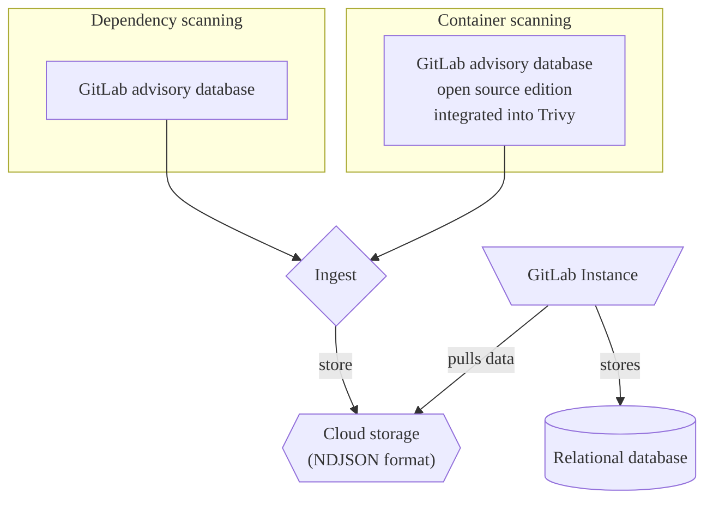

The [GitLab advisory database](https://gitlab.com/gitlab-org/security-products/gemnasium-db) serves as a repository for security advisories related to software dependencies. It is updated on an hourly basis with the latest security advisories.

The database is an essential component of both [dependency scanning](../dependency_scanning/_index.md) and [container scanning](../container_scanning/_index.md).

A free and open-source version of the GitLab advisory database is also available as [GitLab advisory database (open source edition)](https://gitlab.com/gitlab-org/advisories-community). The open source edition receives the same updates but with a 30-day delay.

## Standardization

GitLab advisories use standardized practices to communicate vulnerabilities and their
impact.

- [CVE](../terminology/_index.md#cve)
- [CVSS](../terminology/_index.md#cvss)
- [CWE](../terminology/_index.md#cwe)

## Explore the database

To view the database content, go to the [GitLab advisory database](https://advisories.gitlab.com) home page. On the home page you can:

- Search the database, by identifier, package name, and description.
- View advisories that were added recently.
- View statistical information, including coverage and update frequency.

### Search

Each advisory has a page with the following details:

- **Identifiers**: Public identifiers. For example, CVE ID, GHSA ID, or the GitLab internal ID (`GMS-<year>-<nr>`).
- **Package Slug**: Package type and package name separated by a slash.
- **Vulnerability**: A short description of the security flaw.
- **Description**: A detailed description of the security flaw and potential risks.
- **Affected Versions**: The affected versions.
- **Solution**: How to remediate the vulnerability.
- **Last Modified**: The date when the advisory was last modified.

### GraphQL API



- Tier: Ultimate
- Offering: GitLab.com, GitLab Self-Managed
- Status: Experiment





- [Introduced](https://gitlab.com/gitlab-org/gitlab/-/work_items/503307) in GitLab 18.11 [with a feature flag](../../../administration/feature_flags/_index.md) named `pm_advisory_graphql`. Disabled by default. This feature is an [experiment](../../../policy/development_stages_support.md).



> [!flag]
> The availability of this feature is controlled by a feature flag.
> For more information, see the history.
> This feature is available for testing, but not ready for production use.

Use the following GraphQL endpoints to look up individual or multiple advisories by identifier:

- [`Query.packageMetadataAdvisory` to look up a single advisory](../../../api/graphql/reference/_index.md#querypackagemetadataadvisory)
- [`Query.packageMetadataAdvisories` to look up multiple advisories](../../../api/graphql/reference/_index.md#querypackagemetadataadvisories)

#### Examples

##### Single advisory

To look up a single advisory by identifier:

```graphql
{
  packageMetadataAdvisory(identifier: "CVE-2026-34598") {
    id,
    title,
    description,
    publishedDate
    identifiers {
      name
      url
    }
  }
}
```

Will return something like:

```json
{
  "data": {
    "packageMetadataAdvisory": {
      "id": "gid://gitlab/PackageMetadata::Advisory/8295281",
      "title": "YesWiki has Persistent Blind XSS at \"/?BazaR&vue=consulter\"",
      "description": "A stored and blind XSS vulnerability exists in the form title field. A malicious attacker can inject JavaScript without any authentication via a form title that is saved in the backend database. When any user visits that injected page, the JavaScript payload gets executed.\n\nType: Stored and Blind Cross-Site Scripting (XSS)\nAffected Component: form title input field\nAuthentication Required: No (Unauthenticated attack possible)\nImpact: Arbitrary JavaScript execution in victim’s browser",
      "publishedDate": "2026-04-01",
      "identifiers": [
        {
          "name": "CVE-2026-34598",
          "url": "https://cve.mitre.org/cgi-bin/cvename.cgi?name=CVE-2026-34598"
        },
        {
          "name": "GHSA-37fq-47qj-6j5j",
          "url": "https://github.com/advisories/GHSA-37fq-47qj-6j5j"
        },
        {
          "name": "CWE-79",
          "url": "https://cwe.mitre.org/data/definitions/79.html"
        },
        {
          "name": "CWE-87",
          "url": "https://cwe.mitre.org/data/definitions/87.html"
        },
        {
          "name": "CWE-937",
          "url": "https://cwe.mitre.org/data/definitions/937.html"
        },
        {
          "name": "CWE-1035",
          "url": "https://cwe.mitre.org/data/definitions/1035.html"
        }
      ]
    }
  },
  "correlationId": "9f10f45bdb871a6e-MEL"
}
```

##### Multiple advisories

To look up multiple advisories by identifiers:

```graphql
{
  packageMetadataAdvisories(identifiers: ["CVE-2026-34598", "CVE-2026-34601"]) {
    nodes {
      id
      title
      description
      publishedDate
      identifiers {
        name
        url
      }
    }
  }
}
```

Will return something like:

```json
{
  "data": {
    "packageMetadataAdvisories": {
      "nodes": [
        {
          "id": "gid://gitlab/PackageMetadata::Advisory/8295281",
          "title": "YesWiki has Persistent Blind XSS at \"/?BazaR&vue=consulter\"",
          "description": "A stored and blind XSS vulnerability exists in the form title field. A malicious attacker can inject JavaScript without any authentication via a form title that is saved in the backend database. When any user visits that injected page, the JavaScript payload gets executed.\n\nType: Stored and Blind Cross-Site Scripting (XSS)\nAffected Component: form title input field\nAuthentication Required: No (Unauthenticated attack possible)\nImpact: Arbitrary JavaScript execution in victim’s browser",
          "publishedDate": "2026-04-01",
          "identifiers": [
            {
              "name": "CVE-2026-34598",
              "url": "https://cve.mitre.org/cgi-bin/cvename.cgi?name=CVE-2026-34598"
            },
            {
              "name": "GHSA-37fq-47qj-6j5j",
              "url": "https://github.com/advisories/GHSA-37fq-47qj-6j5j"
            },
            {
              "name": "CWE-79",
              "url": "https://cwe.mitre.org/data/definitions/79.html"
            },
            {
              "name": "CWE-87",
              "url": "https://cwe.mitre.org/data/definitions/87.html"
            },
            {
              "name": "CWE-937",
              "url": "https://cwe.mitre.org/data/definitions/937.html"
            },
            {
              "name": "CWE-1035",
              "url": "https://cwe.mitre.org/data/definitions/1035.html"
            }
          ]
        },
        {
          "id": "gid://gitlab/PackageMetadata::Advisory/8295301",
          "title": "xmldom: XML injection via unsafe CDATA serialization allows attacker-controlled markup insertion",
          "description": "`@xmldom/xmldom` allows attacker-controlled strings containing the CDATA terminator `]]>` to be inserted into a `CDATASection` node. During serialization, `XMLSerializer` emitted the CDATA content verbatim without rejecting or safely splitting the terminator. As a result, data intended to remain text-only became **active XML markup** in the serialized output, enabling XML structure\ninjection and downstream business-logic manipulation.\n\nThe sequence `]]>` is not allowed inside CDATA content and must be rejected or safely handled during serialization. ([MDN Web Docs](https://developer.mozilla.org/))",
          "publishedDate": "2026-04-01",
          "identifiers": [
            {
              "name": "CVE-2026-34601",
              "url": "https://cve.mitre.org/cgi-bin/cvename.cgi?name=CVE-2026-34601"
            },
            {
              "name": "GHSA-wh4c-j3r5-mjhp",
              "url": "https://github.com/advisories/GHSA-wh4c-j3r5-mjhp"
            },
            {
              "name": "CWE-91",
              "url": "https://cwe.mitre.org/data/definitions/91.html"
            },
            {
              "name": "CWE-937",
              "url": "https://cwe.mitre.org/data/definitions/937.html"
            },
            {
              "name": "CWE-1035",
              "url": "https://cwe.mitre.org/data/definitions/1035.html"
            }
          ]
        },
        {
          "id": "gid://gitlab/PackageMetadata::Advisory/8295310",
          "title": "xmldom: XML injection via unsafe CDATA serialization allows attacker-controlled markup insertion",
          "description": "`@xmldom/xmldom` allows attacker-controlled strings containing the CDATA terminator `]]>` to be inserted into a `CDATASection` node. During serialization, `XMLSerializer` emitted the CDATA content verbatim without rejecting or safely splitting the terminator. As a result, data intended to remain text-only became **active XML markup** in the serialized output, enabling XML structure\ninjection and downstream business-logic manipulation.\n\nThe sequence `]]>` is not allowed inside CDATA content and must be rejected or safely handled during serialization. ([MDN Web Docs](https://developer.mozilla.org/))",
          "publishedDate": "2026-04-01",
          "identifiers": [
            {
              "name": "CVE-2026-34601",
              "url": "https://cve.mitre.org/cgi-bin/cvename.cgi?name=CVE-2026-34601"
            },
            {
              "name": "GHSA-wh4c-j3r5-mjhp",
              "url": "https://github.com/advisories/GHSA-wh4c-j3r5-mjhp"
            },
            {
              "name": "CWE-91",
              "url": "https://cwe.mitre.org/data/definitions/91.html"
            },
            {
              "name": "CWE-937",
              "url": "https://cwe.mitre.org/data/definitions/937.html"
            },
            {
              "name": "CWE-1035",
              "url": "https://cwe.mitre.org/data/definitions/1035.html"
            }
          ]
        },
        {
          "id": "gid://gitlab/PackageMetadata::Advisory/9800476",
          "title": "xmldom: xmldom: XML structure injection via CDATA terminator",
          "description": "xmldom is a pure JavaScript W3C standard-based (XML DOM Level 2 Core) `DOMParser` and `XMLSerializer` module. In xmldom versions 0.6.0 and prior and @xmldom/xmldom prior to versions 0.8.12 and 0.9.9, xmldom/xmldom allows attacker-controlled strings containing the CDATA terminator ]]> to be inserted into a CDATASection node. During serialization, XMLSerializer emitted the CDATA content verbatim without rejecting or safely splitting the terminator. As a result, data intended to remain text-only became active XML markup in the serialized output, enabling XML structure injection and downstream business-logic manipulation. This issue has been patched in xmldom version 0.6.0 and @xmldom/xmldom versions 0.8.12 and 0.9.9.",
          "publishedDate": "2026-04-02",
          "identifiers": [
            {
              "name": "CVE-2026-34601",
              "url": "https://cve.mitre.org/cgi-bin/cvename.cgi?name=CVE-2026-34601"
            },
            {
              "name": "CWE-91",
              "url": "https://cwe.mitre.org/data/definitions/91.html"
            }
          ]
        }
      ]
    }
  },
  "correlationId": "9f10f5072e0f1a6e-MEL"
}
```

## Open source edition

GitLab provides a free and open-source version of the database, the [GitLab advisory database (open source edition)](https://gitlab.com/gitlab-org/advisories-community).

The open-source version is a time-delayed clone of the GitLab advisory database, MIT-licensed and contains all advisories from the GitLab advisory database that are older than 30 days or with the `community-sync` flag.

## Integrations

- [Dependency scanning](../dependency_scanning/_index.md)
- [Container scanning](../container_scanning/_index.md)
- Third-party tools

> [!note]
> GitLab advisory database terms prohibit the use of data contained in the GitLab advisory database by third-party tools. Third-party integrators can use the MIT-licensed, time-delayed [repository clone](https://gitlab.com/gitlab-org/advisories-community) instead.

### How the database can be used

The following example uses the database as a source for an advisory ingestion process
as part of continuous vulnerability scans.



## Maintenance

The Vulnerability Research team is responsible for the maintenance and regular updates of the GitLab advisory database and the GitLab advisory database (open source edition).

Community contributions are accessible in [advisories-community](https://gitlab.com/gitlab-org/advisories-community) via the `community-sync` flag.

## Contributing to the vulnerability database

If you know about a vulnerability that is not listed, you can contribute to the GitLab advisory database by either opening an issue or submit the vulnerability.

For more information, see [Contribution guidelines](https://gitlab.com/gitlab-org/security-products/gemnasium-db/-/blob/master/CONTRIBUTING.md).

## License

The GitLab advisory database is freely accessible in accordance with the [GitLab advisory database terms](https://gitlab.com/gitlab-org/security-products/gemnasium-db/-/blob/master/LICENSE.md#gitlab-advisory-database-term).
